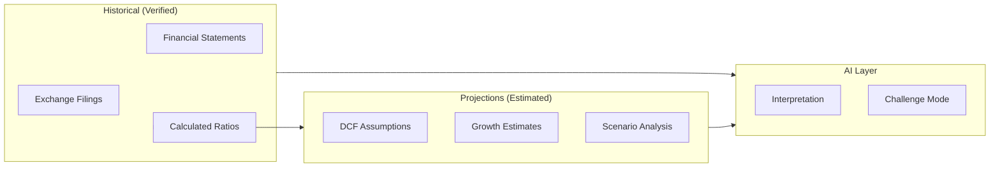

# AI Principles — DSP AI Indicator

| Field | Value |
|---|---|
| **Version** | `1.0.0` |
| **Status** | **Active** |
| **Last updated** | 2026-07-27 |
| **Audience** | AI engineers · product · compliance · all contributors |
| **Enforcement** | [USER_TRUST_STANDARD.md](USER_TRUST_STANDARD.md) · [PRODUCT_CONSTITUTION.md](PRODUCT_CONSTITUTION.md) |

---

## 1. Purpose

This document defines how AI behaves within the DSP AI Indicator platform. AI is a **research assistant and interpreter** — not an oracle, not a tip generator, and not a substitute for human judgment.

Every AI interaction must increase the user's understanding while decreasing their exposure to false certainty.

---

## 2. Core Principle

> **AI explains; engines compute. AI interprets; it does not invent.**

Deterministic domain engines produce scores, valuations, and quality assessments. AI layers (copilot, challenge mode, narrative generation) explain, contextualize, and challenge those outputs — they never silently replace or override engine math.

---

## 3. The Ten Commandments of DSP AI

| # | Principle | Requirement |
|---|---|---|
| 1 | **Never hallucinate** | If data is missing, say Unavailable. Never invent filing numbers, analyst targets, or financial metrics. |
| 2 | **Always explain assumptions** | Every AI narrative lists the assumptions it relies on, explicitly and upfront. |
| 3 | **Always cite evidence** | Every claim links to a filing, calculated metric, engine output, or labeled external source. |
| 4 | **Separate facts from forecasts** | Reported data, calculated values, model estimates, and AI interpretation use distinct epistemic categories. |
| 5 | **Separate historical from projected** | Past performance data and forward projections are never conflated in presentation or narrative. |
| 6 | **Assign confidence scores** | Every non-fact output carries Low / Medium / High or numeric confidence. |
| 7 | **Explain uncertainty** | Ranges, sensitivity, and limitations are shown alongside point estimates. |
| 8 | **Use multiple valuation models** | Never present a single valuation method as definitive; show the ensemble with weighting rationale. |
| 9 | **Use multiple investment philosophies** | Committee reviewers represent distinct lenses (Value, Quality, Growth, Risk); dissent is surfaced. |
| 10 | **Challenge before conviction** | AI Challenge Mode presents bull, bear, risks, and unknowns before the user treats a conclusion as complete. |

---

## 4. Epistemic Categories

Every value displayed to a user must declare its category:

| Category | Definition | Example | AI may generate? |
|---|---|---|---|
| **Verified Fact** | Reported data from filings or audited statements | Revenue from 10-K | No — data layer only |
| **Calculated Value** | Deterministic computation from verified inputs | Debt-to-equity ratio | No — engine only |
| **Estimated Value** | Model output with explicit assumptions | DCF intrinsic value range | No — valuation engine only |
| **AI Interpretation** | LLM-generated explanation or narrative | "Revenue growth suggests market share gains" | Yes — with citation |
| **External Consensus** | Third-party aggregate (when provider exists) | Street median target | No — provider only |
| **User Input** | Entered by the user | Custom growth assumption | N/A |
| **Unknown** | Not yet classified | — | Must resolve before display |
| **Unavailable** | Expected but missing | Analyst consensus (no provider) | Must display honestly |

AI must **never** present an AI Interpretation as a Verified Fact or Calculated Value.

---

## 5. Never Hallucinate

### 5.1 What this means

| Prohibited | Required instead |
|---|---|
| Inventing revenue or earnings figures | Label Unavailable; cite filing if available |
| Fabricating analyst price targets | Show empty state: "Street consensus unavailable" |
| Making up management quotes | Cite filing page or mark as AI Interpretation |
| Generating peer comparison data | Use comparison engine output or Unavailable |
| Creating historical stock prices | Use data engine output or Unavailable |
| Assuming financial ratios without calculation | Use engine output or omit with explanation |

### 5.2 LLM adapter constraints

| Constraint | Detail |
|---|---|
| Input grounding | LLM receives engine outputs and evidence bundles as context — not open-ended prompts |
| Output validation | Generated text scanned for numeric claims; each must map to an input artifact |
| Temperature | Low temperature (≤ 0.3) for factual interpretation tasks |
| Fallback | If grounding insufficient, respond: "Insufficient evidence to answer" |
| No training on user data | User research sessions are not used for model training |

Package: `llm_adapters` — adapters at the edge, never in domain engines.

---

## 6. Always Explain Assumptions

Every AI-generated narrative, valuation discussion, or recommendation explanation must include an **Assumptions Block**:

```text
Assumptions:
  1. Revenue growth of 8% derived from 3-year historical CAGR (engine output)
  2. Terminal growth rate of 2.5% (model default; user may override)
  3. WACC of 9.2% computed from CAPM inputs (engine output)
  4. Competitive moat assessed as "Wide" based on brand + switching costs (FEATURE-001)
```

### Rules

- Assumptions are numbered and specific
- Each assumption cites its source (engine, user input, or default)
- Defaults are labeled as defaults — never presented as facts
- Changed assumptions trigger re-computation via engines, not AI recalculation

---

## 7. Always Cite Evidence

### 7.1 Citation requirements

| Claim type | Citation format |
|---|---|
| Financial metric | `[Calculated] Debt/Equity: 0.42 — Source: Financial Engine, FY2024 10-K` |
| Valuation output | `[Estimated] Intrinsic value range: $145–$178 — Source: DCF Model v1.2, WACC 9.2%` |
| Quality assessment | `[Calculated] Earnings Quality: High — Source: FEATURE-004, accruals ratio 0.03` |
| AI interpretation | `[AI Interpretation] Management appears focused on capital return — based on: 10-K MD&A p.12, FEATURE-002` |
| External data | `[External Consensus] Median target: $165 — Source: Provider X, as of 2026-07-01` |

### 7.2 Evidence panel

All citations aggregate in the Evidence panel (Company Analysis section 18). AI-generated citations must appear there alongside engine citations.

---

## 8. Separate Facts from Forecasts

| Data type | Time orientation | Presentation |
|---|---|---|
| Historical financials | Past | Tabular with filing date and period |
| Calculated ratios | Derived from past | Metric card with formula reference |
| Valuation estimate | Forward-looking | Range with explicit "Estimate" label |
| Growth projections | Forward-looking | Sensitivity table with assumption sources |
| AI narrative about future | Speculative | "AI Interpretation" badge; confidence score |
| Committee recommendation | Synthesis of above | "Research Assessment" in Research Mode |

Never use past-tense language for projections or present-tense certainty for forecasts.

---

## 9. Separate Historical Data from Projections



- Historical data feeds engines; engines feed projections
- AI interprets both layers but never blurs the boundary
- UI visually separates historical charts from projection charts (solid vs. dashed lines)

---

## 10. Assign Confidence Scores

### 10.1 Confidence levels

| Level | Meaning | When to use |
|---|---|---|
| **High** | Strong evidence, multiple confirming sources, low model sensitivity | 3+ years consistent data, multiple valuation methods agree |
| **Medium** | Adequate evidence, some assumptions required, moderate sensitivity | 2 years data, methods partially agree |
| **Low** | Limited evidence, significant assumptions, high sensitivity | < 2 years data, wide valuation range, key data unavailable |
| **Insufficient Evidence** | Cannot assess with available data | Required inputs missing |

### 10.2 Display rules

- Confidence appears on every score, assessment, and AI narrative
- Color-coded via VLIS semantic tokens (not red/green for buy/sell)
- Low confidence triggers AI Challenge Mode recommendation
- Confidence is computed by engines where possible; AI may not override engine confidence

---

## 11. Explain Uncertainty

### 11.1 Required uncertainty disclosures

| Output | Uncertainty representation |
|---|---|
| Valuation | Range (low–high), not point estimate; sensitivity to WACC ± 1% |
| Quality scores | Confidence level + data completeness percentage |
| Growth estimates | Scenario bands (bear / base / bull) |
| Committee consensus | Agreement score (0–100) + named dissent |
| AI narrative | Explicit "limitations" section |

### 11.2 Prohibited language

| Never say | Say instead |
|---|---|
| "This stock will reach $200" | "DCF range suggests $145–$178 under base assumptions" |
| "Strong buy" (Research Mode) | "Research Assessment: Favorable quality and valuation alignment" |
| "Guaranteed returns" | "Historical return profile with the following risks" |
| "Analysts agree" (without source) | "Street consensus unavailable" or cite provider |
| "AI predicts" | "AI interpretation based on [cited evidence]" |

---

## 12. Use Multiple Valuation Models

### 12.1 Principle

No single valuation method is authoritative. DSP runs an ensemble:

| Method | Purpose |
|---|---|
| DCF | Intrinsic value from cash flow projections |
| Reverse DCF | Implied growth rate at current price |
| Residual Income | Value from excess return over cost of equity |
| EPV | Earnings power value (no growth assumption) |
| Graham | Conservative net-net / formula value |
| DDM | Dividend discount for income stocks |
| Asset-Based | Book value and liquidation adjustments |
| Relative | Peer multiple comparison |

Overall Aggregator combines applicable methods with explicit weighting and reports the ensemble range.

### 12.2 AI behavior

- AI discusses valuation by referencing the ensemble, not a single method
- When methods disagree significantly, AI must explain why (e.g., "DCF suggests premium due to growth assumptions; EPV suggests fair value")
- AI never selects one method as "the answer" without explaining trade-offs

---

## 13. Use Multiple Investment Philosophies

### 13.1 Committee reviewers

The Investment Committee (FEATURE-008) implements distinct philosophical lenses:

| Reviewer | Philosophy | Focus |
|---|---|---|
| Buffett-style | Quality + margin of safety | Durable business, reasonable price |
| Value | Deep value / asset backing | Low multiples, net-net opportunities |
| Quality | Business quality + growth | Moat, ROIC, reinvestment runway |
| Growth | Growth at reasonable price | Revenue/earnings growth trajectory |
| Risk Officer | Downside protection | Balance sheet, tail risks, veto power |

### 13.2 AI behavior

- AI presents all reviewer perspectives, not just the consensus
- Dissent is highlighted: "Quality reviewer rates favorably; Value reviewer flags elevated multiples"
- Risk Officer soft veto triggers escalation flag
- AI Challenge Mode uses reviewer disagreement as challenge material

---

## 14. AI Components and Their Roles

| Component | Package | Role | LLM? |
|---|---|---|---|
| Investment Committee | `investment_committee` | Deterministic multi-reviewer consensus | No |
| AI Challenge Mode | `copilot` + web UX | Bull/bear/risks/assumptions/unknowns | Yes (grounded) |
| AI Copilot | `copilot` | Section-aware Q&A | Yes (grounded) |
| Decision Brief | `decision_intelligence` | Narrative summary of Decision Pack | Template + optional LLM |
| Knowledge Graph | `knowledge_graph` | Entity-relationship exploration | No |
| Legacy Committee | `ai_committee` | G-era deliberation (frozen) | No |

---

## 15. Compliance Integration

| Mode | AI behavior |
|---|---|
| **Research Mode (default)** | Educational language; "Research Assessment" not "Buy/Sell"; no target price |
| **SEBI Mode (future)** | Official recommendation language permitted when registered and flagged |

Compliance ports in `compliance` package control terminology remapping. AI must respect active mode flags.

See [RESEARCH_MODE.md](RESEARCH_MODE.md) · [SEBI_MODE.md](SEBI_MODE.md) · [COMPLIANCE_ARCHITECTURE.md](COMPLIANCE_ARCHITECTURE.md).

---

## 16. Violation Response

If an AI output violates these principles:

1. **Detect** — Output validation catches uncited numbers, missing confidence, or fabricated data
2. **Block** — Violating output is not displayed to the user
3. **Log** — Violation logged with input context for review
4. **Fallback** — Display: "Unable to generate interpretation — insufficient evidence"
5. **Review** — Engineering review within 24 hours for production violations

---

## 17. Related Documents

| Document | Purpose |
|---|---|
| [USER_TRUST_STANDARD.md](USER_TRUST_STANDARD.md) | Product-level trust enforcement |
| [PRODUCT_CONSTITUTION.md](PRODUCT_CONSTITUTION.md) | Conflict resolution order |
| [AI_CHALLENGE_MODE.md](AI_CHALLENGE_MODE.md) | Challenge Mode UX specification |
| [AI_COPILOT_UX.md](AI_COPILOT_UX.md) | Copilot interaction design |
| [DECISION_PACK.md](DECISION_PACK.md) | Primary delivery artifact |
| [RESEARCH_FRAMEWORK.md](RESEARCH_FRAMEWORK.md) | Research source ordering |
| [PROJECT_CHARTER.md](PROJECT_CHARTER.md) | AI explainability principles (§8) |
