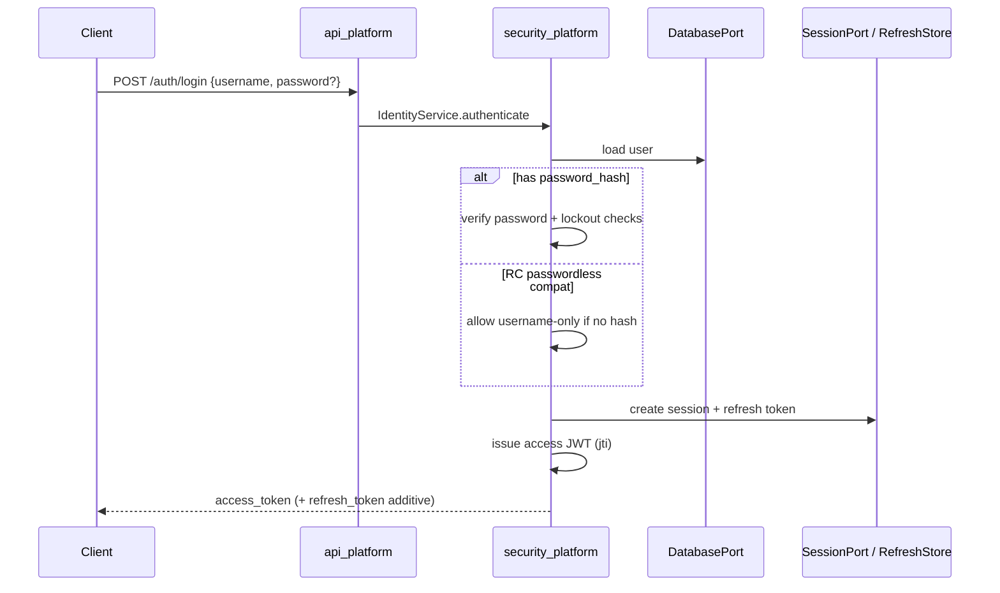
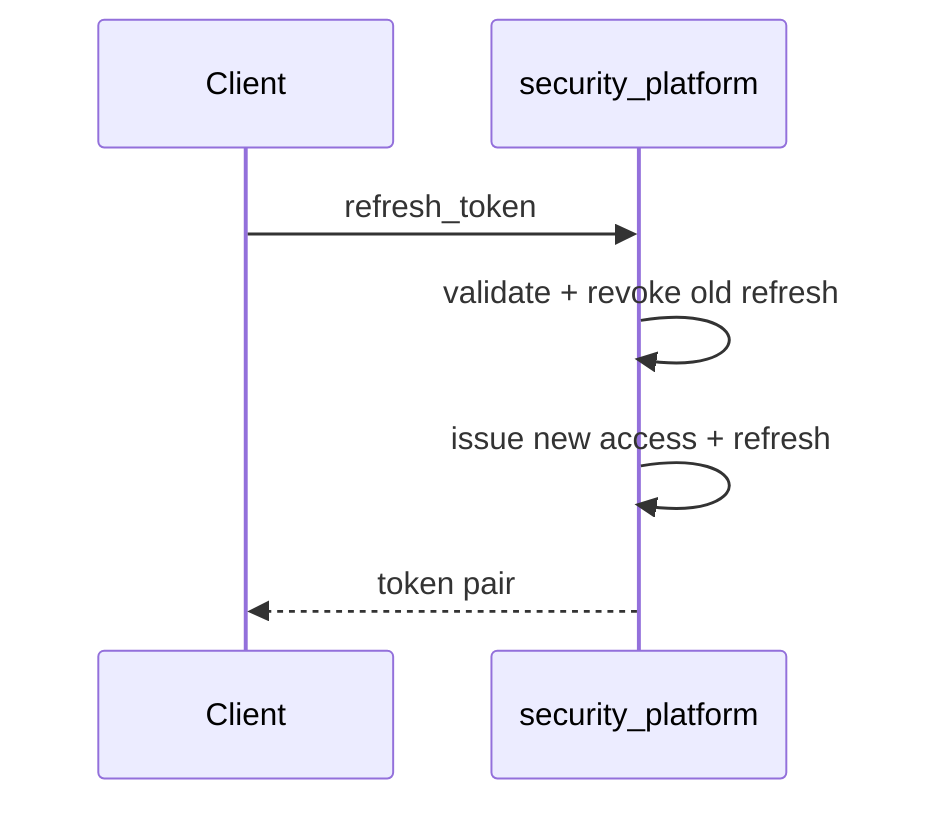

# Authentication Flow (PEP-001)

## Password login (preferred when hash present)

## Refresh rotation

## API key

Unchanged: `api_key_id` + `api_key_secret` or `Authorization: ApiKey …`.

## OIDC / enterprise multi-provider

Implemented via `EnterpriseAuthPlatform` (see [AUTH_ENTERPRISE_PLATFORM.md](AUTH_ENTERPRISE_PLATFORM.md)):

Client redirects to IdP → authorization code + **PKCE** → API callback → link/create user → **same** local session + JWT/cookies. Not Auth.js.

Passwordless username login is deprecated once OIDC or password+MFA is mandatory in production profile.

## Logout

Revoke refresh token(s), delete session, optional denylist access `jti`.
