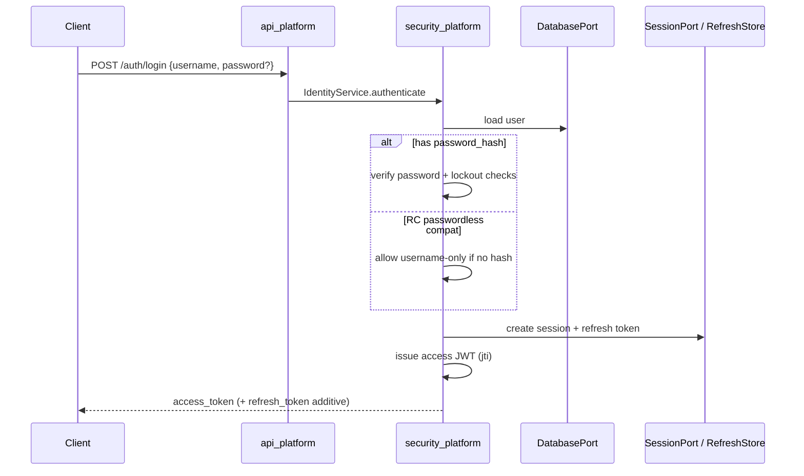
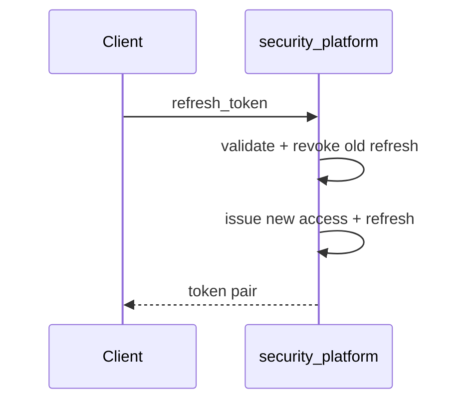
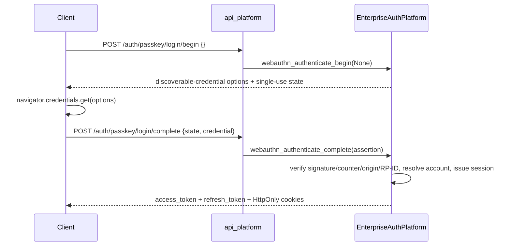
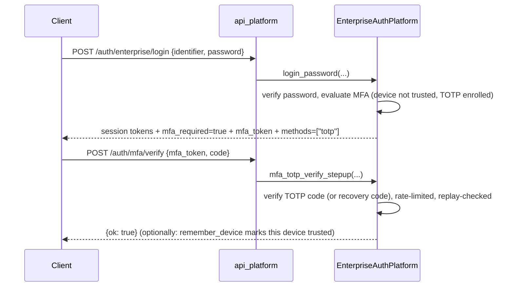

# Authentication Flow (PEP-001)

## Password login (preferred when hash present)

## Refresh rotation

## API key

Unchanged: `api_key_id` + `api_key_secret` or `Authorization: ApiKey …`.

## OIDC / enterprise multi-provider

Implemented via `EnterpriseAuthPlatform` (see [AUTH_ENTERPRISE_PLATFORM.md](AUTH_ENTERPRISE_PLATFORM.md), [ENTERPRISE_AUTH_PLATFORM.md](security/ENTERPRISE_AUTH_PLATFORM.md)) for Google, Microsoft Entra ID, and Facebook — one shared `OAuthProviderAdapter`, not three separate implementations:

Client redirects to IdP → authorization code + **PKCE** → API callback → link/create user → **same** local session + JWT/cookies. Not Auth.js.

Google and Microsoft additionally verify a signed OIDC `id_token` (JWKS signature, issuer, audience, nonce). Facebook does not issue an `id_token`; its trust anchor is the live Graph `/me` profile call made with the freshly-exchanged access token.

Passwordless username login is deprecated once OIDC or password+MFA is mandatory in production profile.

## Passkey (WebAuthn) — primary, passwordless login

Implemented via `EnterpriseAuthPlatform` + `auth.mfa_webauthn.WebAuthnAdapter` (see [AUTH_ENTERPRISE_PLATFORM.md](AUTH_ENTERPRISE_PLATFORM.md), [ENTERPRISE_AUTH_PLATFORM.md §3c](security/ENTERPRISE_AUTH_PLATFORM.md)). Gated by `DSP_AUTH_MFA=true`; requires the optional `webauthn` package.

No password or prior identifier is required — the credential ID in the browser's assertion resolves the account. Registration (`POST /auth/passkey/register/begin|complete`) is authenticated and adds a resident/discoverable credential to the caller's account; the same credential also works for MFA step-up under `/auth/mfa/webauthn/*`.

## MFA (TOTP) — authenticator-app step-up

Implemented via `EnterpriseAuthPlatform` + `auth.mfa_totp.TotpAdapter` (see [AUTH_ENTERPRISE_PLATFORM.md](AUTH_ENTERPRISE_PLATFORM.md), [ENTERPRISE_AUTH_PLATFORM.md §3d](security/ENTERPRISE_AUTH_PLATFORM.md)). Gated by `DSP_AUTH_MFA=true`; RFC 6238-compliant, works with any standard authenticator app.

The primary session (access + refresh tokens, HttpOnly cookies) is issued *before* step-up completes — MFA is additive, not blocking, so existing single-factor clients are unaffected when `DSP_AUTH_MFA=false` or a user has no factor enrolled. A device marked "remembered" (`remember_device: true` + `device_id`) skips this challenge on future logins for `DSP_AUTH_TRUSTED_DEVICE_DAYS` days (default 30), after which trust automatically expires and step-up is required again.

## Logout

Revoke refresh token(s), delete session, optional denylist access `jti`.
