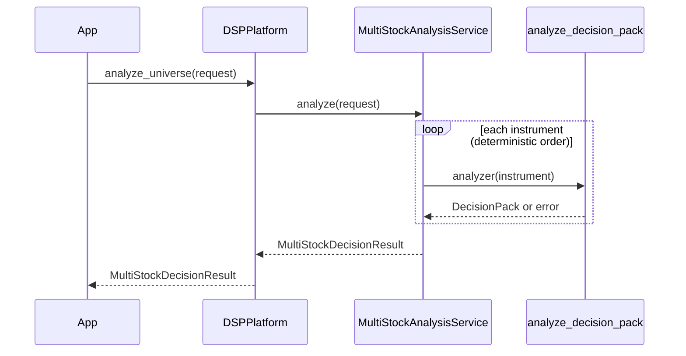

# Phase C1 — Investment Universe & Multi-Stock Foundation

**Status:** Implemented · Architecture frozen · DecisionPack remains canonical

## Design decision

| Topic | Choice |
|-------|--------|
| Ownership | New package `universe` above Decision Intelligence |
| Dependencies | `contracts`, `core`, `decision_intelligence` only |
| Platform API | Additive `DSPPlatform.analyze_universe(...)` |
| Single-name path | Unchanged `analyze` / `analyze_decision_pack` |
| Aggregation input | `DecisionPack` only — never engine votes |
| Why no redesign | Additive consumer of frozen spine; no reverse deps |

## Models

- `InvestmentUniverse` / `UniverseEntry` — membership ≠ ownership
- `MultiStockAnalysisRequest` / `MultiStockDecisionResult`
- `InstrumentAnalysisOutcome` — pack **or** structured failure
- `ComparableDecisionSummary` — read-only projection, **no score / no rank**
- `filter_entries` / `group_entries` — explicit metadata + tags only

## Sequence

