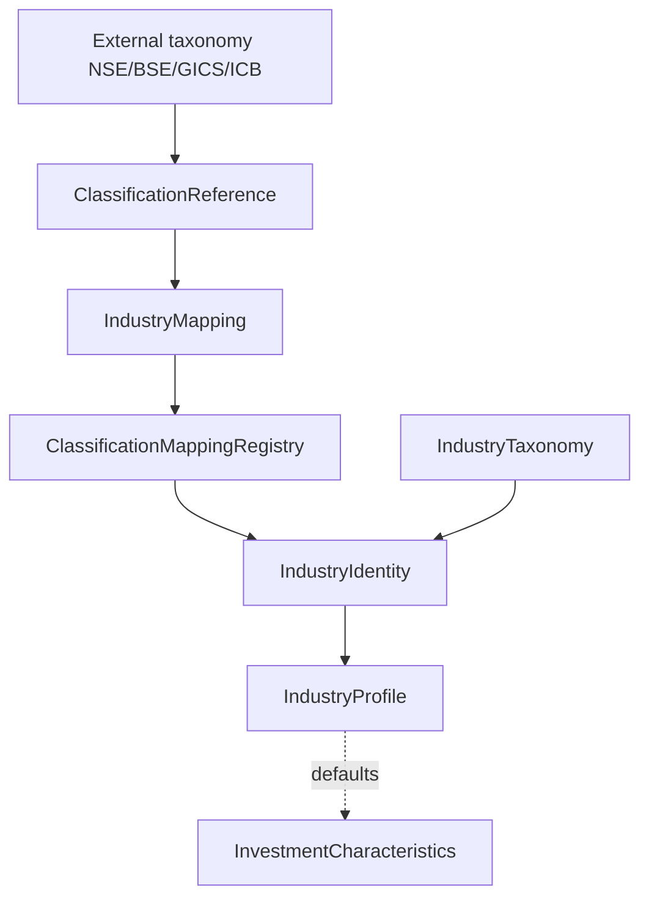

# Phase C2.1 — Industry Identity & Taxonomy Infrastructure

**Status:** Implemented · Identity only · AIMF design freeze preserved

## What shipped

| Component | Role |
|---|---|
| `IndustryIdentity` | Stable DSP industry id |
| `IndustryTaxonomy` | Hierarchy + validation |
| `ClassificationReference` | External taxonomy pointer |
| `IndustryMapping` | Versioned external→DSP map |
| `ClassificationMappingRegistry` | Register / lookup / deprecate / validate |

## What did not ship (in C2.1)

Characteristics (shipped in C2.2), Methodologies, Peer comparison, Comparison Engine, rankings.

## Diagram

See package README: [packages/industry/README.md](../packages/industry/README.md).
See C2.2: [C2_2_INVESTMENT_CHARACTERISTICS.md](C2_2_INVESTMENT_CHARACTERISTICS.md).
