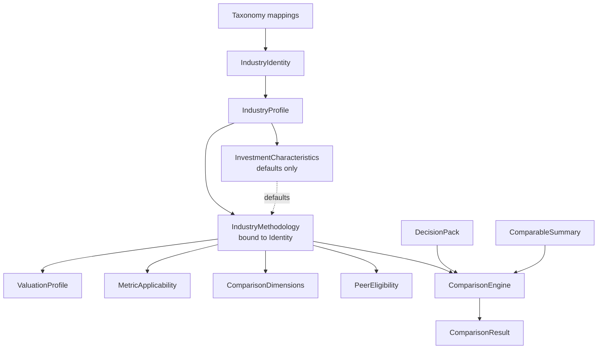

# AIMF — Architecture Freeze (Phase C2 Final)

**Status:** DESIGN FROZEN · C2.1–C2.5 **implemented** (Identity → Characteristics → Methodology → Peer Eligibility → Qualitative Comparison) · rankings/scores still forbidden  
**Effective:** 2026-07-21  
**Supersedes interim wording in earlier C2 drafts where they conflict**  
**Canonical consumers:** `packages/industry/` (identity + characteristics + methodology live), then `packages/comparison/` (engine)

---

## 1. Final architecture

```
Taxonomy  (NSE / BSE / GICS / ICB / CUSTOM — mappings only)
        ↓
IndustryIdentity          (DSP-stable industry id)
        ↓
IndustryProfile           (industry facts + business models)
        │
        ├────────────► InvestmentCharacteristics
        │                 (shared economic archetype;
        │                  DEFAULTS ONLY)
        │
        ▼
IndustryMethodology       (BOUND TO IndustryIdentity; versioned)
        │
        ├── ValuationProfile          (defaults ← Characteristics; overrides here)
        ├── MetricApplicability       (industry-owned ONLY)
        ├── ComparisonDimensions      (defaults ← Characteristics; overrides here)
        ├── PeerEligibility           (industry-owned ONLY)
        └── MethodologyVersion
        │
        ▼
ComparisonEngine          (industry-agnostic)
        inputs:  IndustryMethodology + DecisionPack + ComparableSummary
        output:  ComparisonResult
```

### Mermaid



---

## 2. Responsibility matrix (exactly one owner)

| Responsibility | Owner | Must NOT own |
|---|---|---|
| External taxonomy codes & labels | **Taxonomy / ClassificationRef** | DSP industry economics |
| Stable DSP industry id | **IndustryIdentity** | Peer sets, metrics, valuation prefs |
| Industry facts, parent, business-model variants, characteristic refs | **IndustryProfile** | Assembled comparison policy; peer rules |
| Reusable economic archetype; default valuation philosophy; default dimension emphasis; capital intensity / cash-flow / cyclicality / pricing power / regulatory intensity descriptors | **InvestmentCharacteristics** | MetricApplicability; PeerEligibility; industry ids; peer definitions; industry-specific operating metrics |
| Versioned investment policy for one industry; overrides; assembled profiles | **IndustryMethodology** | Taxonomy codes; DecisionPack mutation |
| Preferred / acceptable / unsupported valuation method refs | **ValuationProfile** (assembled on Methodology; defaults may originate from Characteristics) | MoS recalculation; engine execution |
| Which metrics apply, importance, why, peer-use flags | **MetricApplicability** (on Methodology) | Characteristics; peer group membership |
| Peer eligibility outcomes (DIRECT / RELATED / LIMITED / NOT_COMPARABLE / UNKNOWN) | **PeerEligibility** (on Methodology) | Characteristics |
| Industry-agnostic evaluation of injected methodology + packs | **ComparisonEngine** | Industry name branches; ranking requirement; scoring requirement |

**Overlap check:** No two objects own the same responsibility. Defaults on Characteristics are *templates*; the authoritative assembled policy lives only on IndustryMethodology.

---

## 3. Design rules (frozen)

1. **IndustryMethodology is bound to IndustryIdentity.** Methodologies are never shared directly between industries.
2. **InvestmentCharacteristics provide defaults only.** Methodology may override any default.
3. **Characteristics MUST NOT own** MetricApplicability, PeerEligibility, industry-specific operating metrics, peer definitions, or industry identifiers.
4. **Sharing characteristics never implies** DIRECT peers, RELATED peers, or comparable companies.
5. **ComparisonEngine consumes only** IndustryMethodology, DecisionPack, ComparableSummary. No `if industry == …`, no `switch(industry)`, no hardcoded sector logic.

---

## 4. Default / override policy

```
resolve(methodology):
  base = methodology.industry_profile.investment_characteristics

  valuation =
    methodology.valuation_overrides
      if present else base.default_valuation

  dimensions =
    methodology.dimension_overrides
      if present else base.default_dimensions

  metrics = methodology.metric_applicability        # NEVER from characteristics
  peers   = methodology.peer_eligibility            # NEVER from characteristics

  return AssembledMethodology(valuation, dimensions, metrics, peers, version)
```

- Missing override → use characteristic default (if any).  
- Explicit methodology value always wins.  
- Absence of a characteristic default is allowed; methodology must then define the field or mark a data/method gap.

---

## 5. Reuse examples (correct)

| IndustryIdentity | InvestmentCharacteristics | Own IndustryMethodology? | Peer implication |
|---|---|---|---|
| Utilities | Stable Regulated Cash Flow | **Yes — own** | None from characteristics |
| Telecom Towers | Stable Regulated Cash Flow | **Yes — own** | None from characteristics |
| Selected InvITs | Stable Regulated Cash Flow | **Yes — own** | None from characteristics |
| Luxury | Pricing Power Franchise | **Yes — own** | None from characteristics |
| Premium Consumer Brands | Pricing Power Franchise | **Yes — own** | None from characteristics |

Same characteristics ⇒ shared **defaults** (e.g. income-oriented / franchise valuation philosophy).  
Each industry still registers **its own** methodology version with its own metrics and peer policy.

---

## 6. Forbidden sharing examples

These must **never** share one IndustryMethodology (and should not be forced into one Characteristics archetype casually):

| Do not collapse | Why |
|---|---|
| Banks ↔ Insurance ↔ Stock Exchanges | Different balance sheets, capital regimes, valuation anchors |
| Bank ↔ NBFC as identical peers by default | Related at most; distinct credit/ALM metrics |
| REIT / InvIT ↔ Hotel operating company | Asset yield vehicle ≠ operator P&L |
| Software product ↔ IT services staff-aug | Different growth/quality metrics |
| Airline ↔ Logistics “transport” mega-group | Different unit economics |

---

## 7. Dependency / backward compatibility

| Package | Modification required for AIMF freeze? |
|---|---|
| DecisionPack / decision_intelligence | **No** |
| Universe | **No** |
| DSPPlatform | **No** (façade wiring only in a later implementation phase) |
| Committee / ai_committee | **No** |
| Recommendation | **No** |
| Valuation Engine | **No** (method *selection prefs* only; no recalc) |
| Analysis engines (dsp, fundamental, economic, …) | **No** |
| contracts | Additive only later (`IndustryIdentity` thin types if needed) |

AIMF implementation adds `industry` (and later `comparison`) packages **above** Decision Pack — never reverse dependencies into engines.

---

## 8. Package ownership (implementation later)

| Package | Role |
|---|---|
| `industry` | Taxonomy maps, Identity, Profile, Characteristics, Methodology, PeerEligibility, MetricApplicability, **IEF (C3.x)** |
| `comparison` | Industry-agnostic ComparisonEngine: Methodology + DecisionPack + EvidenceBundle |

---

## 9. Remaining implementation phases (after this freeze)

| Phase | Scope |
|---|---|
| **C2.1** | `IndustryIdentity` + taxonomy mapping — **DONE** |
| **C2.2** | `InvestmentCharacteristics` registry + seed archetypes — **DONE** |
| **C2.3** | `IndustryMethodology` registry (version / deprecate) — **DONE** |
| **C2.4** | PeerEligibility enforcement hooks in multi-stock flows (refuse/degrade; still no ranking) — **DONE** |
| **C2.5** | ComparisonEngine v0 — qualitative notes + data gaps only; **no scores, no ranks** — **DONE** |
| **C3.0** | Industry Evidence Framework design review — **DONE** |
| **C3.0A** | Industry Evidence Framework architecture freeze — **DONE** |
| **C3.1** | Evidence + Metric definition registries — **DONE** (applicability deferred to C3.2) |
| **C3.2** | EvidenceApplicability on methodology — **DONE** (Snapshot/Bundle / Comparison wiring still later) |
| **C3.2b** | Snapshot/Bundle; DecisionPack `evidence_snapshot_ref`; Comparison EvidenceBundle |
| **C3.3** | Evidence providers (contracts) — **DONE** (placeholders; engine adapters later) |
| **C3.4** | Evidence interpreters (contracts) — **DONE** (placeholders; templates later) |
| **C3.5** | Evidence Bundle assembly — **DONE** (DecisionPack/Comparison wiring later) |
| **C3.6** | DecisionPack evidence refs — **DONE** |
| **C3.7** | Comparison EvidenceBundle consume — **DONE** |
| **C3.8** | Real adapters; Portfolio/Risk citations |

Out of scope until explicitly chartered: rankings, composite scores, dashboard, ML/LLM, portfolio/risk.

---

## 10. DESIGN FREEZE verdict

**AIMF domain architecture is FROZEN.**

Growth of industry coverage must occur by:

- registering new identities / profiles / methodologies / characteristics, and  
- versioning methodologies,

**not** by redesigning ComparisonEngine or reassigning ownership across the matrix above.

---

## Related documents

| Doc | Role |
|---|---|
| [C2_AIMF_DESIGN.md](C2_AIMF_DESIGN.md) | Historical design audit + data gap matrix (still valid background) |
| [C2_INVESTMENT_CHARACTERISTICS.md](C2_INVESTMENT_CHARACTERISTICS.md) | Characteristics decision record |
| **This file** | **Authoritative frozen architecture** |
| [C1_MULTI_STOCK_FOUNDATION.md](C1_MULTI_STOCK_FOUNDATION.md) | DecisionPack batch foundation |
| [DSP_AI_INDICATOR_ARCHITECTURE.md](DSP_AI_INDICATOR_ARCHITECTURE.md) | Platform spine |
