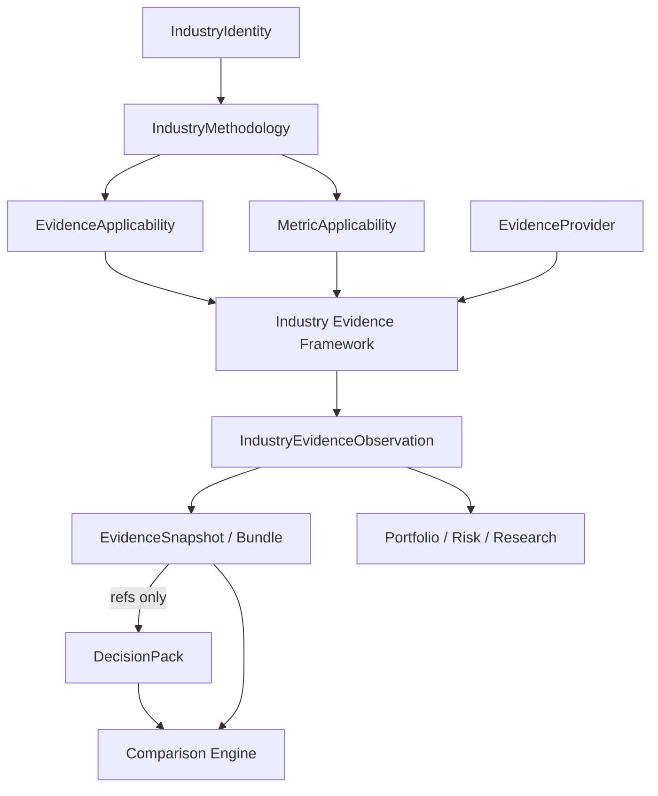

# Industry Evidence Framework (IEF) — Architecture Freeze

**Status:** DESIGN FROZEN  
**Phase:** C3.0A  
**Effective:** 2026-07-21  
**Supersedes:** interim recommendations in [C3_0_INDUSTRY_EVIDENCE_FRAMEWORK.md](C3_0_INDUSTRY_EVIDENCE_FRAMEWORK.md) where they conflict  
**Parent spine:** [DSP_AI_INDICATOR_ARCHITECTURE.md](DSP_AI_INDICATOR_ARCHITECTURE.md) · [C2_AIMF_ARCHITECTURE_FREEZE.md](C2_AIMF_ARCHITECTURE_FREEZE.md)  
**Implementation:** C3.1–C3.7 **DONE** (IEF → DecisionPack refs → Comparison consume) · Next = real adapters / Portfolio citations

This document is the **canonical source of truth** for every C3.x implementation.
Growth of industry coverage must occur by registering definitions and methodology
applicability — **not** by redesigning Comparison, DecisionPack, or ownership.

---

## 1. Canonical architecture

```
Taxonomy / IndustryIdentity
        ↓
IndustryProfile
        │
        ├────────────► InvestmentCharacteristics   (defaults only)
        │
        ▼
IndustryMethodology          (POLICY OWNER — bound to identity)
        │
        ├── ValuationProfile
        ├── ComparisonDimensions
        ├── PeerEligibility
        ├── MetricApplicability          (which metrics apply)
        └── EvidenceApplicability        (which evidence applies)
        │
        ▼
Industry Evidence Framework  (ARTIFACT OWNER — definitions, production, interpretation)
        │
        ├── IndustryMetricDefinition / Reading
        ├── IndustryEvidenceDefinition
        ├── EvidenceProvider (port)
        ├── EvidenceInterpreter
        └── IndustryEvidenceObservation → EvidenceSnapshot / EvidenceBundle
        │
        ▼
Decision Intelligence        (DecisionPack + optional evidence snapshot refs)
        │
        ▼
Comparison Engine            (DecisionPack + EvidenceBundle; industry-agnostic)
        │
        ▼
Portfolio / Risk / Research  (cite observations; no duplicate interpretation)
```

### Frozen invariants

1. **Metric ≠ Evidence.** Separate types, separate registries, separate responsibilities.
2. **IndustryMethodology owns policy** (applicability). IEF never owns methodology.
3. **IEF owns definitions, interpretation rules-as-data, and observations.** Comparison never invents industry evidence.
4. **DecisionPack is not replaced.** Evidence attaches by **reference**, not by embedding bulk payloads.
5. **Comparison remains industry-agnostic.** No `if industry == …` in the comparison package.
6. **No scores, ranks, league tables, or attractiveness composites** in IEF or its consumers.
7. **Absence of evidence is explicit** (gap / degrade). Missing REQUIRED evidence must never be silently invented.
8. **`contracts.Evidence` ≠ IEF evidence.** Distinct names (`IndustryMetric*`, `IndustryEvidence*`). Adapter only if bridging committee citations.

### Mermaid



---

## 2. Metric vs Evidence (frozen definitions)

### Metric

**Definition:** A typed, dated measurement for an instrument (or market), with unit, provenance, and quality flags.

**Responsibilities:**

- Declare what is measured (`IndustryMetricDefinition`)
- Carry a reading (`IndustryMetricReading`: value, as-of, provenance)
- Remain usable without interpretation
- Feed interpreters; never declare investment preference

**Example:** `ROE = 0.23` for FY2024.

**Non-responsibilities:** Investor narrative, peer comparison language, methodology policy, ranking.

### Evidence

**Definition:** An interpreted, citable, industry-aware claim grounded in one or more metrics and/or structural facts, produced under a methodology version.

**Responsibilities:**

- Declare meaning and category (`IndustryEvidenceDefinition`)
- Bind to methodologies via `EvidenceApplicability`
- Interpret readings into `IndustryEvidenceObservation` (claim + limitations)
- Support citation by Comparison, Decision Intelligence, Portfolio, Risk, Research

**Example:** “ROE has remained above 20% for five consecutive years.”

**Non-responsibilities:** Valuation engine execution, peer eligibility, DecisionPack action/MoS ownership, scoring.

### Why they differ (frozen)

| | Metric | Evidence |
|---|---|---|
| Nature | Measurement | Interpretation |
| Can exist without policy? | Yes | Weakly — not comparison-ready without applicability |
| Peer use | Via metric + evidence policy | Explicit `peer_use` on applicability |
| Consumer language | Numeric / typed | Investor-facing claim |
| Failure mode | Unavailable reading | Gap observation / degrade |

---

## 3. Responsibility matrix (exactly one primary owner)

| Responsibility | Owner | Must NOT own |
|---|---|---|
| Industry identity / taxonomy | `industry` (AIMF) | Evidence production |
| Methodology policy (required/optional/unsupported evidence, interpretation notes) | **IndustryMethodology** | Observation text generation at compare-time |
| Metric definitions & metric registry | **IEF inside `industry`** (C3.1+) | Comparison logic |
| Evidence definitions & evidence registry | **IEF inside `industry`** | DecisionPack mutation |
| Evidence applicability records | **IndustryMethodology** (stored/validated with methodology) | Characteristics as authority |
| Evidence interpretation templates / rules-as-data | **IEF** | LLMs; comparison hardcoding |
| Evidence providers (ports + adapters) | Adapters (data_engine / fundamental / future industry data) behind IEF ports | Policy |
| Evidence observations & snapshots | **IEF** | Ranking |
| DecisionPack assembly | `decision_intelligence` | Industry metric calculation |
| Qualitative comparison | `comparison` | Evidence definition ownership |
| Portfolio / risk / research aggregation | Future packages | Re-interpreting evidence |
| Generic committee citations | `contracts.Evidence` | Industry policy |

**Overlap check:** Characteristics remain **defaults only**. They must never own MetricApplicability or EvidenceApplicability.

---

## 4. Ownership model (frozen)

| Concern | Package / layer |
|---|---|
| Metric definitions | `packages/industry/` (IEF module) |
| Evidence definitions | `packages/industry/` (IEF module) |
| Interpretation (rules + interpreter) | `packages/industry/` (IEF module) |
| Applicability | `IndustryMethodology` in `packages/industry/` |
| Versioning of definitions & snapshots | IEF registries + snapshot metadata |
| Validation of registries / applicability | IEF + methodology registry validate() |
| Comparison consumption | `packages/comparison/` |
| Decision Intelligence consumption | `packages/decision_intelligence/` (refs only) |
| Portfolio Intelligence consumption | Future portfolio package (citations only) |

**Physical package rule (frozen for C3.1–C3.2):**

- IEF lives **inside `packages/industry/`**.
- Extract `packages/evidence/` only if industry package size/complexity demands it — **same ownership rules**, new physical boundary.
- IEF must **never** live in `comparison` or `decision_intelligence`.

---

## 5. Dependency graph (frozen)

```
contracts / core
      ↑
industry  (AIMF + IEF definitions, applicability, interpreter, snapshot assembly)
      ↑
provider adapters (implement EvidenceProvider ports; may use data_engine, fundamental, …)
      ↑
decision_intelligence  (DecisionPack; optional EvidenceSnapshotRef)
      ↑
comparison  (DecisionPack + EvidenceBundle)
      ↑
portfolio / risk / research (future)
```

### Forbidden dependencies

| From | To | Why forbidden |
|---|---|---|
| `comparison` | invent industry evidence | Policy leak / industry branches |
| IEF | `comparison` | Ownership inversion |
| IEF | valuation recalculation | Evidence is not Valuation Engine |
| `decision_intelligence` | own evidence definitions | Pack bloat / industry coupling |
| Characteristics | EvidenceApplicability | Defaults-only rule |
| Portfolio | duplicate interpreters | Divergent claims |

`dsp_platform` may re-export types additively; applications still import only `dsp_platform` + `contracts`.

---

## 6. Package responsibilities (frozen building blocks)

| Building block | Responsibility | Why this owner |
|---|---|---|
| **Evidence Registry** | Register / get / list / deprecate `IndustryEvidenceDefinition` (+ metric registry sibling) | Single vocabulary for all industries |
| **Evidence Definition** | Meaning, category, related metrics, dimension hints, interpretation template id | Stable across methodologies |
| **Evidence Applicability** | REQUIRED / OPTIONAL / UNSUPPORTED / MINIMUM_SET; peer_use; methodology notes | Policy belongs on Methodology |
| **Evidence Provider** | Port: supply readings/facts for an instrument under methodology context | Decouples data programs from policy |
| **Evidence Interpreter** | Deterministic map: definition + readings → observation | Keeps claims reproducible; no LLM |
| **Evidence Observation** | Immutable citable artifact + limitations | Shared by Comparison / DI / Portfolio |

Supporting artifacts (frozen names):

- `IndustryMetricDefinition` / `IndustryMetricReading`
- `EvidenceSnapshot` (one instrument, one methodology version)
- `EvidenceBundle` (multi-instrument, one methodology lineage for a comparison run)
- `EvidenceSnapshotRef` (id + methodology id/version + digest) for DecisionPack

---

## 7. Lifecycle (frozen)

```
DRAFT → ACTIVE → DEPRECATED → RETIRED
```

| Stage | Rules |
|---|---|
| **Created** | Definition registered with semver; may reference metrics that are `REQUIRES_NEW_DATA` |
| **Versioned** | New semver beside old; no in-place semantic mutate of ACTIVE versions |
| **Validated** | Unknown refs rejected; conflicting applicability rejected; forbidden ranking language in templates rejected |
| **Deprecated** | Lookup by pin still works; `lookup_active` skips deprecated |
| **Consumed** | Snapshot pins definition + methodology versions; reports store digest |
| **Retired** | No new snapshots; historical citations remain readable |

**Production path:**

```
Methodology.assemble applicability
  → Provider.provide (or gap)
  → Interpreter.interpret
  → Observation
  → Snapshot / Bundle
  → consumers
```

---

## 8. Relationship to Industry Methodology (frozen)

IndustryMethodology **specifies**:

| Field | Meaning |
|---|---|
| **Required Evidence** | Must be present or comparison/DI must record gap / degrade |
| **Optional Evidence** | Used when available |
| **Unsupported Evidence** | Must not be attached or cited for that methodology |
| **Minimum Evidence set** | Smallest acceptable set for a non-REFUSED industry-aware compare |
| **Interpretation notes** | Methodology-level overrides/guidance; templates still live in IEF |

IEF **must never**:

- Bind evidence to an industry without methodology applicability
- Override peer eligibility
- Own valuation method preference (that remains ValuationProfile)
- Share one methodology across banks/insurance/exchanges (AIMF rule unchanged)

Characteristics may **hint** dimension emphasis only — never evidence applicability.

---

## 9. Decision Pack integration (frozen choice)

### Chosen architecture: **Evidence Snapshot References**

```text
DecisionPack
  …existing recommendation / brief / assurance…
  evidence_snapshot_ref?: EvidenceSnapshotRef
      snapshot_id
      methodology_id
      methodology_version
      digest
```

### Rejected alternatives

| Option | Why rejected |
|---|---|
| Raw Evidence embedded in pack | Bloat, churn, industry coupling, hard reproducibility |
| Fully resolved inline observations only | Duplicates snapshot store; packs become industry dumps |
| None of the above forever | Blocks Research/Portfolio citation from packs |

### Justification

- Preserves DecisionPack as the **decision artifact**
- Keeps industry economics out of pack construction hot path until explicitly assembled
- Enables reproducibility via digest + version pins
- Allows C2.5 behavior when ref is absent

**Rule:** Building or refreshing a snapshot is an explicit step (orchestration / platform additive API later). `analyze_decision_pack()` behavior remains backward compatible until an additive API is chartered.

---

## 10. Comparison integration (frozen choice)

### Chosen architecture: **DecisionPack + EvidenceBundle**

```text
ComparisonRequest
  packs: DecisionPack[]
  evidence?: EvidenceBundle     # optional in C3.1–C3.2 transition
  eligibility_options
```

| EvidenceBundle present? | Behavior |
|---|---|
| No | C2.5 path (DecisionPack fields only) + limitation `industry_evidence_not_supplied` |
| Yes, complete for REQUIRED | Industry-aware qualitative observations along methodology dimensions |
| Yes, gaps on REQUIRED | `DEGRADED` (or refuse if methodology marks hard-fail) — never invent |

### Rejected: DecisionPack-only forever

Insufficient for institutional industry research (C3.0 problem statement).

### Rejected: DecisionPack already fully enriched as sole input

Hides missing evidence; couples pack build to industry data availability; weakens engine purity.

**Comparison still owns:** qualitative observations, limitations, report structure.  
**Comparison never owns:** evidence definitions, providers, interpreters.

---

## 11. Portfolio integration (frozen)

Portfolio Intelligence (future) must:

1. **Cite** `IndustryEvidenceObservation` / snapshot digests already produced under a methodology version.
2. **Aggregate** citations across holdings (coverage, gaps, shared fragilities) without re-running interpreters.
3. **Reuse** the same Evidence Registry vocabulary — no portfolio-local evidence types.
4. **Respect** peer eligibility before any cross-holding industry compare.
5. **Never** create portfolio-specific “scores” from evidence density.

Duplicate logic is prevented by making IEF the **only** producer of industry evidence observations.

---

## 12. Future extension strategy (frozen)

New industries (Banks, Insurance, NBFC, Asset Managers, Utilities, Telecom, Consumer, Manufacturing, Technology, Healthcare, REITs, InvITs, Airlines, Cement, Metals, Chemicals, …) extend DSP by:

1. `IndustryIdentity` (+ mappings)
2. `IndustryMethodology` version (valuation, dimensions, peers)
3. `EvidenceApplicability` + any new `IndustryEvidenceDefinition` / `IndustryMetricDefinition`
4. Provider adapters when data exists
5. **No** Comparison Engine redesign; **no** DecisionPack schema fork per industry

If a metric/evidence is unavailable, register availability as `REQUIRES_NEW_DATA` and emit gaps — do not block the architecture.

ESG category exists in the enum space but **defaults OFF** until an ESG data program is chartered.

---

## 13. Risks (frozen awareness)

| Risk | Severity | Mitigation |
|---|---|---|
| Hidden scoring via “confidence” | High | Confidence bands = data quality only; ban attractiveness scores; template language gates |
| Name collision with `contracts.Evidence` | High | Mandatory `Industry*` prefixes |
| REQUIRED evidence → mass REFUSED | Medium | C3.1–C3.2 start OPTIONAL-heavy; hard-fail only where methodology explicitly demands |
| Providers push industry `if` into comparison | High | Architecture tests; comparison consumes bundles only |
| DecisionPack bloat | Medium | Refs only (this freeze) |
| Premature `packages/evidence` extract | Low | Stay in `industry/` through C3.2 |

---

## 14. Technical debt (accepted until later phases)

- C2.5 comparison has no EvidenceBundle hook yet (additive in C3.2).
- MetricApplicability on methodology is still a placeholder contract from C2.3.
- No banking/utilities evidence fixtures exist until C3.1 acceptance criteria.
- Instrument→industry bindings remain explicit (C2.4); evidence resolution depends on them.
- Classification mapping versions may remain non-semver; IEF definitions use semver.

---

## 15. Implementation roadmap (post-freeze)

| Phase | Scope | Status |
|---|---|---|
| **C3.0** | Design review | DONE |
| **C3.0A** | Architecture freeze (this document) | **DONE** |
| **C3.1** | Evidence + Metric definition registries — **DONE** (no providers) |
| **C3.2** | EvidenceApplicability on methodology — **DONE** |
| **C3.2b** | Snapshot/Bundle; DecisionPack `evidence_snapshot_ref`; Comparison EvidenceBundle |
| **C3.3** | Providers from existing engine outputs — **DONE** (placeholder contracts; real adapters later) |
| **C3.4** | Evidence interpreters (contracts) — **DONE** (placeholders; methodology templates later) |
| **C3.5** | Evidence Bundle assembly — **DONE** (no DecisionPack/Comparison wiring yet) |
| **C3.6** | DecisionPack evidence refs — **DONE** (Comparison consume later) |
| **C3.7** | Comparison EvidenceBundle consume — **DONE** |
| **C3.8** | Real provider adapters; Portfolio/Risk citations | Planned |

### C3.1 acceptance gate (conditions to start coding)

1. Type names use `IndustryMetric*` / `IndustryEvidence*` (no clash with `contracts.Evidence`).
2. At least **two** methodology applicability fixtures as data (Commercial Banking + Electric Utilities) — definitions may be sparse; providers not required.
3. Comparison and DecisionPack remain green without evidence (1009+ tests).
4. No ranking/scoring types introduced.

---

## 16. Architecture freeze status

| Item | Status |
|---|---|
| Metric vs Evidence separation | **FROZEN** |
| Ownership / responsibility matrix | **FROZEN** |
| Dependency graph / forbidden edges | **FROZEN** |
| Building blocks (six roles) | **FROZEN** |
| Lifecycle / versioning | **FROZEN** |
| Methodology ↔ Evidence applicability | **FROZEN** |
| DecisionPack = snapshot refs | **FROZEN** |
| Comparison = Pack + EvidenceBundle | **FROZEN** |
| Portfolio = cite, don’t reinterpret | **FROZEN** |
| Industry extensibility via registration | **FROZEN** |
| Implementation / registries / models | **IN PROGRESS** (C3.1–C3.7 done; real adapters / Portfolio pending) |

**AIMF C2 freeze remains in force.** IEF extends AIMF; it does not reopen Characteristics ownership or Comparison ranking bans.

---

## Related documents

| Doc | Role |
|---|---|
| **This file** | **Authoritative IEF architecture freeze** |
| [C3_0_INDUSTRY_EVIDENCE_FRAMEWORK.md](C3_0_INDUSTRY_EVIDENCE_FRAMEWORK.md) | Design review (historical; superseded on conflicts) |
| [C2_AIMF_ARCHITECTURE_FREEZE.md](C2_AIMF_ARCHITECTURE_FREEZE.md) | AIMF freeze |
| [C2_5_COMPARISON_ENGINE.md](C2_5_COMPARISON_ENGINE.md) | Qualitative comparison (pre-evidence) |
