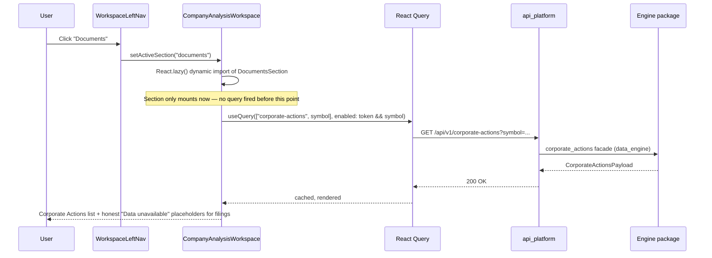

# Institutional Company Workspace

**Status:** Implemented · **Route:** `/analysis` (`CompanyAnalysisWorkspace`) · **Supersedes:** ad-hoc per-engine dashboards as the flagship search-landing screen (`/search` redirects here)

This document describes the Company Workspace — the single institutional-grade screen a user lands on after searching any company. It is an **orchestration layer only**: every insight it shows is computed by an existing engine package and reused as-is. See [`docs/DSP_AI_INDICATOR_ARCHITECTURE.md`](./DSP_AI_INDICATOR_ARCHITECTURE.md) §8 for how this fits the platform architecture, and that document's §3 for what each underlying engine does.

---

## 1. Architecture

```mermaid
flowchart TB
    subgraph frontend ["apps/web — /analysis (CompanyAnalysisWorkspace)"]
        Header[CompanyHeaderBar]
        NavTabs[WorkspaceLeftNav — 20+ sections]
        CoreSections["Overview / Financials / Valuation / Business / Management / Moat / Risk"]
        NewSections["Peers / Ownership / Documents / News / AI Copilot / Settings"]
        Export[ExportSection — Downloads tab]
    end

    subgraph coreApi ["api_platform — single aggregated call"]
        Analyse["POST /api/v1/analyse"]
    end

    subgraph perSectionApi ["api_platform — independently lazy-loaded"]
        MarketApi["GET /api/v1/market/quote"]
        FundApi["GET /api/v1/fundamentals/statements"]
        CorpActionsApi["GET /api/v1/corporate-actions"]
        CompareApi["POST /api/v1/compare"]
        CopilotApi["POST /api/v1/copilot/complete"]
        ResearchApi["POST /api/v1/research/{object,report,export}"]
    end

    subgraph engines ["Existing engine packages — reused as-is, zero new algorithms"]
        Valuation[valuation: DCF / Reverse-DCF / RI / EPV / Graham / Asset / Relative / Consensus / Sensitivity]
        Moat[economic_moat]
        Mgmt[management_quality]
        Risk["risk + quantitative_risk via dsp_platform.composition Risk stage"]
        Comparison["comparison.QualitativeComparisonEngine + industry.peer_registry"]
        AiCommittee[ai_committee]
        CopilotPkg[copilot]
        ExportEngine[dsp_platform.institutional_export]
    end

    Header --> MarketApi
    Header --> FundApi
    CoreSections --> Analyse
    Analyse --> Valuation
    Analyse --> Moat
    Analyse --> Mgmt
    Analyse --> AiCommittee
    Analyse --> Risk

    NewSections --> CorpActionsApi
    NewSections --> CompareApi
    CompareApi --> Comparison
    NewSections --> CopilotApi
    CopilotApi --> CopilotPkg
    Export --> ResearchApi
    ResearchApi --> ExportEngine
```

**Data-fetch strategy (hybrid, by design):**

- The single `POST /analyse` call remains the source for everything it already aggregates: Executive Summary, Valuation, Business Quality, Management, Economic Moat, Financial Performance, Risk, and the AI Committee decision. This avoids re-deriving or duplicating any calculation client-side.
- Genuinely new, independently-cacheable concerns (live market header fields, Peers, AI Copilot chat, Corporate Actions inside Documents) get their own small endpoints and their own React Query hooks, so they can lazy-load and cache independently of the main analyse payload.

---

## 2. Page layout

| Region | Component | Notes |
|---|---|---|
| Header | `CompanyHeaderBar` (in `WorkspaceChrome.tsx`) | Company identity from the analyse request + local catalogue metadata, plus a live market snapshot (Current Price, Daily Change, Market Cap, 52-week range, Dividend Yield, ROE) sourced from `GET /market/quote` and `GET /fundamentals/statements`. P/E and P/B are rendered as "Data unavailable" — no backend ratio exists for them yet; no client-side derivation was added. |
| Left navigation | `WorkspaceLeftNav.tsx` | Company search, workspace section list (keyboard shortcuts `1`–`9`, `0`, and letter shortcuts for the rest), a "Deep dive" sub-list, recent/pinned companies, and search history. |
| Main content | Section components, switched by `activeSection` in `useWorkspacePrefsStore` | See §3 for the full section → component → data-source table. |
| Context panel | Right-hand panel in `CompanyAnalysisWorkspace.tsx` | Quick facts / shortcuts; independent of the main section switch. |

---

## 3. Section → component → API map

All section ids and metadata live in [`apps/web/src/lib/company-analysis/sections.ts`](../apps/web/src/lib/company-analysis/sections.ts) (`ANALYSIS_SECTIONS`). `lazy: true` sections are not rendered (and therefore fetch nothing) until the user activates that tab — enforced structurally, because `CompanyAnalysisWorkspace.tsx` only mounts a section's component when `activeSection` matches, and each lazy section is itself a `React.lazy()`-wrapped dynamic import.

| Section id | Label | Component | Reused engine / data source |
|---|---|---|---|
| `summary` | Executive Summary | `SummarySection` (`WorkspaceSections.tsx`) + `CompanyHeaderBar` | `POST /analyse` (AI summary, thesis, confidence, rating) + `GET /market/quote`, `GET /fundamentals/statements` |
| `valuation` | Valuation | `ValuationSection` | `POST /analyse` → `valuation` package (DCF, Reverse DCF, Residual Income, EPV, Graham, Asset, Relative, Consensus, Sensitivity, Margin of Safety) |
| `quality` | Business Quality | `WorkspaceSections.tsx` | `POST /analyse` → `business_quality` / `business_quality_aggregator` |
| `management` | Management | `WorkspaceSections.tsx` | `POST /analyse` → `management_quality` |
| `moat` | Economic Moat | `WorkspaceSections.tsx` | `POST /analyse` → `economic_moat` |
| `risk` | Risk | `RiskSection` (`FlagshipSections.tsx`) | `POST /analyse` → `dsp_platform.composition` **Risk stage** (structural aggregation of `financial_strength` + `economic_moat`; see architecture doc §8.1) |
| `financial` | Financial Performance | `WorkspaceSections.tsx` | `POST /analyse` → `financial_strength` / `growth_quality` |
| `ai` | AI Committee | `WorkspaceSections.tsx` | `POST /analyse` → `ai_committee` |
| `ownership` | Ownership | `sections/OwnershipSection.tsx` | No data source anywhere in the platform yet — honest "Data unavailable" empty state; links to Management for the overlapping Capital Allocation/Governance fields instead of duplicating them |
| `peers` | Peers | `sections/PeersSection.tsx` | `POST /analyze/company` (per symbol, `as_decision_pack=true`) → `POST /compare` → `comparison.QualitativeComparisonEngine` + `industry.PeerEligibilityEvaluator` |
| `copilot` | AI Copilot | `sections/AiCopilotSection.tsx` | `POST /copilot/complete` (live backend AI engine — not a client template), scoped to the loaded analyse request/response via `market_context` |
| `documents` | Documents | `sections/DocumentsSection.tsx` | `GET /corporate-actions` (real) + honest empty states for Annual Reports / Quarterly Results / Investor Presentations / Conference Calls (no filings data source exists yet) |
| `news` | News | `sections/NewsSection.tsx` | No news data source anywhere in the platform — honest empty state |
| `settings` | Settings | `sections/SettingsSection.tsx` | `useWorkspacePrefsStore` (theme, panel visibility, session-local notes/tags) |
| `export` | Downloads | `ExportSection` (`WorkspaceSections.tsx`) | Client-side JSON/CSV/HTML+print (mapped fields only) **plus** `POST /research/object` → `POST /research/report` → `POST /research/export` (format `docx`/`pptx`) against `dsp_platform.institutional_export` |
| `explainability`, `evidence`, `timeline`, `ratings`, `valuationTransparency`, `research`, `buffett`, `compliance` | — | Pre-existing deep-dive sections, unchanged by this work | `POST /analyse` |

---

## 4. API surface

### 4.1 Reused as-is (already mounted)

- `POST /api/v1/analyse` — the single aggregated company-intelligence call.
- `POST /api/v1/copilot/complete`, `/copilot/chat`, `/copilot/stream` — live AI Investment Copilot.
- `POST /api/v1/analyze/company` — produces a `DecisionPack`, used by Peers to build comparable reports.

### 4.2 Newly mounted (routers existed, tested, but were never imported into `app.py`)

`packages/api_platform/src/api_platform/api/app.py` now imports and registers these into `_register_routers`'s `versioned` list (both unversioned and `/api/v1`-prefixed, per the existing pattern):

`market`, `fundamentals`, `historical`, `corporate_actions`, `data`, `research`, `research_monitoring`, `decision_workspace`, `portfolio_intelligence`, `institutional_committee`, `institutional_workflow`, `investment_policy`, `persistence`.

For the Workspace specifically, this unlocks:

- `GET /api/v1/market/quote` — header live price/change/market-cap/52-week range/dividend yield.
- `GET /api/v1/fundamentals/statements` — header ROE and other latest-period ratios.
- `GET /api/v1/corporate-actions` — real events inside the Documents tab.
- `POST /api/v1/research/object`, `/research/report`, `/research/export` — institutional report generation and multi-format export (JSON/CSV/XLSX/PDF/**DOCX**/**PPTX**).

Each of these previously returned `404`; they are otherwise untouched — no new logic was added to any of them.

### 4.3 Newly wired (endpoint existed as a stub; composition-root DI completed)

- `POST /api/v1/compare` — previously returned `ok: false` because no `QualitativeComparisonEngine` was ever injected into `DSPPlatform`. `DSPPlatform.compare_companies` now lazily resolves (and caches) a default engine via `dsp_platform.comparison_engine.build_default_comparison_engine()`, seeded from `industry.peer_seeds`. Request shape: `{"report_ids": [...], "allow_related": bool, "allow_limited": bool}`, where `report_ids` reference `DecisionPack` reports already produced by `POST /analyze/company`. Results for the default engine are cached for 300s via the existing `data_engine.cache.InMemoryCache` (no new cache mechanism).

### 4.4 New composition stage (not a new endpoint — a new field in the existing `/analyse` payload)

- `payload.risk` — the Risk composition stage described in the architecture addendum §8.1. Structural aggregation only; no new risk-scoring algorithm.

### 4.5 New export formats (same endpoint, new formats)

- `POST /research/export` now additionally accepts `format: "docx"` and `format: "pptx"`, implemented in `dsp_platform/institutional_export/formats/{docx,pptx}_export.py` using only the standard library (`zipfile` + hand-rolled OOXML), mirroring the existing `pdf_export.py`/`xlsx` writers. No third-party document libraries were introduced.

---

## 5. Sequence diagram — loading a lazy tab

The same pattern applies to every `lazy: true` section: the component (and therefore its query) does not exist in the React tree until `activeSection` matches, which is what the lazy-load test in `company-analysis.test.tsx` (`"does not fire a new lazy section's queries until it becomes active"`) asserts.

---

## 6. Component guide — adding a new section

1. **Register the section id** in [`apps/web/src/lib/company-analysis/sections.ts`](../apps/web/src/lib/company-analysis/sections.ts): add the id to `AnalysisSectionId` and an entry to `ANALYSIS_SECTIONS` (set `lazy: true` unless the section must be visible immediately, like `summary`/`export`).
2. **Add it to the left nav filter** in `WorkspaceLeftNav.tsx` (`ANALYSIS_SECTIONS.filter(...)`) so it renders as a nav button.
3. **Build the component** under `apps/web/src/components/company-analysis/sections/YourSection.tsx`:
   - Accept `{ view: ResearchView }` at minimum (reuse `SectionCard`, `FieldRow`, `WorkspaceEmpty` from `WorkspacePrimitives.tsx`).
   - If it needs its own data, use its own `useQuery`/`useMutation` — do not thread new fields onto `/analyse`.
   - If no backend data source exists, render `WorkspaceEmpty` / `"Data unavailable — no data source connected."` — never mock data.
4. **Wire it into `CompanyAnalysisWorkspace.tsx`**: add a `React.lazy()` import next to the others, then a conditional render. For sections that only need `view`, use the existing `LazyViewSection` helper; for sections needing extra props (like `AiCopilotSection`'s raw analyse request/response), wrap in `<Suspense fallback={<SectionFallback />}>` directly.
5. **Test it**: add a case to `apps/web/src/components/company-analysis/sections/sections.test.tsx` (or a new file) mocking `@/lib/api/client` and `@/lib/auth/AuthProvider`, rendering with a `QueryClientProvider`.
6. **Never duplicate a calculation.** If the data already exists somewhere in the `/analyse` payload or another engine's public API, reuse it — do not recompute it in the component.

---

## 7. Testing

- **Backend:** `packages/dsp_platform/tests/test_composition_risk_view.py`, `test_composition_pipeline.py` (Risk stage); `test_comparison_engine.py` (compare wiring + cache); `test_institutional_export.py` (docx/pptx round-trip); `packages/api_platform/tests/test_api.py::TestCompareWorkflowCopilot` and the per-router test files (`test_market_api.py`, `test_fundamentals_api.py`, `test_corporate_actions_api.py`, `test_data_api.py`, `test_historical_api.py`, `test_research_api.py`, `test_decision_workspace_api.py`, …) confirm the newly-mounted routers return `200` instead of `404`.
- **Frontend component tests:** `apps/web/src/components/company-analysis/sections/sections.test.tsx` (Peers, AI Copilot, Ownership, Documents, News, Settings), `WorkspaceSections.export.test.tsx` (DOCX/PPTX export flow), `company-analysis.test.tsx` (section registry, Risk mapping, lazy-load assertion).
- **Lazy-load / performance:** `company-analysis.test.tsx` → `"does not fire a new lazy section's queries until it becomes active"` asserts a lazy section's query mock is not called until its tab is selected.
- **End-to-end smoke:** `apps/web/e2e/browser/company-workspace.smoke.spec.ts` tabs through every section in the live left nav (14+ buttons) against a running app and asserts no uncaught page errors and no 5xx responses.

---

## 8. Explicit non-goals

No new valuation, research, moat, management, or risk-scoring algorithm was introduced by this work. No new data ingestion exists for Ownership/insider transactions, News, or filings/Documents (Annual Reports, Quarterly Results, Investor Presentations, Conference Calls) — these are honest, wired empty states pending a future data-connector sprint that would follow the existing `MarketDataPort` pattern in `data_engine`.
