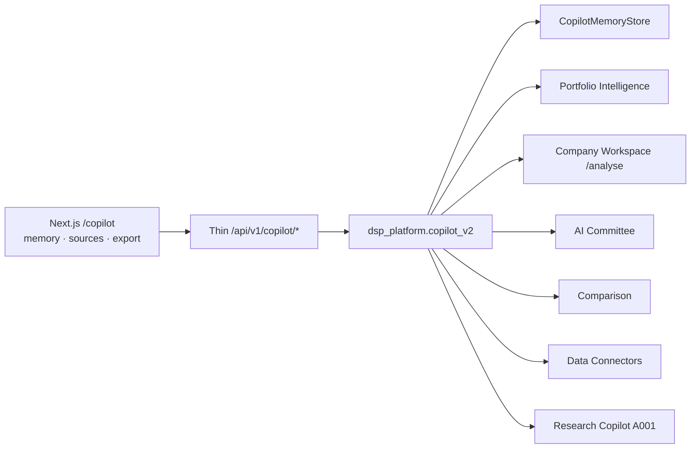
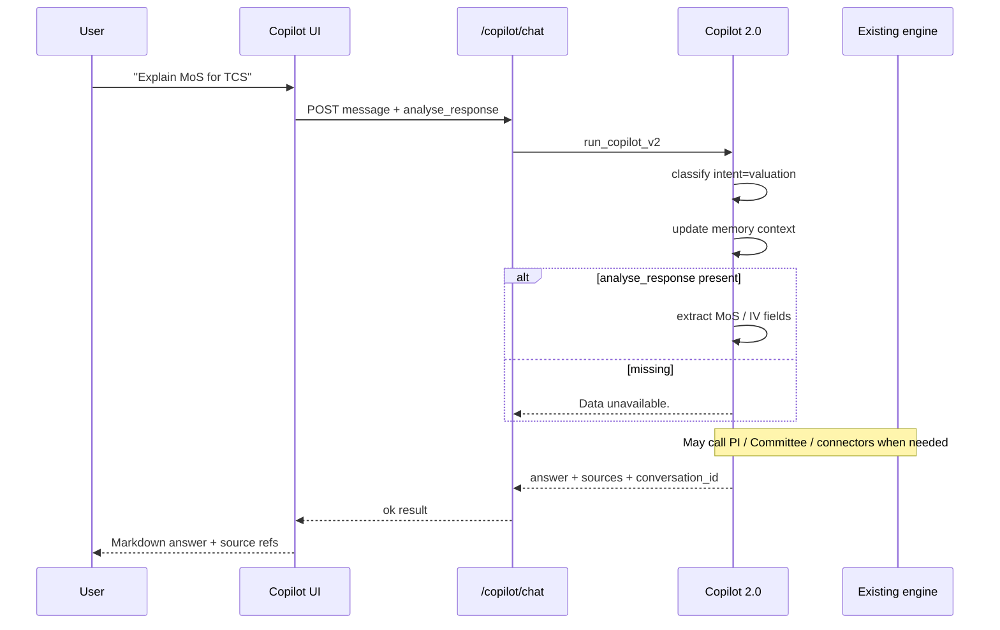

# RC1 Milestone 7 — AI Research Copilot 2.0

| | |
|---|---|
| **Status** | Implemented (orchestration / explanation only) |
| **Rule** | Never calculate independently; never invent numbers |

## 1. Purpose

Copilot 2.0 is the single conversational interface for DSP AI Indicator. It
**routes** questions to existing engines and **explains** their outputs. It does
not replace Company Workspace, Valuation, Committee, Risk, Portfolio
Intelligence, Comparison, Documents, or Export.

## 2. Capabilities → engines

| Capability | Mode | Reuse |
|---|---|---|
| Company Analysis | `company` | Analyse payload / Research Copilot / data bundle |
| Valuation Explanation | `valuation` | Analyse / research valuation fields |
| AI Committee | `committee` | `run_institutional_committee` / analyse summary |
| Risk | `risk` | Analyse risk + Portfolio Intelligence |
| Portfolio | `portfolio` | `evaluate_portfolio_intelligence` |
| Comparison | `comparison` | Dual analyse payloads / comparison result |
| Documents Q&A | `document` | Filings / news / transcripts connectors |
| Investment Memo | `memo` | Assembles existing sections only |
| Bull/Base/Bear | `scenarios` | Committee outputs |
| Explain like Buffett | `buffett` | Plain-language wrap — no new figures |

## 3. Architecture

## 4. Conversation flow

## 5. Context memory

`CopilotMemoryStore` retains per conversation:

- Current company / symbols
- Current portfolio id
- Previous questions
- Previous comparisons
- Selected valuation pointer
- Current workspace

Turns store metadata only — never mutable research payloads (J0.0A freeze).

## 6. APIs

| Method | Path |
|---|---|
| GET | `/copilot/schema` |
| POST | `/copilot/chat` |
| POST | `/copilot/company` |
| POST | `/copilot/portfolio` |
| POST | `/copilot/valuation` |
| POST | `/copilot/comparison` |
| POST | `/copilot/document` |
| GET | `/copilot/history` |
| GET | `/copilot/history/{id}` |
| DELETE | `/copilot/history/{id}` |

Legacy retained: `/copilot/complete`, `/copilot/stream`, `/copilot/providers`,
and J1 `context_ref` chat when `message` is absent.

## 7. Honesty

If required engine data is missing → **Data unavailable.**  
No estimates, no hallucinations, no browser valuation.

## 8. Frontend

Reuse `/copilot` shell. Improvements:

- Server conversation memory note
- Suggested questions for M7 modes
- Source references on assistant bubbles
- Lightweight Markdown headings / tables
- Export conversation Markdown
- Delete conversation (local + server)

## 9. Tests

- `packages/dsp_platform/tests/test_copilot_v2.py`
- `packages/api_platform/tests/test_copilot_v2_api.py`
- `apps/web/src/lib/copilot/copilot-v2.test.tsx`
- Playwright smoke includes `/copilot`
