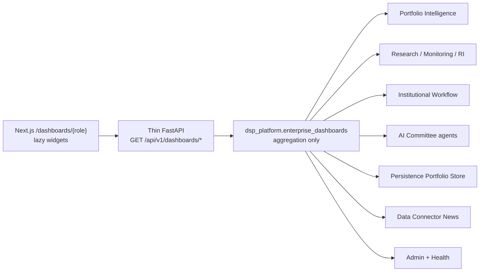
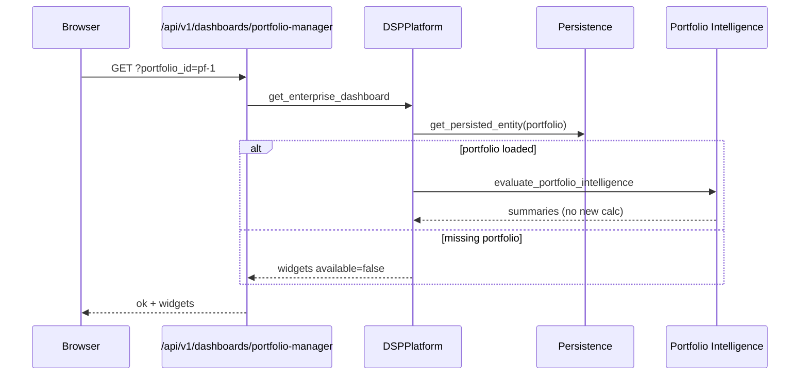

# RC1 Milestone 6 — Enterprise Dashboards

| | |
|---|---|
| **Status** | Implemented (aggregation-only) |
| **Scope** | Role-specific dashboards over frozen `/api/v1` engines |
| **Non-goals** | New valuation, scoring, recommendation, or browser AI |

## 1. Purpose

Enterprise Dashboards give each institutional role a focused surface without
duplicating Portfolio Intelligence, Research Engine, Workflow Automation, AI
Committee, or Portfolio Store logic. Every widget is an aggregation of an
existing engine response. Missing inputs render **Data unavailable.**

## 2. Roles

| Role | Path | Primary reuse |
|---|---|---|
| Research Analyst | `/dashboards/research` | Research Engine, Monitoring, Committee, News |
| Portfolio Manager | `/dashboards/portfolio-manager` | Portfolio Intelligence |
| Wealth Advisor | `/dashboards/wealth-advisor` | Portfolio Store, Workflow Automation |
| Family Office | `/dashboards/family-office` | Portfolio Store, Portfolio Intelligence |
| Executive | `/dashboards/executive` | Admin KPIs, Health, Workflow |

The legacy `/dashboard` Institutional Executive Dashboard remains unchanged.

## 3. Architecture



### Rules

- No duplicated calculations
- No invented health/opportunity/performance scores
- Thin routers only — validate query params, delegate to `DSPPlatform`
- Thin client — `apps/web` calls `/api/v1` only

## 4. APIs

Base: `/api/v1` (root aliases also mounted)

| Method | Path | Notes |
|---|---|---|
| GET | `/dashboards/schema` | Roles, rules, engine reuse list |
| GET | `/dashboards/research` | Optional `symbols`, `watchlist_id`, `workflow_id` |
| GET | `/dashboards/portfolio-manager` | Optional `portfolio_id`, `symbols`, `watchlist_id` |
| GET | `/dashboards/wealth-advisor` | Optional `portfolio_id`, `client_portfolio_ids`, `workflow_id` |
| GET | `/dashboards/family-office` | Optional `portfolio_id`, `symbols` |
| GET | `/dashboards/executive` | Optional `workflow_id` |

Response envelope:

```json
{
  "ok": true,
  "result": {
    "role": "research",
    "generated_at": "...",
    "widgets": {
      "recent_news": {
        "available": false,
        "source": "data_connector_news",
        "data": null,
        "message": "Data unavailable."
      }
    },
    "provenance": {
      "aggregation_only": true,
      "calculations_performed": false
    }
  },
  "message": null
}
```

## 5. Frontend

- Index: `/dashboards`
- Role pages: `/dashboards/[role]`
- Components: `RoleDashboard`, `DashboardSectionCard` (lazy)
- Reuses `DashboardWidgetShell` / `WidgetUnavailable`
- Feature flag: `NEXT_PUBLIC_ENTERPRISE_DASHBOARDS` (default on)

## 6. Sequence (Portfolio Manager)



## 7. Compliance

| Control | Behaviour |
|---|---|
| CV-001 | No fabricated numbers |
| CV-002 | Source before score — PI pass-through only |
| CV-005 | Prefer Data unavailable. / Unable to calculate. |
| Thin client | No valuation / AI in the browser |

## 8. Tests

- Unit: `packages/dsp_platform/tests/test_enterprise_dashboards.py`
- API: `packages/api_platform/tests/test_dashboards_api.py`
- Frontend: `apps/web/src/lib/dashboards/enterprise-dashboards.test.tsx`
- Playwright smoke: `/dashboards` and each role path
