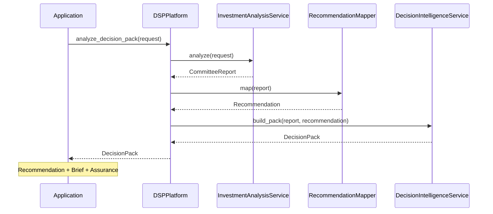
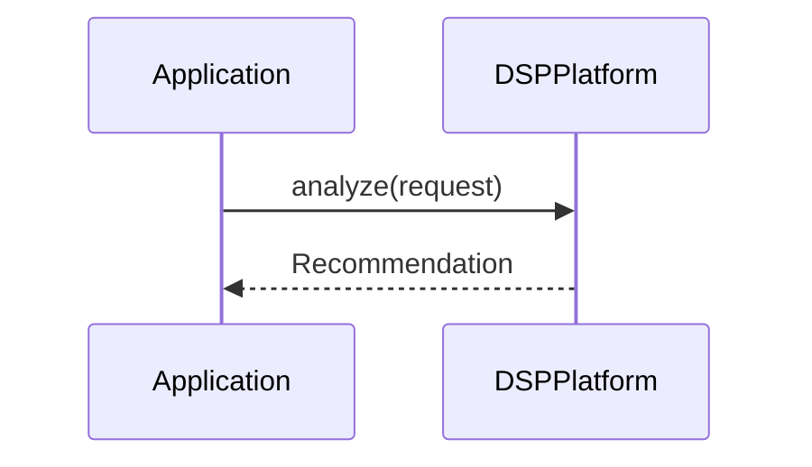

# Decision Pack sequence

Primary investor-facing delivery path (Phase B2).

```mermaid
sequenceDiagram
    participant App as Application
    participant Plat as DSPPlatform
    participant Orch as InvestmentAnalysisService
    participant Map as RecommendationMapper
    participant DI as DecisionIntelligenceService

    App->>Plat: analyze_decision_pack(request)
    Plat->>Orch: analyze(request)
    Orch-->>Plat: CommitteeReport
    Plat->>Map: map(report)
    Map-->>Plat: Recommendation
    Plat->>DI: build_pack(report, recommendation)
    DI-->>Plat: DecisionPack
    Plat-->>App: DecisionPack
    Note over App: Recommendation + Brief + Assurance
```

Backward-compatible path:

```mermaid
sequenceDiagram
    participant App as Application
    participant Plat as DSPPlatform

    App->>Plat: analyze(request)
    Plat-->>App: Recommendation
```
