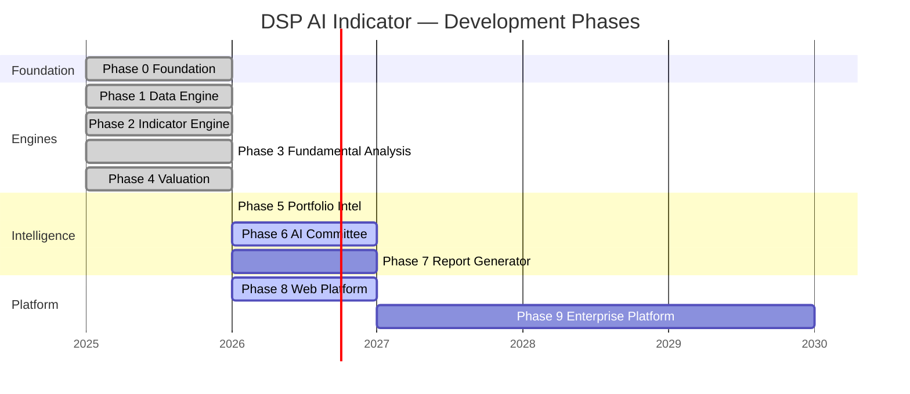
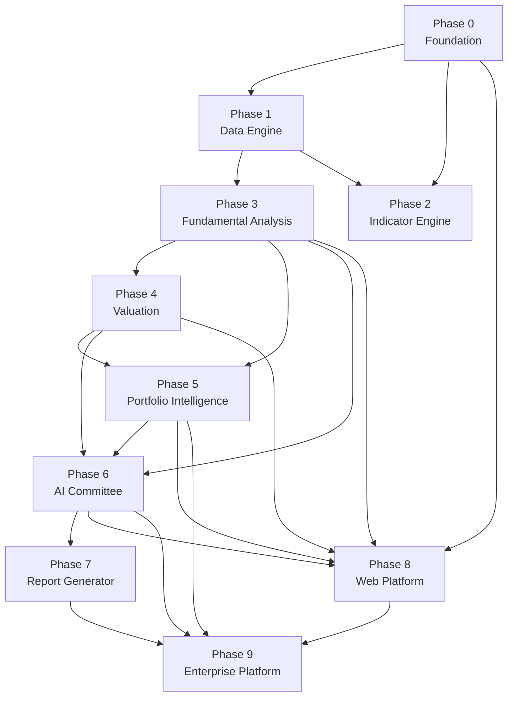

# Development Roadmap — DSP AI Indicator

| Field | Value |
|---|---|
| **Version** | `1.0.0` |
| **Status** | **Active** (Living) |
| **Last updated** | 2026-07-27 |
| **Audience** | Engineering leads · product · program management |
| **Companion** | Epic status board → [DSP_ROADMAP.md](DSP_ROADMAP.md) · Living status → [DSP_STATUS.md](DSP_STATUS.md) |

---

## Roadmap Overview

---

## Phase 0 — Foundation

| Field | Value |
|---|---|
| **Status** | **Complete** |
| **Complexity** | Medium |

### Objectives

Establish the monorepo, shared kernel, platform composition pattern, documentation suite, CI quality gates, and architecture stabilization framework.

### Deliverables

| Deliverable | Status |
|---|---|
| `contracts` shared kernel | ✓ Complete · Frozen |
| `core` technical foundation | ✓ Complete · Frozen |
| `dsp_platform` composition façade | ✓ Complete · Active |
| `orchestration` analysis pipeline | ✓ Complete · Frozen |
| `compliance` mode & terminology ports | ✓ Complete · Frozen |
| Monorepo packaging (`pyproject.toml` per package) | ✓ Complete |
| DSP documentation suite (`DSP_*.md`) | ✓ Complete |
| ASI (Architecture Stabilization Initiative) | ✓ Closed |
| CI quality gates | ✓ Complete |
| Release engineering (REP-001) | ✓ Complete |

### Milestones

| # | Milestone | Date |
|---|---|---|
| M0.1 | Monorepo scaffold with package boundaries | 2025 |
| M0.2 | `dsp_platform` public façade operational | 2025 |
| M0.3 | ASI-001 through ASI-008 complete | 2026-07 |
| M0.4 | Architecture Stabilization Certificate issued | 2026-07 |

### Success Criteria

- Application imports only `dsp_platform` + `contracts`
- Architecture tests 30/30 PASS
- Package ownership matrix complete
- Documentation suite indexed and AI-loadable
- Regression GREEN on all protected modules

### Dependencies

None — greenfield foundation.

---

## Phase 1 — Data Engine

| Field | Value |
|---|---|
| **Status** | **Complete** |
| **Complexity** | High |

### Objectives

Build the data acquisition layer with provider adapters, normalization ports, and snapshot bridge for feeding all downstream engines.

### Deliverables

| Deliverable | Status |
|---|---|
| `data_engine` provider adapters | ✓ Complete · Frozen |
| `snapshot_bridge` statement/series mapping | ✓ Complete · Frozen |
| Normalization ports (hexagonal) | ✓ Complete |
| Offline test fixtures | ✓ Complete |
| Provider registry | ✓ Complete |

### Milestones

| # | Milestone | Date |
|---|---|---|
| M1.1 | Provider port interfaces defined | 2025 |
| M1.2 | First adapter (offline/fixture) operational | 2025 |
| M1.3 | `snapshot_bridge` maps to engine inputs | 2025 |
| M1.4 | Data engine frozen | 2026 |

### Success Criteria

- Engines consume normalized snapshots without direct vendor imports
- Partial data scenarios handled gracefully (Unavailable, not fabricated)
- Offline E2E tests pass without network
- Provider registration validated by `PlatformHealthService`

### Dependencies

- Phase 0 (`contracts`, `core`)

### Future work

- Additional live provider adapters (filings, consensus, macro)
- Orphan `data-ingestion` scaffold resolution (ADR-ASI-002-002)

---

## Phase 2 — Indicator Engine

| Field | Value |
|---|---|
| **Status** | **Complete** |
| **Complexity** | Medium |

### Objectives

Implement the DSP indicator engine producing deterministic technical and signal-processing indicators from price and volume series.

### Deliverables

| Deliverable | Status |
|---|---|
| `dsp` indicator engine | ✓ Complete · Frozen |
| Filter library (smoothing, detrending) | ✓ Complete |
| Transform library (spectral, wavelet) | ✓ Complete |
| Indicator registry with metadata | ✓ Complete |
| Composite indicator pipelines | ✓ Complete |

### Milestones

| # | Milestone | Date |
|---|---|---|
| M2.1 | Core filter and transform modules | 2025 |
| M2.2 | Indicator catalog with parameter schemas | 2025 |
| M2.3 | Pipeline composition API | 2025 |
| M2.4 | DSP engine frozen | 2026 |

### Success Criteria

- Deterministic outputs for identical input series
- Each indicator carries source, parameters, and confidence metadata
- Unit tests for all registered indicators
- Integration with platform pipeline via orchestration

### Dependencies

- Phase 0 (`contracts`, `core`)
- Phase 1 (`data_engine`, `snapshot_bridge`)

---

## Phase 3 — Fundamental Analysis

| Field | Value |
|---|---|
| **Status** | **Complete** |
| **Complexity** | Very High |

### Objectives

Build comprehensive fundamental analysis covering financial statements, business quality, and FEATURE domain intelligence modules.

### Deliverables

| Deliverable | Status |
|---|---|
| `fundamental` company analysis engine | ✓ Complete · Frozen |
| `financial` statement intelligence (F2.1–F2.7) | ✓ Complete · Frozen · `0.7.0` |
| `business_quality` intelligence (F3.1–F3.7) | ✓ Complete · Frozen · `0.7.0` |
| `economic_moat` (FEATURE-001) | ✓ Complete · `0.2.0` |
| `management_quality` (FEATURE-002) | ✓ Complete · `0.1.0` |
| `financial_strength` (FEATURE-003) | ✓ Complete · `0.1.0` |
| `earnings_quality` (FEATURE-004) | ✓ Complete · `0.1.0` |
| `growth_quality` (FEATURE-005) | ✓ Complete · `0.1.0` |
| `business_quality_aggregator` (FEATURE-006) | ✓ Complete · `0.1.0` |
| `industry` identity & evidence framework | ✓ Complete · Frozen |
| `comparison` peer engine | ✓ Complete · Frozen |

### Milestones

| # | Milestone | Date |
|---|---|---|
| M3.1 | Financial domain models (F2.1) | 2025 |
| M3.2 | Financial intelligence aggregator (F2.7) | 2026 |
| M3.3 | Business quality framework (F3.1) | 2026 |
| M3.4 | Business quality aggregator (F3.7) | 2026 |
| M3.5 | FEATURE-001–006 domains complete | 2026-07 |
| M3.6 | Milestone `v2.0.0-financial-intelligence` | 2026 |
| M3.7 | Milestone `v3.0.0-business-quality` | 2026 |

### Success Criteria

- `FinancialEngine.analyze_financials()` produces full statement intelligence
- Business quality aggregator synthesizes cross-domain scores
- Each FEATURE domain has 15+ unit tests and ADR
- All engines produce evidence-backed outputs
- Milestone tags applied and frozen

### Dependencies

- Phase 0, Phase 1

---

## Phase 4 — Valuation

| Field | Value |
|---|---|
| **Status** | **Complete** |
| **Complexity** | Very High |

### Objectives

Implement multi-method intrinsic value estimation with shared valuation infrastructure, sensitivity analysis, and overall aggregation.

### Deliverables

| Deliverable | Status |
|---|---|
| `valuation` core infrastructure | ✓ Complete |
| DCF (V1.2) | ✓ Complete |
| Reverse DCF (V1.3) | ✓ Complete |
| Residual Income (V1.4) | ✓ Complete |
| Valuation core (V1.5) | ✓ Complete |
| EPV (V1.6) | ✓ Complete |
| Graham (V1.7) | ✓ Complete |
| DDM (V1.8) | ✓ Complete |
| Asset-Based (V1.9) | ✓ Complete |
| Relative (V1.10) | ✓ Complete |
| Consensus (V1.11) | ✓ Complete |
| Overall Aggregator (V1.12) | ✓ Complete · Enabled |
| Package frozen at `0.12.0` | ✓ Complete |

### Milestones

| # | Milestone | Date |
|---|---|---|
| M4.1 | Valuation core (ValuationResult, confidence, sensitivity) | 2025 |
| M4.2 | Primary models (DCF, Reverse DCF, RI) | 2025–2026 |
| M4.3 | Secondary models (EPV, Graham, DDM, Asset, Relative) | 2026 |
| M4.4 | Overall Aggregator enabled | 2026 |
| M4.5 | Valuation suite frozen | 2026 |

### Success Criteria

- Each method produces range (not point estimate) with confidence
- Sensitivity and scenario analysis available per method
- Overall Aggregator combines methods with explicit weighting rationale
- All valuation outputs include assumptions and limitations
- Deterministic: same inputs → same valuation envelope

### Dependencies

- Phase 0, Phase 1, Phase 3 (financial snapshots)

---

## Phase 5 — Portfolio Intelligence

| Field | Value |
|---|---|
| **Status** | **Complete** |
| **Complexity** | High |

### Objectives

Aggregate single-name research into portfolio-level intelligence — assembly, qualitative analysis, citation enrichment, validation, and monitoring.

### Deliverables

| Deliverable | Status |
|---|---|
| `portfolio` domain models (C4.1) | ✓ Complete · Frozen |
| Portfolio assembler (C4.2) | ✓ Complete · Frozen |
| Qualitative analysis (C4.3) | ✓ Complete · Frozen |
| Citation enrichment (C4.4) | ✓ Complete · Frozen |
| Validation & architecture freeze (C4.5) | ✓ Complete · Frozen |
| Portfolio monitoring (C4.6) | ✓ Complete · Frozen |
| `universe` multi-stock aggregation | ✓ Complete · Frozen |
| `risk` + `quantitative_risk` engines | ✓ Complete · Frozen |

### Milestones

| # | Milestone | Date |
|---|---|---|
| M5.1 | Portfolio domain models | 2026 |
| M5.2 | Portfolio assembler operational | 2026 |
| M5.3 | Architecture freeze (C4.0A) | 2026 |
| M5.4 | Risk intelligence architecture freeze (E0.0A) | 2026 |
| M5.5 | Portfolio monitoring | 2026 |

### Success Criteria

- Multi-holding Decision Pack aggregation works offline
- Portfolio-level risk and concentration metrics produced
- Citation trail preserved across portfolio artifacts
- Monitoring detects thesis drift and risk escalation
- Architecture tests pass for portfolio dependency direction

### Dependencies

- Phase 0, Phase 3, Phase 4
- Decision Pack pipeline (Phase 6 precursor)

---

## Phase 6 — AI Committee

| Field | Value |
|---|---|
| **Status** | **In Progress** — domains complete; platform composition pending |
| **Complexity** | High |

### Objectives

Implement deterministic multi-reviewer investment committee deliberation and recommendation mapping, distinct from legacy `ai_committee`.

### Deliverables

| Deliverable | Status |
|---|---|
| `investment_recommendation` (FEATURE-007) | ✓ Complete · `0.1.0` |
| `investment_committee` (FEATURE-008) | ✓ Complete · `0.1.0` |
| Five rule-based reviewers | ✓ Complete |
| Confidence-weighted consensus | ✓ Complete |
| Risk Officer soft veto | ✓ Complete |
| Agreement score & escalation flags | ✓ Complete |
| Platform composition (EPIC-001) | ⏳ Awaiting approval |
| `decision_intelligence` Decision Pack | ✓ Complete · Frozen |
| Legacy `ai_committee` | ✓ Frozen (untouched) |

### Milestones

| # | Milestone | Date |
|---|---|---|
| M6.1 | Investment recommendation domain (FEATURE-007) | 2026-07 |
| M6.2 | Investment committee consensus (FEATURE-008) | 2026-07 |
| M6.3 | Decision Pack pipeline (Brief + Assurance) | 2026 |
| M6.4 | Platform composition of FEATURE domains | Pending approval |
| M6.5 | `/api/v1` exposes committee output | Pending |

### Success Criteria

- 15+ tests PASS per FEATURE package
- Committee produces explainable consensus with dissent
- Decision Pack is primary investor artifact
- No LLM in Phase 1 committee (deterministic only)
- Platform wiring does not break frozen modules

### Dependencies

- Phase 3 (engine artifacts for deliberation)
- Phase 4 (valuation for recommendation context)
- Phase 5 (portfolio-level committee aggregation)

### Remaining technical debt

- TD-F015: Platform composition of `investment_committee`
- TD-F016: Tunable veto / additional reviewer roles

---

## Phase 7 — Report Generator

| Field | Value |
|---|---|
| **Status** | **Planned** |
| **Complexity** | Medium |

### Objectives

Produce investor-grade exportable reports (PDF/HTML) from Decision Pack envelopes with full citation trail, supporting all user personas.

### Deliverables

| Deliverable | Status |
|---|---|
| Export panel in Company Analysis Workspace | Partial (L1.x) |
| Decision Pack → PDF pipeline | Planned |
| Advisor presentation format (V2) | In progress (demo-flagged) |
| Evidence appendix generation | Planned |
| Portfolio review report template | Planned |
| Report section registry (plugin point) | Planned |

### Milestones

| # | Milestone | Target |
|---|---|---|
| M7.1 | Single-name PDF export from Decision Pack | Q3 2026 |
| M7.2 | Advisor presentation template (V2.5) | Q4 2026 |
| M7.3 | Portfolio review report | Q1 2027 |
| M7.4 | Evidence appendix with filing citations | Q1 2027 |
| M7.5 | Report section plugin registry | Q2 2027 |

### Success Criteria

- Exported PDF matches on-screen research content exactly
- Every number in report traceable to engine output or filing citation
- Research Mode language in all default exports
- Export completes in < 30 seconds for single-name report
- Portfolio report aggregates multi-name Decision Packs

### Dependencies

- Phase 6 (Decision Pack as source artifact)
- Phase 8 (export UX in web platform)
- Phase 3 (evidence bundles for appendix)

---

## Phase 8 — Web Platform

| Field | Value |
|---|---|
| **Status** | **In Progress** — EPIC-003 complete |
| **Complexity** | Very High |

### Objectives

Deliver the Intelligence Workspace — a thin-client web application presenting all engine outputs through the frozen 19-section Company Analysis flow.

### Deliverables

| Deliverable | Status |
|---|---|
| `apps/web` Next.js application | ✓ Active · `dsp-web 2.5.0` |
| Company Analysis Workspace (L1.2) | ✓ Largely delivered |
| 19-section frozen UX (PXB) | ✓ Frozen |
| Intelligence Workspace (EPIC-003) | ✓ Complete |
| `/api/v1` integration (EPIC-002) | ✓ Complete · `api_platform 0.2.0` |
| AI Copilot workspace (L1.3) | Planned |
| Portfolio workspace (L1.4) | Planned |
| Reports workspace (L1.5) | Planned |
| Mobile-responsive UX | ✓ Delivered |
| VLIS design system (PR1.2) | ✓ Frozen |

### Milestones

| # | Milestone | Date |
|---|---|---|
| M8.1 | PR1.0–PR1.2 UX freezes | 2026 |
| M8.2 | Company Analysis Workspace (L1.2) | 2026 |
| M8.3 | API platform RC `v1.0.0-rc1` | 2026 |
| M8.4 | EPIC-003 Intelligence Workspace | 2026-07 |
| M8.5 | AI Copilot workspace (L1.3) | Planned |
| M8.6 | Portfolio workspace (L1.4) | Planned |
| M8.7 | Reports workspace (L1.5) | Planned |

### Success Criteria

- Web vitest 14 PASS (EPIC-003)
- Zero investment math in TypeScript
- All numbers from `/api/v1` envelopes
- WCAG AA accessibility compliance
- Research Mode default on all screens
- Four-question rule satisfied on every section

### Dependencies

- Phase 0 (API platform, security platform)
- Phase 6 (Decision Pack for Decision Dashboard)
- All engine phases (data source for sections)

---

## Phase 9 — Enterprise Platform

| Field | Value |
|---|---|
| **Status** | **Future** |
| **Complexity** | Very High |

### Objectives

Transform DSP from a single-deployment research platform into a multi-tenant institutional cloud service with RBAC, audit, entitlements, and optional regulated research mode.

### Deliverables

| Deliverable | Status |
|---|---|
| Multi-tenant architecture | Planned |
| Organization-level RBAC | Planned |
| SSO / OAuth integration | Planned |
| Audit logging & data lineage | Planned |
| Entitlements (ticker, region, feature) | Planned |
| Cloud persistence (accounts, sync) | Planned |
| SEBI Mode activation (jurisdiction-dependent) | Architecture prepared |
| API marketplace for plugins | Planned |
| White-label deployment | Planned |
| Real-time monitoring & alerting | Planned |
| Horizontal scaling (K8s) | Planned |

### Milestones

| # | Milestone | Target |
|---|---|---|
| M9.1 | Multi-tenant data model | 2027 |
| M9.2 | SSO + RBAC | 2027 |
| M9.3 | Audit log & compliance dashboard | 2028 |
| M9.4 | Cloud persistence & sync | 2028 |
| M9.5 | SEBI Mode (if jurisdiction permits) | 2028 |
| M9.6 | API marketplace beta | 2029 |
| M9.7 | White-label advisor platform | 2030 |

### Success Criteria

- Tenant isolation verified by security audit
- All research queries and exports logged with user attribution
- 99.9% uptime SLA for API tier
- Horizontal scale to 1000+ concurrent users
- Compliance mode enforceable at organization level
- Zero cross-tenant data leakage

### Dependencies

- Phase 8 (stable web platform and API RC)
- Phase 7 (report generator for enterprise exports)
- Phase 6 (committee pipeline fully composed)
- Infrastructure epic (cloud, K8s, observability)

---

## Phase Dependency Graph

---

## Complexity Summary

| Phase | Complexity | Status |
|---|---|---|
| Phase 0 — Foundation | Medium | Complete |
| Phase 1 — Data Engine | High | Complete |
| Phase 2 — Indicator Engine | Medium | Complete |
| Phase 3 — Fundamental Analysis | Very High | Complete |
| Phase 4 — Valuation | Very High | Complete |
| Phase 5 — Portfolio Intelligence | High | Complete |
| Phase 6 — AI Committee | High | In Progress |
| Phase 7 — Report Generator | Medium | Planned |
| Phase 8 — Web Platform | Very High | In Progress |
| Phase 9 — Enterprise Platform | Very High | Future |

---

## Related Documents

| Document | Purpose |
|---|---|
| [DSP_ROADMAP.md](DSP_ROADMAP.md) | Epic-level status board |
| [DSP_STATUS.md](DSP_STATUS.md) | Living delivery status |
| [PROJECT_CHARTER.md](PROJECT_CHARTER.md) | Vision and 5-year horizon |
| [SYSTEM_ARCHITECTURE.md](SYSTEM_ARCHITECTURE.md) | System design |
| [VERSION_MATRIX.md](VERSION_MATRIX.md) | Package versions |
