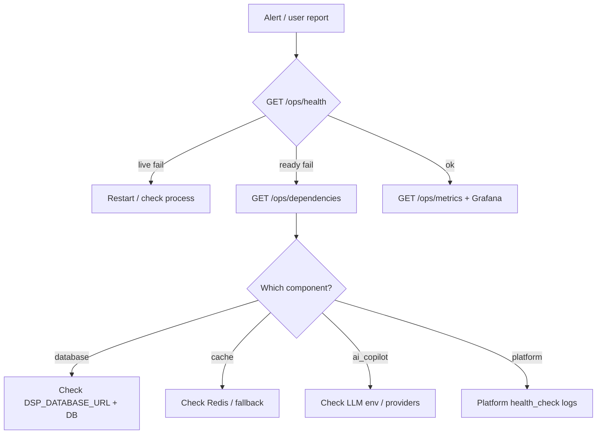

# Operations Runbook (RC1 Milestone 10)

## Triage flow

## Common checks

| Symptom | Action |
|---|---|
| 503 on ready | Inspect `/ops/dependencies` and infra notes |
| High latency | Grafana API latency panel; check DB/cache |
| Auth failures | Security headers/CORS; JWT secret rotation hooks |
| Copilot degraded | Lifecycle may be `degraded` — optional dependency |
| Backup status unavailable | Expected until BackupPort adapter wired — use shell scripts |

## Logging

- Prefer JSON logs with `correlation_id` / `X-Request-Id`
- Never log secrets or raw API key material
- Audit mutations via enterprise / security audit loggers

## Rollback

1. Helm/Kustomize previous revision (rolling update reverse)
2. Confirm `/ops/version` git_sha
3. Confirm `/health/ready` 200
4. Re-run `scripts/perf/rc1_m10_load_scenarios.py` on staging if needed
