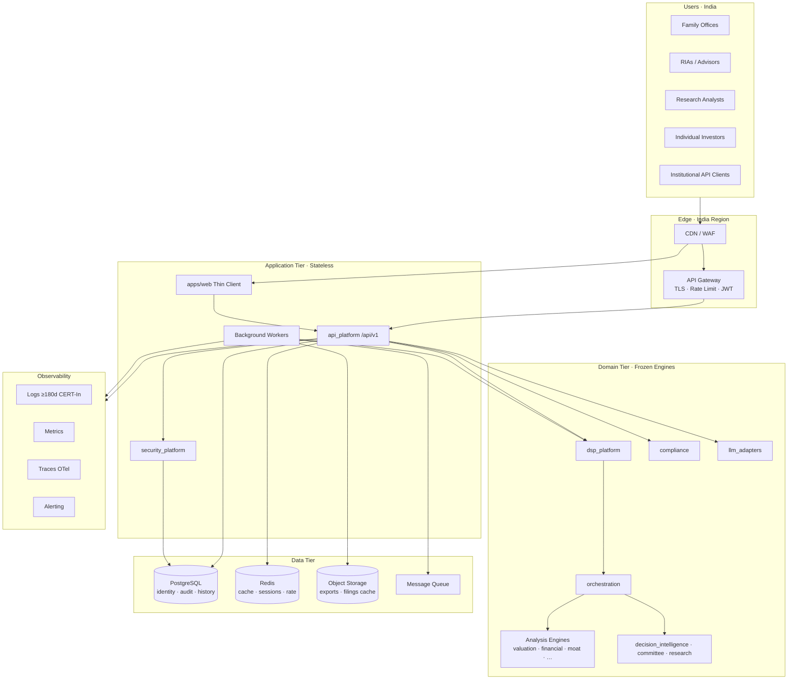
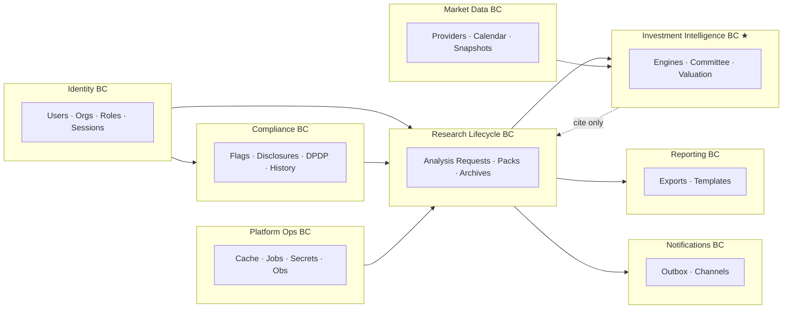
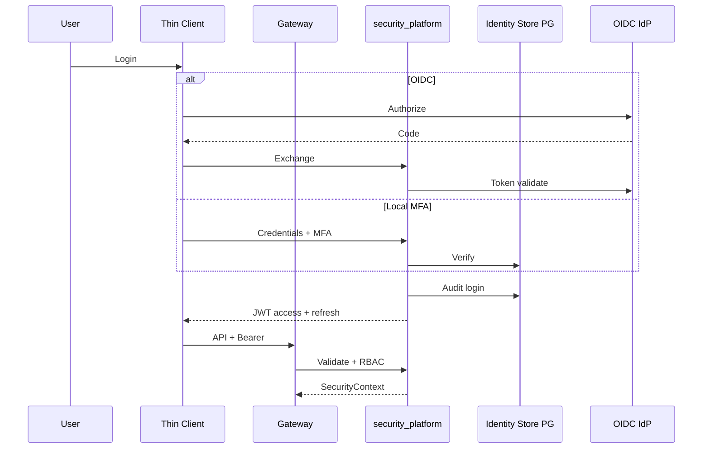
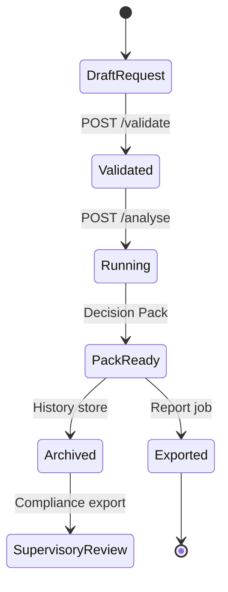

# PEP-000 — Enterprise Architecture Freeze

| Field | Value |
|---|---|
| **Version** | `1.0.0` |
| **Status** | **FROZEN** |
| **Effective** | 2026-07-27 |
| **Audience** | Architects · engineering · security · compliance · ops · AI agents |
| **Authority** | Governing document for all PEP-001…009 implementations |
| **Baseline** | [PLATFORM_EXCELLENCE_PROGRAM.md](PLATFORM_EXCELLENCE_PROGRAM.md) · [EPIC_016](EPIC_016_FINAL_PRODUCTION_READINESS_AUDIT.md) |
| **Companions** | [PEP_ARCHITECTURE_DECISIONS.md](PEP_ARCHITECTURE_DECISIONS.md) · [PEP_DEPENDENCY_RULES.md](PEP_DEPENDENCY_RULES.md) · [PEP_ENTERPRISE_ROADMAP.md](PEP_ENTERPRISE_ROADMAP.md) |

---

## Freeze Declaration

This document **freezes** the enterprise platform architecture for DSP AI Indicator for a **5–10 year** horizon.

| May change under PEP | Must NOT change under PEP |
|---|---|
| Adapters behind existing ports | Valuation / DCF / EPV / RI / Graham / DDM / Relative formulas |
| Identity, persistence, observability, tenancy | Financial / business quality / moat / committee scoring math |
| India compliance & ops controls | Thin-client rule (no browser investment math) |
| Infrastructure & deploy topology | `/api/v1` public contracts without versioned RC |
| Feature-flag presentation | AI overriding deterministic engine outputs |

**STOP rule:** Any PEP implementation that requires engine redesign, browser scoring, or silent API breaks → **STOP → ADR → escalate** ([DSP_DECISION_RECORDS.md](DSP_DECISION_RECORDS.md)).

---

## 1. Enterprise Architecture Diagram



---

## 2. Updated Layer Diagram

```text
┌─────────────────────────────────────────────────────────────────┐
│ L7  Presentation     apps/web · future mobile  (THIN CLIENT)    │
├─────────────────────────────────────────────────────────────────┤
│ L6  Edge             CDN · WAF · API Gateway · Edge rate limit  │
├─────────────────────────────────────────────────────────────────┤
│ L5  HTTP / Security  api_platform · security_platform           │
│                      (auth wraps HTTP; domain stays auth-free)  │
├─────────────────────────────────────────────────────────────────┤
│ L4  Platform Ops     production_platform adapters               │
│                      cache · secrets · scheduler · storage      │
├─────────────────────────────────────────────────────────────────┤
│ L3  Composition      dsp_platform · orchestration · compliance  │
├─────────────────────────────────────────────────────────────────┤
│ L2  Intelligence     decision_intelligence · recommendation     │
│                      investment_committee · research · copilot  │
│                      knowledge_graph · workflow · llm_adapters  │
├─────────────────────────────────────────────────────────────────┤
│ L1  Analysis Engines ★ FROZEN                                    │
│     valuation · financial · dsp · fundamental · economic        │
│     business_quality · FEATURE-* · portfolio · risk · industry  │
├─────────────────────────────────────────────────────────────────┤
│ L0  Foundation       contracts · core · data_engine             │
│                      snapshot_bridge · universe                 │
└─────────────────────────────────────────────────────────────────┘

★ L1 packages are PEP-immutable except via explicit unlocked epic + ADR.
```

---

## 3. Bounded Context Map



★ Investment Intelligence BC is **frozen**; other BCs adapt around it.

---

## 4. Context Relationships

| From | To | Relationship | Rule |
|---|---|---|---|
| Presentation | API | Customer–Supplier | HTTP `/api/v1` only |
| API | Identity | Conformist | JWT claims / security context |
| API | Investment Intelligence | Open Host | Façade `dsp_platform` |
| Research Lifecycle | Investment Intelligence | Customer–Supplier | Request in · Decision Pack out |
| Compliance | Presentation | Shared Kernel (flags) | Terminology remap only |
| Market Data | Engines | Anti-Corruption | Normalize at `data_engine` |
| LLM | Engines | **Forbidden upward** | LLM explains; never scores |
| Ops | All | Published Language | Correlation IDs, health |

---

## 5. Dependency Rules

Canonical PEP dependency rules live in [PEP_DEPENDENCY_RULES.md](PEP_DEPENDENCY_RULES.md).

**Invariants (summary):**
1. Domain engines never import `api_platform`, `security_platform`, web, DB drivers, or LLM SDKs.
2. `dsp_platform` does not import auth.
3. Web never contains investment math.
4. New enterprise packages depend **inward** only.
5. India adapters (NSE/BSE, DigiLocker, AA, etc.) live at the **edge** of Data / Identity BCs.

---

## 6. Infrastructure Architecture

| Component | Choice (India-first) | Port owner |
|---|---|---|
| Primary region | India (`ap-south-1` / Azure Central India / GCP Mumbai) | Deploy |
| Relational DB | Managed PostgreSQL | `production_platform` StoragePort |
| Cache / sessions / rate | Managed Redis | CachePort + security |
| Object storage | S3-compatible (region India) | StoragePort |
| Queue | Redis Streams / SQS / RabbitMQ (adapter) | SchedulerPort / new JobPort |
| Secrets | Cloud KMS + Secrets Manager | SecretsPort |
| Compute | Containers (Compose → K8s) | — |

Offline/dev: in-memory adapters remain valid for engine tests (PEP must not break offline GREEN).

---

## 7. Identity Architecture



**Roles (frozen vocabulary):** `ADMIN` · `ADVISOR` · `CLIENT` · `RESEARCHER` · `API` · `GUEST`  
**Future:** `COMPLIANCE_OFFICER` · `ORG_ADMIN` (additive; ADR required).

---

## 8. Observability Architecture

| Signal | Pipeline | Retention |
|---|---|---|
| Logs | Structured JSON → collector → store | **≥ 180 days** (CERT-In posture) |
| Metrics | Prometheus → Grafana | 90 days hot |
| Traces | OpenTelemetry → Tempo/Jaeger | 30 days |
| Audit | Append-only Postgres (+ optional WORM) | Policy-driven (compliance) |
| Clock | NTP / chrony | CERT-In sync |

Every request carries `X-Request-Id` / correlation ID end-to-end.

---

## 9. Compliance Architecture

```text
                    ┌──────────────────────┐
   Feature flags ──►│     compliance       │◄── disclosures / terminology
                    │  Research Mode DEF   │
                    │  SEBI Mode GATED     │
                    └──────────┬───────────┘
                               │
         ┌─────────────────────┼─────────────────────┐
         ▼                     ▼                     ▼
   DPDP Services        Recommendation         CERT-In Logging
   consent/purpose      History Store          retention/incident
   erasure/export       (supervisory)
```

| Mode | Default | Activation |
|---|---|---|
| Research Mode | **ON** | Always |
| Recommendation Mode | OFF | Explicit flag |
| SEBI Mode | OFF | Registration + legal epic + flags |

DPDP: purpose limitation, consent records, retention jobs, data principal rights APIs — **no** change to engine math.

---

## 10. Data Platform Architecture

```text
Providers (NSE/BSE/Yahoo/FRED/… adapters)
        ↓
data_engine ports  ──► bronze/silver (object store + PG metadata)
        ↓
snapshot_bridge
        ↓
★ FROZEN engines
        ↓
Decision Pack / stage summaries
```

**India services (architecture ports — not implementations):**
| Port | Purpose |
|---|---|
| `MarketCalendarPort` | NSE/BSE holidays · IST sessions |
| `IndiaQuotePort` / `IndiaFundamentalsPort` | Exchange data |
| `DematPort` | Future NSDL/CDSL |
| `DigiLockerPort` | Future document fetch |
| `PanVerificationPort` | Future KYC (minimize PII) |
| `UpiPort` / `OcenPort` / `AccountAggregatorPort` | Future fintech rails |

Engines consume **normalized snapshots only**.

---

## 11. AI Governance Architecture

```text
Engine outputs (deterministic, cited)
        ↓
copilot / llm_adapters  ← grounded prompts only
        ↓
Safety validation (no score override)
        ↓
UI: [AI Interpretation] badge + confidence
```

| Rule | Enforcement |
|---|---|
| LLM never writes engine scores | `llm_adapters.safety` + architecture tests |
| Prompt templates versioned | Prompt registry (PEP) |
| Provider failover → deterministic composer | Existing registry pattern |
| Research Mode language | `compliance` terminology |

---

## 12. Research Governance Architecture



Lifecycle metadata (who/when/mode/flags/pipeline_version) is durable; engine internals remain immutable artifacts cited by digest.

---

## 13. Deployment Architecture

| Environment | Region | Notes |
|---|---|---|
| `dev` | Local / optional India | Compose: api+web+pg+redis |
| `staging` | India | Prod-like security ON |
| `prod` | India primary | Multi-AZ DB; WAF; no default secrets |

Progression: Docker Compose → managed containers → Kubernetes when scale demands (not a day-1 requirement).

---

## 14. Security Architecture

| Control | Design |
|---|---|
| Transport | TLS 1.2+ |
| AuthN | OIDC and/or password+MFA |
| AuthZ | RBAC on gateway + `security_platform` |
| Rate limit | Edge primary; Redis secondary |
| Secrets | KMS; never in images |
| Headers | Existing security headers middleware |
| PII | Minimize; DPDP classification; no Aadhaar storage without dedicated legal epic |
| Thin client | No secrets / no investment math in browser |

---

## 15. Scalability Architecture

| Layer | Strategy |
|---|---|
| Web | CDN + static/SSR scale-out |
| API | Stateless horizontal pods |
| Analyse | Sync for interactive; async worker for heavy exports |
| Cache | Redis by `(instrument, as_of, config_hash, pipeline_version)` |
| DB | Primary + read replica when needed |
| Tenancy | Row-level isolation (PEP-007) |

Determinism enables safe caching and replay.

---

## 16. Disaster Recovery Architecture

| Metric | Initial target |
|---|---|
| RPO | ≤ 15 minutes (PITR) |
| RTO | ≤ 1 hour |
| Backups | Daily full + continuous WAL |
| Drill | Quarterly restore test |
| Failover | Multi-AZ Postgres; documented runbook |

Ephemeral-only mode remains for offline CI — **not** for production India.

---

## 17. Migration Strategy

Aligned with [PEP_ENTERPRISE_ROADMAP.md](PEP_ENTERPRISE_ROADMAP.md):

1. **Strangler adapters** — implement ports without changing façades.
2. **Dual-run** — in-memory + durable behind flags.
3. **Offline tests stay GREEN** — engines never require cloud.
4. **API compatibility** — additive fields only; breaks need new RC.
5. **Research Mode default** throughout migration.

---

## 18. Risk Analysis

| Risk | Severity | Mitigation |
|---|---|---|
| Engine freeze violation | Critical | PEP-000 STOP rule + arch tests |
| Premature SEBI activation | Critical | Flags + legal gate |
| DPDP gaps | High | PEP-004 before multi-tenant PII |
| Auth lockout | Medium | Dual auth window |
| Data residency | High | India-region primary |
| Vendor lock-in | Medium | Hexagonal ports |
| CERT-In non-compliance | High | 180d logs + NTP in Wave 1–2 |

---

## 19. Architecture Decisions (ADR)

Full register: [PEP_ARCHITECTURE_DECISIONS.md](PEP_ARCHITECTURE_DECISIONS.md).

---

## 20. Technology Recommendations

| Concern | Recommendation | Avoid |
|---|---|---|
| Language (domain) | Python 3.11+ (existing) | Rewrites |
| API | FastAPI `/api/v1` | Parallel public APIs |
| Web | Next.js thin client | Client scoring |
| DB | PostgreSQL | Engine-embedded DBs |
| Cache | Redis | Process-only in prod |
| Queue | Redis Streams or cloud SQS | Ad-hoc threads only |
| IdP | Keycloak / Azure AD / Google Workspace | Custom SSO from scratch |
| Obs | OTel + Prometheus + Grafana + Loki/ELK | Vendor-only lock-in without ports |
| Secrets | Cloud KMS | Secrets in git |
| Region | India | Default non-India prod |

---

## Quality Review Scores (Architecture Freeze)

| Dimension | Score | Notes |
|---|---:|---|
| Maintainability | **90** | Ports + frozen engines |
| Extensibility | **88** | Adapter model |
| Security | **85** (design) / **42** (as-built) | Design frozen; implement PEP-001 |
| Performance | **80** (design) | Cache + async planned |
| Scalability | **85** (design) | Stateless API |
| Compliance | **82** (design) / **55** (as-built) | DPDP/SEBI paths defined |
| Developer Experience | **86** | Offline engines preserved |
| Operational Excellence | **80** (design) | CERT-In + DR targets |
| Enterprise Readiness | **48** as-built → **≥80** target | Per PEP program |
| Indian Market Readiness | **36** as-built → **≥70** target | Per PEP program |

---

## Governance

| Rule | Detail |
|---|---|
| Document owner | Platform Architecture |
| Change control | ADR in `PEP_ARCHITECTURE_DECISIONS.md` + STATUS update |
| Implementation epics | PEP-001…009 must cite this freeze |
| AI agents | Load this file for any PEP work (with Master Protocol + STATUS) |

---

## Related

[PLATFORM_EXCELLENCE_PROGRAM.md](PLATFORM_EXCELLENCE_PROGRAM.md) · [DSP_ARCHITECTURE.md](DSP_ARCHITECTURE.md) · [SYSTEM_ARCHITECTURE.md](SYSTEM_ARCHITECTURE.md) · [AI_PRINCIPLES.md](AI_PRINCIPLES.md) · [USER_TRUST_STANDARD.md](USER_TRUST_STANDARD.md)
