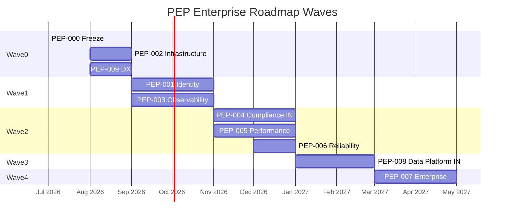

# PEP Enterprise Roadmap

| Field | Value |
|---|---|
| **Version** | `1.0.0` |
| **Status** | **Active** (Living) |
| **Last updated** | 2026-07-27 |
| **Authority** | [PEP_000_ENTERPRISE_ARCHITECTURE_FREEZE.md](PEP_000_ENTERPRISE_ARCHITECTURE_FREEZE.md) |
| **Program** | [PLATFORM_EXCELLENCE_PROGRAM.md](PLATFORM_EXCELLENCE_PROGRAM.md) |

---

## 1. Purpose

This roadmap sequences **implementation epics** PEP-001…009 under the PEP-000 freeze. It does not change investment engines or public API contracts except via additive, versioned changes.

---

## 2. North star

| Metric | Baseline | Target |
|---|---:|---:|
| Enterprise Readiness | 48 | ≥ 80 |
| Indian Market Readiness | 36 | ≥ 70 |
| Thin Client | 98 | ≥ 96 maintained |
| Engine freeze | Intact | Intact |
| Research Mode default | ON | ON |

---

## 3. Wave plan

Dates are indicative (±4 weeks) for a 4–6 engineer platform squad + counsel.

---

## 4. Initiative backlog (summary)

| ID | Name | Wave | Priority | Depends on | Exit criteria (abbrev.) |
|---|---|---|---|---|---|
| **PEP-000** | Architecture Freeze | 0 | P0 | — | This doc set published |
| **PEP-002** | Infrastructure | 0 | P0 | PEP-000 | Postgres+Redis India staging; compose profile |
| **PEP-009** | Developer Experience | 0 | P2 | PEP-002 | `india-dev` one-command up; OpenAPI gate |
| **PEP-001** | Identity & Security | 1 | P0 | PEP-002 | OIDC or password+MFA; durable audit; edge rate limit |
| **PEP-003** | Observability | 1 | P0 | PEP-002 | OTel; alerts; ≥180d log plan |
| **PEP-004** | Compliance India | 2 | P0 | PEP-001, PEP-002 | DPDP MVP; history store; CERT-In runbook; SEBI still gated |
| **PEP-005** | Performance | 2 | P1 | PEP-002 | Redis analyse cache; p95 SLO documented |
| **PEP-006** | Reliability | 2 | P1 | PEP-002 | Backup drill; RPO/RTO published |
| **PEP-008** | Data Platform India | 3 | P1 | PEP-002 | IST/holiday calendar; first NSE/BSE adapter ported |
| **PEP-007** | Enterprise Tenancy | 4 | P1 | PEP-001, PEP-004 | Org isolation + RLS tests |

Detailed initiative specs remain in [PLATFORM_EXCELLENCE_PROGRAM.md](PLATFORM_EXCELLENCE_PROGRAM.md).

---

## 5. Implementation rules per epic

Every PEP epic must:

1. Cite **PEP-000** + relevant **ADR-PEP-****  
2. Declare scope class: Infrastructure / Compliance / Presentation / Documentation — **never** Domain scoring  
3. Keep offline `pytest packages` GREEN without cloud  
4. Keep Vitest thin-client guards GREEN  
5. Prefer additive `/api/v1` fields; no silent breaks  
6. Update [DSP_STATUS.md](DSP_STATUS.md) and readiness scores on exit  
7. **Not** modify valuation / financial / committee / recommendation formulas  

---

## 6. India-first checkpoints

| Checkpoint | Gate |
|---|---|
| After Wave 0 | Data residency region selected; secrets not in git |
| After Wave 1 | Admin MFA; CERT-In logging design accepted |
| After Wave 2 | DPDP consent paths testable; Research Mode still default |
| After Wave 3 | Market calendar IST; filings/provider path for India symbols |
| After Wave 4 | Multi-org demo without cross-tenant leakage |

**Explicit non-implementations until separate legal epic:** Aadhaar storage, live UPI payments, DigiLocker production, NSDL/CDSL writes, OCEN/AA production — ports only under PEP-008/001.

---

## 7. Success scorecard (living)

| Wave exit | Enterprise | India | Notes |
|---|---:|---:|---|
| Now (PEP-000) | 48 | 36 | Freeze only |
| Wave 0 | ~55 | ~40 | Durable infra |
| Wave 1 | ~65 | ~48 | Identity + obs |
| Wave 2 | ~75 | ~62 | DPDP + DR + cache |
| Wave 3 | ~78 | ~70 | Market calendar/adapters |
| Wave 4 | ≥80 | ≥70 | Tenancy |

---

## 8. Risk register (roadmap-level)

| Risk | Wave | Mitigation |
|---|---|---|
| Infra delay blocks identity | 0–1 | Start Postgres schema early |
| Legal lag on DPDP | 2 | Parallel counsel from Wave 0 |
| Scope creep into engines | All | PEP-000 STOP + review checklist |
| Premature SEBI Mode | 2–4 | Flag lock + charter |
| Over-building fintech rails | 3 | Ports-only policy |

---

## 9. Handoff to implementation

Approved sequence to start coding (separate epics, not this freeze):

1. **PEP-002** Infrastructure epic brief  
2. Parallel **PEP-009** DX  
3. Then **PEP-001** / **PEP-003**

No implementation is authorized by PEP-000 alone beyond documentation.

---

## Related

[PLATFORM_EXCELLENCE_PROGRAM.md](PLATFORM_EXCELLENCE_PROGRAM.md) · [PEP_000_ENTERPRISE_ARCHITECTURE_FREEZE.md](PEP_000_ENTERPRISE_ARCHITECTURE_FREEZE.md) · [PEP_ARCHITECTURE_DECISIONS.md](PEP_ARCHITECTURE_DECISIONS.md) · [PEP_DEPENDENCY_RULES.md](PEP_DEPENDENCY_RULES.md) · [DEVELOPMENT_ROADMAP.md](DEVELOPMENT_ROADMAP.md) Phase 9
