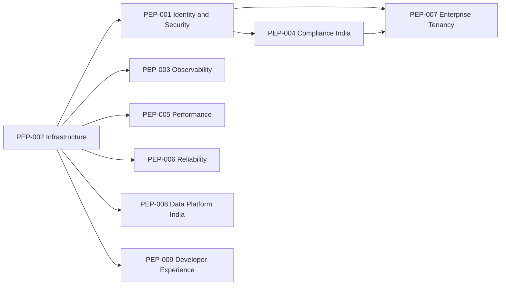

# Platform Excellence Program (PEP)

| Field | Value |
|---|---|
| **Version** | `1.0.0` |
| **Status** | **Active** (Planning) |
| **Last updated** | 2026-07-27 |
| **Audience** | Leadership · engineering · compliance · ops · security |
| **Scope** | Enterprise-grade platform hardening for **India** |
| **Constraint** | **No** investment-engine redesign · **No** API contract breaks · **No** code in this document |
| **Baseline** | Product GA approved ([EPIC_016](EPIC_016_FINAL_PRODUCTION_READINESS_AUDIT.md)) · Thin client restored ([EPIC_015](EPIC_015_THIN_CLIENT_REMEDIATION.md)) |
| **Architecture Freeze** | **[PEP_000_ENTERPRISE_ARCHITECTURE_FREEZE.md](PEP_000_ENTERPRISE_ARCHITECTURE_FREEZE.md)** — governing document for all PEP implementations |

---

## 1. Executive Summary

DSP AI Indicator has reached **production-ready investment intelligence** (deterministic engines, `/api/v1`, thin client, Research Mode default). That is **not** the same as **enterprise-grade** operation for Indian family offices, RIAs, research houses, and regulated intermediaries.

The Platform Excellence Program (PEP) transforms the platform from **Production Ready → Enterprise Grade** by hardening:

| Pillar | Intent |
|---|---|
| Security | Durable identity, SSO, enforced RBAC, secrets, edge rate limits |
| Infrastructure | Stateful India-region deploy, Postgres, Redis, workers |
| Observability | CERT-In–ready logs, metrics, tracing, alerting |
| Compliance | DPDP, SEBI/AMFI readiness, disclosures, recommendation history |
| Scalability | Horizontal API, async jobs, cache, multi-tenant isolation |
| Reliability | Backup, DR, SLOs, chaos/resilience drills |
| Operations | Runbooks, on-call, IST ops calendar, INR localization |

**Indian primacy:** every initiative is evaluated against SEBI Research Analyst / Investment Adviser expectations, AMFI adjacency, **DPDP Act 2023**, **CERT-In** logging, IST/INR UX, and future NSE/BSE · NSDL/CDSL · UPI · DigiLocker · Aadhaar/PAN **interfaces** (architecture ports only until separately approved).

**Non-goals:** new valuation methods, scoring changes, browser investment math, premature SEBI Mode activation without registration.

---

## 2. Enterprise Readiness Score

| Dimension | Score | Rationale |
|---|---:|---|
| Product / domain engines | **94** | EPIC-016 GA baseline |
| Thin client | **98** | EPIC-015 |
| Identity & access | **42** | In-memory users; passwordless login; OIDC port only |
| Durable persistence | **28** | Ephemeral ReportStore / localStorage |
| Observability | **48** | Health + Prometheus scrape; no OTel / SIEM |
| Compliance operations | **55** | Research/SEBI flags strong; DPDP absent |
| Multi-tenant / enterprise IAM | **20** | Not implemented |
| DR / backup | **25** | Redeploy-only per RC1 ops handbook |
| India localization (IST/INR ops) | **40** | INR/NSE awareness; UTC defaults; no holiday calendar |
| **Enterprise Readiness (overall)** | **48 / 100** | Product strong · platform ops weak |

---

## 3. Indian Market Readiness Score

| Dimension | Score | Notes |
|---|---:|---|
| Research Mode / disclosure architecture | **85** | Flag-gated; SEBI Mode designed, not activated |
| INR / NSE·BSE taxonomy awareness | **60** | Domain enums + demos; not full market integration |
| IST / India calendar / holidays | **25** | UTC-centric |
| DPDP Act 2023 readiness | **15** | No consent, purpose limitation, or data principal flows |
| CERT-In logging readiness | **30** | Request IDs exist; no 180-day durable logs |
| SEBI RA / IA operating model | **45** | Architecture prepared; no registration workflow |
| AMFI / mutual-fund adjacency | **20** | Future |
| Broker / demat / UPI / DigiLocker ports | **10** | Architecture placeholders only |
| **Indian Market Readiness (overall)** | **36 / 100** | Strong research posture; weak regulated ops |

---

## 4. Security Readiness

### Current state
- `security_platform`: JWT (HS256), roles (ADMIN / ADVISOR / CLIENT / RESEARCHER / API / GUEST), API keys, in-memory rate limiter, in-memory audit ring
- `api_platform`: CORS, security headers, optional `DSP_ENABLE_SECURITY`, health public paths (EPIC-014)
- `scripts/validate_env.py`: rejects default JWT secret in production profile
- Auth login: **passwordless username** match against seeded store (RC-era)

### Gaps
| Gap | India impact |
|---|---|
| No password / MFA / OIDC | Unfit for RIA / family-office multi-user |
| Process-local rate limit | Weak under abuse / bot scraping of research |
| In-memory audit | Cannot demonstrate access history to auditors |
| No secrets manager (Vault / cloud KMS) | `.env` only |
| Web auth largely client-side | Advisor surfaces weakly gated |

### Target (PEP-001)
Durable identity store · OIDC (Azure AD / Google Workspace / Keycloak) · MFA for privileged roles · edge + Redis rate limits · append-only audit · KMS-backed secrets · Next middleware route protection.

**Security readiness today: 42 / 100**

---

## 5. Compliance Readiness

### Current state
- `compliance` package: Research Mode default, SEBI Mode / recommendation flags off
- Disclosure & terminology ports; AI Challenge Mode; Trust Standard
- Docs: `RESEARCH_MODE.md`, `SEBI_MODE.md`, `COMPLIANCE_ARCHITECTURE.md`

### Indian regulatory map (architecture expectations)

| Regime | Relevance to DSP | PEP action |
|---|---|---|
| **SEBI Research Analyst Regulations** | If publishing research / ratings | Keep Research Mode until registration; durable recommendation history; disclosures |
| **SEBI Investment Adviser Regulations** | If personalized advice | Advisor workflows stay educational unless IA registration + flags |
| **AMFI** | Future MF research adjacency | Product taxonomy ports only |
| **DPDP Act 2023** | Personal data of users/clients | Consent, purpose, retention, erasure, data principal rights |
| **CERT-In** | Cyber incident & log retention | Centralized logs ≥ 180 days; clock sync; incident runbooks |
| **Tax reporting** | Client reports may feed CA workflows | Export envelopes with IST timestamps / INR labels (no tax engine) |

### Gaps
- No DPDP consent / retention / erasure APIs
- No durable recommendation / analysis history for supervisory review
- No CERT-In–aligned log retention
- SEBI Mode activation still correctly blocked pending registration

**Compliance readiness today: 55 / 100** (policy architecture strong; operating controls weak)

---

## 6. Infrastructure Readiness

### Current state
- Docker multi-stage API + web; compose healthchecks; prod resource limits
- CI: integrity, architecture, pytest, frontend, docker config
- `production_platform`: **ports** for cache, storage, scheduler, secrets, logging, metrics, tracing — **in-memory defaults**
- No Postgres / Redis / queue in compose

### Target
India-region primary (e.g. `ap-south-1` / Azure Central India / GCP Mumbai):

```text
Clients → CDN/WAF (India edge)
       → API Gateway (TLS, rate limit, JWT)
       → api_platform pods (stateless)
       → Workers (async research / reports)
       → PostgreSQL (identity, audit, history)
       → Redis (cache, rate limit, sessions)
       → Object storage (exports, filings cache)
       → Observability stack (logs/metrics/traces)
```

**Infrastructure readiness today: 40 / 100**

---

## 7. Scalability Readiness

| Capability | Today | Target |
|---|---|---|
| API scale-out | Single process / compose | Stateless horizontal pods |
| Analysis jobs | Synchronous request path | Queue + workers for heavy packs |
| Cache | In-process | Redis by config hash |
| Multi-tenant | None | Tenant-scoped data + entitlements |
| DB | None | Postgres + read replicas when needed |

**Scalability readiness today: 35 / 100**

---

## 8. Operations Readiness

| Capability | Today | Target |
|---|---|---|
| Health | `/health`, `/health/live`, `/health/ready` | SLO dashboards + paging |
| Metrics | Prometheus text scrape | Grafana + alert rules |
| Tracing | In-memory spans | OpenTelemetry → Jaeger/Tempo |
| Backup / DR | Redeploy ephemeral | PITR backups, RPO/RTO defined |
| Runbooks | RC1 ops handbook | CERT-In incident + IST on-call |
| Localization ops | UTC | Asia/Kolkata default; INR formatting |

**Operations readiness today: 38 / 100**

---

## 9. Platform Excellence Roadmap

Nine independent initiatives. Each preserves frozen investment engines; adapters plug into existing ports.

---

### PEP-001 — Identity & Security

| Field | Detail |
|---|---|
| **Current State** | In-memory users; passwordless login; JWT HS256; RBAC matrices; optional security middleware; in-memory audit |
| **Target State** | Durable users; password + MFA; OIDC SSO; enforced RBAC on all sensitive routes; Redis/edge rate limits; KMS secrets; append-only audit |
| **Business Value** | Enables multi-user RIAs and family offices; auditor trust |
| **Technical Value** | Removes RC auth debt; aligns with `security_platform` ports |
| **Risk** | Medium — auth migration can lock out demos if poorly phased |
| **Dependencies** | PEP-002 (Postgres) for durable identity |
| **Estimated Effort** | 6–8 weeks |
| **Priority** | **P0** |
| **Recommended Architecture** | Identity in Postgres; OIDC via `OAuth2TokenValidator` adapter; sessions in Redis; gateway rate limit; secrets in Vault/cloud KMS |
| **Migration Strategy** | 1) Env-forced strong JWT 2) Password users behind flag 3) OIDC 4) Deprecate passwordless 5) Audit sink to DB |

---

### PEP-002 — Infrastructure

| Field | Detail |
|---|---|
| **Current State** | Stateless Docker compose; no DB/Redis/MQ; India region not mandated |
| **Target State** | Compose/K8s with Postgres + Redis + object storage; India primary region; TLS everywhere |
| **Business Value** | Durable research history and client workspaces |
| **Technical Value** | Activates `production_platform` storage/cache ports without engine changes |
| **Risk** | Medium — ops complexity |
| **Dependencies** | None (foundation for others) |
| **Estimated Effort** | 5–7 weeks |
| **Priority** | **P0** |
| **Recommended Architecture** | Managed Postgres (India); Redis; S3-compatible storage; private subnets; WAF |
| **Migration Strategy** | Dev compose with Postgres/Redis → staging India → prod; keep ephemeral mode for offline tests |

---

### PEP-003 — Observability

| Field | Detail |
|---|---|
| **Current State** | Request IDs, response timing, Prometheus counters, health probes, stdlib/in-memory logging & tracing ports |
| **Target State** | Structured JSON logs; OTel traces; metrics dashboards; alerts; CERT-In–capable retention (≥180 days) |
| **Business Value** | Faster incident response; regulatory log readiness |
| **Technical Value** | Replace in-memory tracing/metrics adapters with OTel/Prometheus stack |
| **Risk** | Low–Medium |
| **Dependencies** | PEP-002 storage for log archival |
| **Estimated Effort** | 4–6 weeks |
| **Priority** | **P0** |
| **Recommended Architecture** | OTel Collector → Tempo/Jaeger; Loki/ELK; Grafana; NTP/chrony for clock sync (CERT-In) |
| **Migration Strategy** | Emit structured logs first → scrape alerts → distributed tracing → long-term retention policy |

---

### PEP-004 — Compliance (India)

| Field | Detail |
|---|---|
| **Current State** | Research Mode default; SEBI Mode architecture-only; disclosure ports; no DPDP program |
| **Target State** | DPDP consent & retention; durable recommendation/analysis history; disclosure templates (IST/INR); SEBI Mode still gated on registration; CERT-In incident runbooks |
| **Business Value** | Legal operability in India; advisor/research firm trust |
| **Technical Value** | Extends `compliance` ports; no engine math changes |
| **Risk** | High if over-claiming regulated status — mitigate with Research Mode default |
| **Dependencies** | PEP-001 audit; PEP-002 persistence |
| **Estimated Effort** | 8–12 weeks (phased legal + eng) |
| **Priority** | **P0** |
| **Recommended Architecture** | `DataPrincipal` / `ConsentRecord` tables; purpose tags; retention jobs; exportable supervisory packs; disclosure versioning |
| **Migration Strategy** | 1) DPDP inventory 2) Consent UX 3) History store 4) CERT-In logging SLA 5) SEBI Mode remains flag-locked |

**Architecture-only future ports (do not implement in PEP-004 unless separately approved):**
Aadhaar/PAN verification · DigiLocker · UPI · NSDL/CDSL · broker APIs — define interfaces and threat models only.

---

### PEP-005 — Performance

| Field | Detail |
|---|---|
| **Current State** | Sync analyse path; in-process cache; no CDN strategy documented for API |
| **Target State** | Redis cache of AnalyseResponse by config hash; CDN for web; async report generation; p95 latency SLOs |
| **Business Value** | Snappy research UX at advisor scale |
| **Technical Value** | Uses existing deterministic envelopes for safe caching |
| **Risk** | Low — cache invalidation discipline required |
| **Dependencies** | PEP-002 Redis |
| **Estimated Effort** | 3–5 weeks |
| **Priority** | **P1** |
| **Recommended Architecture** | Cache key = `(instrument, as_of, config_hash, pipeline_version)`; stale-while-revalidate for dashboards |
| **Migration Strategy** | Measure baselines → Redis read-through → async heavy exports |

---

### PEP-006 — Reliability

| Field | Detail |
|---|---|
| **Current State** | Healthchecks; ephemeral state; redeploy = recovery |
| **Target State** | Defined RPO/RTO; Postgres PITR; multi-AZ; chaos drills; graceful degradation (Unavailable honesty preserved) |
| **Business Value** | Continuity for institutional clients |
| **Technical Value** | Hardens production_platform without domain changes |
| **Risk** | Medium cost |
| **Dependencies** | PEP-002 |
| **Estimated Effort** | 4–6 weeks |
| **Priority** | **P1** |
| **Recommended Architecture** | Multi-AZ Postgres; Redis persistence optional; object storage versioning; blue/green deploys |
| **Migration Strategy** | Backup jobs → restore drills quarterly → document RPO 15m / RTO 1h (initial) |

---

### PEP-007 — Enterprise (Multi-tenant & Entitlements)

| Field | Detail |
|---|---|
| **Current State** | Single-tenant process; roadmap Phase 9 |
| **Target State** | Organizations, workspaces, entitlements (ticker/region/feature), advisor–client isolation |
| **Business Value** | White-label RIA / family-office deployments |
| **Technical Value** | Tenant_id on durable records; row-level security |
| **Risk** | High — data leakage if wrong |
| **Dependencies** | PEP-001, PEP-002, PEP-004 |
| **Estimated Effort** | 10–14 weeks |
| **Priority** | **P1** (after P0 foundation) |
| **Recommended Architecture** | Tenant context in JWT claims; RLS in Postgres; feature entitlements via `compliance` flags per org |
| **Migration Strategy** | Single default tenant → invite orgs → enforce isolation tests |

---

### PEP-008 — Data Platform (India Markets)

| Field | Detail |
|---|---|
| **Current State** | `data_engine` ports; Yahoo/FRED-style adapters; NSE/BSE taxonomy enums; filings order in Research Framework |
| **Target State** | India market calendar (holidays); IST as-of semantics; NSE/BSE provider adapters; corporate action normalization; future demat/UPI **ports** |
| **Business Value** | Correct India research context |
| **Technical Value** | Adapter growth only — engines consume normalized snapshots |
| **Risk** | Medium — vendor licensing |
| **Dependencies** | PEP-002 for raw data lake; legal vendor contracts |
| **Estimated Effort** | 8–12 weeks ongoing |
| **Priority** | **P1** |
| **Recommended Architecture** | Medallion raw→bronze→silver→gold in object storage; holiday calendar service; exchange holiday awareness in as-of |
| **Migration Strategy** | Calendar + IST first → NSE/BSE quotes/fundamentals adapters → optional corporate actions |

---

### PEP-009 — Developer Experience

| Field | Detail |
|---|---|
| **Current State** | Strong ASI/CI, architecture tests, docs suite; empty env YAML placeholders |
| **Target State** | One-command India-dev stack; contract tests; ADR templates for PEP; load fixtures; OpenAPI freshness gates |
| **Business Value** | Faster safe delivery without engine regressions |
| **Technical Value** | Protects freezes while platform evolves |
| **Risk** | Low |
| **Dependencies** | PEP-002 local compose |
| **Estimated Effort** | 3–4 weeks (continuous) |
| **Priority** | **P2** |
| **Recommended Architecture** | `make india-dev-up` (API+web+Postgres+Redis); Pact/OpenAPI diff CI; PEP ADR folder |
| **Migration Strategy** | DX improvements parallel to P0; never block security/compliance |

---

## Special Review Matrix

| Topic | Current | PEP owner |
|---|---|---|
| Authentication | Passwordless JWT | PEP-001 |
| Authorization / RBAC | Matrices exist; weak enforcement | PEP-001 |
| Persistence | Ephemeral | PEP-002 · PEP-008 |
| Caching | In-process | PEP-002 · PEP-005 |
| Rate limiting | Hook + in-memory | PEP-001 · edge |
| Logging | Stdlib / in-memory | PEP-003 · CERT-In |
| Monitoring | Prometheus scrape | PEP-003 |
| Tracing | In-memory spans | PEP-003 |
| Secrets | `.env` | PEP-001 |
| Audit trail | In-memory ring | PEP-001 · PEP-004 |
| Compliance / disclosures | Flags + ports | PEP-004 |
| Recommendation history | Not durable | PEP-004 |
| User management | Seeded store | PEP-001 · PEP-007 |
| Backup / DR | Redeploy | PEP-006 |
| Horizontal scaling | Manual | PEP-002 · PEP-005 |
| Database strategy | None | PEP-002 |
| Message queue / jobs | None | PEP-002 · PEP-005 |
| Notifications | Toast UI only | PEP-007 (later) |
| IST / INR / holidays | Partial | PEP-008 · PEP-004 |
| NSE/BSE / demat / UPI / DigiLocker / Aadhaar-PAN | Taxonomy / future | PEP-008 ports |

---

## 10. Recommended Initiative Order



| Wave | Initiatives | Theme |
|---|---|---|
| **Wave 0** | PEP-002 + PEP-009 (kickoff) | Durable foundation + DX |
| **Wave 1** | PEP-001 + PEP-003 | Secure & observable |
| **Wave 2** | PEP-004 + PEP-005 + PEP-006 | India compliance + scale + DR |
| **Wave 3** | PEP-008 | India market data depth |
| **Wave 4** | PEP-007 | Multi-tenant enterprise |

---

## 11. Estimated Timeline

Assuming 1 platform squad (4–6 engineers) + part-time compliance counsel:

| Wave | Calendar | Exit criteria |
|---|---|---|
| Wave 0 | Weeks 1–7 | Postgres/Redis in staging (India region); `make india-dev-up` |
| Wave 1 | Weeks 6–14 | OIDC or password+MFA; durable audit; OTel + alerts |
| Wave 2 | Weeks 12–24 | DPDP MVP; CERT-In log retention; Redis cache; backup drills |
| Wave 3 | Weeks 20–32 | IST/holiday calendar; first NSE/BSE adapter behind ports |
| Wave 4 | Weeks 28–40 | Multi-tenant orgs; entitlements; advisor isolation tests |

**Target:** Enterprise-ready India posture in **~9–10 months** without touching frozen investment math.

---

## 12. Risks

| Risk | Mitigation |
|---|---|
| Premature SEBI Mode claims | Keep flags off until registration; Research Mode default |
| DPDP underestimation | Early legal review; data map before coding |
| Auth migration downtime | Feature-flag dual auth; default tenant |
| Vendor lock-in (India cloud) | Prefer ports; multi-cloud object APIs |
| Scope creep into engines | Freeze rule: PEP forbids valuation/recommendation math changes |
| CERT-In non-compliance | Log retention + NTP as Wave 1/2 exit gates |
| Aadhaar data temptation | Architecture ports only; minimize PII; never store Aadhaar without explicit legal epic |

---

## 13. Success Criteria

PEP is successful when **all** are true:

1. **Enterprise Readiness ≥ 80 / 100**
2. **Indian Market Readiness ≥ 70 / 100**
3. Durable identity + enforced RBAC + SSO or MFA for admins
4. Postgres-backed analysis/recommendation history with export
5. DPDP consent + retention + erasure paths documented and tested
6. CERT-In–capable log retention (≥ 180 days) and incident runbook
7. IST default timezone + INR presentation consistency in exports
8. Redis cache + horizontal API scale verified under load test
9. Backup restore drill passed (documented RPO/RTO)
10. Investment engines remain frozen; regression suite GREEN
11. Thin client remains 96+; no browser scoring restored
12. SEBI Mode still gated until explicit registration epic

---

## 14. Final Recommendation

**Proceed with the Platform Excellence Program** as the post-GA strategic track for India.

1. **Do not** reopen valuation / financial / committee / recommendation engines for PEP work.
2. **Start Wave 0 immediately:** PEP-002 Infrastructure (India-region Postgres + Redis) with PEP-009 DX parallel.
3. **Prioritize Wave 1** Identity & Observability — unlock institutional pilots.
4. **Run PEP-004 with counsel** — DPDP and SEBI posture before any regulated language.
5. Treat NSE/BSE, demat, UPI, DigiLocker, Aadhaar/PAN as **ported future interfaces**, not near-term builds.
6. Re-score Enterprise & Indian Market Readiness after each wave; update [DSP_STATUS.md](DSP_STATUS.md).

**Strategic posture:** DSP remains an **explainable AI investment research platform** for India — enterprise-grade in security, compliance, and operations — while Research Mode protects users until SEBI registration is a deliberate, separate product decision.

---

## Related Documents

| Document | Role |
|---|---|
| [PROJECT_CHARTER.md](PROJECT_CHARTER.md) | Vision & 5-year horizon |
| [SYSTEM_ARCHITECTURE.md](SYSTEM_ARCHITECTURE.md) | Module catalog & future cloud |
| [DEVELOPMENT_ROADMAP.md](DEVELOPMENT_ROADMAP.md) | Phase 9 Enterprise alignment |
| [AI_PRINCIPLES.md](AI_PRINCIPLES.md) | AI must not override engines |
| [COMPLIANCE_ARCHITECTURE.md](COMPLIANCE_ARCHITECTURE.md) | Mode flags |
| [EPIC_016_FINAL_PRODUCTION_READINESS_AUDIT.md](EPIC_016_FINAL_PRODUCTION_READINESS_AUDIT.md) | GA baseline |
| [ops/RC1_OPS_HANDBOOK.md](ops/RC1_OPS_HANDBOOK.md) | Current ops truth |
