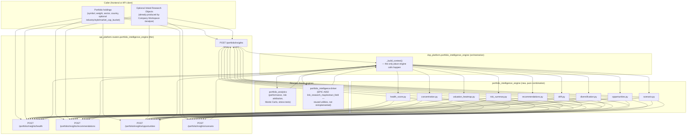

# Portfolio Guide — Server-Side Persistence (RC1 Milestone 3)

Status: **COMPLETE**
Priority: P0 · Portfolio Platform Foundation
Supersedes: browser-`localStorage`-only Portfolio persistence
Related: [PORTFOLIO_ANALYTICS.md](PORTFOLIO_ANALYTICS.md) (quantitative
engine — unaffected, reused as-is), [EPIC_A002_PORTFOLIO_GUIDE.md](EPIC_A002_PORTFOLIO_GUIDE.md)
(read-only research-object linker — unaffected, reused as-is), [API_GUIDE.md](API_GUIDE.md#portfolio-store-api-rc1-milestone-3)
(endpoint reference)

## Goal

Replace the browser-only `localStorage` Portfolio persistence with a
production-grade, server-side persistence layer for **Portfolio**,
**Holdings**, **Transactions**, and **Watchlist/Benchmark** — without
redesigning Portfolio Analytics, Authentication, the Company Workspace, the
Data Connector Framework, the AI Committee, the Risk Engine, the Export
Engine, or the API Architecture. Existing browser users must not lose data.

## Architecture

```
[Web thin client]
   PortfolioProvider / usePersistence()  — SAME public interface as before
        ↓
[apps/web/src/lib/portfolio/repository.ts]  — Repository layer (new)
   maps PortfolioHolding <-> ServerHolding; wraps every api.portfolio* call
        ↓
[apps/web/src/lib/api/client.ts]  — api.portfolio{List,Create,Get,Update,
   Delete,SetBenchmark,ListHoldings,UpsertHolding,RemoveHolding,
   ListTransactions,RecordTransaction,ListWatchlist,AddWatchlistSymbol,
   RemoveWatchlistSymbol,Migrate}
        ↓  (Authorization: Bearer <token> or RBAC session cookie)
[api_platform]  routers/portfolio.py   (thin; no business logic;
                 Depends(get_current_user_id) on every route)
        ↓
[dsp_platform]  DSPPlatform.{create_portfolio, list_portfolios, ...}
        ↓
[dsp_platform.portfolio_store_facade]  thin pass-through
        ↓
[portfolio_store]  (new package) PortfolioService
   ownership-checked CRUD — mirrors packages/enterprise's EXACT pattern
        ↓
PortfolioStorePort (Protocol)
   ├── InMemoryPortfolioStore   — process-local default / tests
   └── DatabasePortfolioStore   — hydrates from / flushes to a DatabasePort
                                   (production_platform.DatabasePort — the
                                   same duck-typed port enterprise already
                                   uses; no new persistence architecture)
```

## Why this reuses `enterprise`'s pattern instead of `packages/persistence`

`packages/persistence` (EPIC-A008) is explicitly scoped to "references and
metadata only — research artifact payloads are never stored" (workflow
records, audit records, citations, provenance) and its storage layer has no
per-user partitioning built in. Portfolio Holdings/Transactions are
business data with a completely different shape and access pattern
(inherently per-user, potentially large transaction histories), so reusing
that package would have meant bending its documented scope.

`packages/enterprise` already solved exactly this class of problem —
durable, ownership-scoped domain records over a `DatabasePort` — via
`EnterpriseStorePort` / `InMemoryEnterpriseStore` / `DatabaseEnterpriseStore`
(JSON snapshot rows + an append-only audit log, hydrated at construction,
flushed on every mutation). `portfolio_store` mirrors this pattern exactly:
`PortfolioStorePort` / `InMemoryPortfolioStore` / `DatabasePortfolioStore`,
with one JSON snapshot row per **portfolio** (not one global blob) plus a
true append-only SQL table for the transaction ledger — the same
snapshot-row + append-only-log design, at a finer grain appropriate to
per-user portfolios. No new persistence architecture was invented.

Like `enterprise`, `portfolio_store` has **zero package dependencies** — it
duck-types the `DatabasePort` (`execute`/`fetchall`) rather than importing
`production_platform`, exactly matching `enterprise.db_store`'s convention.

## Ownership model

Every `Portfolio` belongs to `user_id` — the authenticated principal
resolved via `DSPPlatform.auth_current_user()`, the **existing**
institutional auth (EPIC-A009). `get_current_user_id` (a new FastAPI
dependency in `api_platform.api.dependencies`) performs the exact same
resolution `GET /auth/rbac/me` already does (Bearer token first, RBAC
session cookie fallback) — no new auth scheme, no new login flow.

- **Multiple portfolios**: a user may own any number of portfolios.
- **Default portfolio**: exactly one portfolio per user has `is_default =
  true` at all times — enforced by `PortfolioService`, never by the
  caller. The user's first portfolio is always the default; deleting the
  default promotes the next-oldest remaining portfolio.
- **Personal portfolios**: `Portfolio.org_id` exists on the model today but
  is **unused** — reserved so Organization ownership (e.g. authorizing by
  org membership instead of/alongside `user_id`) can be layered on later
  **without a schema migration or redesign**.
- Every service method enforces ownership: `ForbiddenError` (HTTP 403) if
  `portfolio.user_id != user_id`; `NotFoundError` (HTTP 404) if the
  portfolio doesn't exist at all.

## What is (and is not) stored here

| Stored by `portfolio_store` | Computed by (unmodified) |
|---|---|
| Portfolio name, default flag, benchmark symbol selection | — |
| Holdings: symbol, weight, and the same optional fields `portfolio_analytics.PositionInput` already accepts (`units`, `cost_basis_per_unit`, `purchase_date`, `sector`, `country`, `exchange`, factor-proxy scores) | Sharpe/Sortino/Beta/etc. — `packages/portfolio_analytics` (unchanged) |
| Transactions: an append-only ledger of buy/sell/dividend/bonus/split/rights/fee/tax/cash_deposit/cash_withdrawal events | — |
| Watchlist symbols per portfolio | — |

Holdings are declared in the **exact same shape** the already-shipped
Portfolio Analytics endpoints expect — a persisted holding can be handed
straight to `POST /portfolio/analytics/performance` etc. with zero
translation, and no calculation is duplicated anywhere in this milestone.
Transactions are a **ledger only** — this milestone does not derive
holdings/weights from transaction history automatically (see Remaining
Gaps below); that would be new reconciliation business logic outside this
milestone's scope.

## Migration strategy

On first authenticated load, `PersistenceProvider` (frontend) performs
exactly this decision, once per signed-in user:

```
IF   a server default portfolio already exists
     → use the server copy as the source of truth for holdings
     (local savedAnalyses/copilotConversations/preferences are untouched —
     out of scope for this milestone)

ELSE IF localStorage has a portfolio (holdings, possibly empty)
     → POST /portfolio/migrate with the local snapshot
     → the server creates the user's default portfolio from it
     → the returned portfolio_id becomes the sync target for all
       subsequent holding/watchlist/benchmark mutations

Local data is NEVER deleted by this flow, regardless of outcome. If the
migration call fails (network, server error), the UI keeps serving the
local copy exactly as before this milestone, and simply retries the
reconciliation on the next authenticated load.
```

The backend half (`PortfolioService.migrate_local_portfolio` /
`POST /portfolio/migrate`) is **idempotent**: if the user already has a
default portfolio, the call is a no-op (`migrated: false`) and the
supplied local snapshot is discarded — a retry (e.g. a second browser tab,
a flaky network causing a duplicate request) can never overwrite server
data with a stale local copy.

After the initial reconciliation, `PersistenceProvider.persistPortfolio()`
(unchanged public signature) additionally diffs the new holdings list
against the last-known server state and pushes only the delta (upserts +
removals) to the server — best-effort, never blocking the always-on local
save that already existed before this milestone.

Watchlist and Benchmark follow the identical "server exists → adopt; else
push local up" reconciliation, performed once per resolved
`serverPortfolioId` inside `PortfolioIntelligenceWorkspace` (see
`usePortfolioIntelPrefsStore` for the local session store those two fields
already lived in since RC1 Milestone 1 — unchanged public API, this
milestone only adds a server-sync side effect around it).

## Frontend — preserved public interfaces

No component outside `PersistenceProvider.tsx` and
`PortfolioIntelligenceWorkspace.tsx` needed to change:

- `usePortfolio()` (`PortfolioProvider`) — identical shape
  (`holdings`, `addHolding`, `removeHolding`, …).
- `usePersistence()` (`PersistenceProvider`) — identical existing fields
  (`portfolioView`, `persistPortfolio`, `isLoaded`, …) **plus** three new,
  purely additive fields consumers may ignore:
  `serverPortfolioId`, `portfolioSyncStatus`
  (`idle|syncing|synced|error`), `portfolioSyncError`.
- `usePortfolioIntelPrefsStore` (watchlist/benchmark) — identical actions;
  the server-sync side effects live in the workspace component, not the
  store itself.

## Testing

- `packages/portfolio_store/tests/` — models, service (CRUD, ownership,
  multi-portfolio, default-portfolio invariants, every transaction type,
  watchlist, benchmark, migration idempotency), durability round-trip via
  `production_platform.InMemoryDatabasePort` (rehydrate after simulated
  restart), architecture boundary (zero dependencies, no forbidden
  imports).
- `packages/dsp_platform/tests/test_portfolio_store_facade.py` — façade
  wiring + `DSPPlatform` delegation.
- `packages/api_platform/tests/test_portfolio_api.py` — full endpoint
  coverage: auth-required (401), ownership (403/404), multi-portfolio,
  default-portfolio invariant, every transaction type, migration
  (including idempotent retry), watchlist, benchmark.
- `apps/web/src/lib/portfolio/repository.test.ts` — mapping functions +
  every repository call against a mocked `api` client.
- `apps/web/src/providers/PersistenceProvider.test.tsx` — the full
  migration strategy end-to-end: server-exists → adopt; server-empty →
  migrate (including an empty local portfolio); honest degrade (local data
  preserved) on server failure; unauthenticated → zero server calls;
  migration attempted exactly once per subject.
- `apps/web/src/lib/portfolio-intelligence/portfolio-intelligence.test.tsx`
  — workspace renders correctly with the new sync wiring; watchlist/
  benchmark reconciliation calls the repository as expected.

## Performance

- Holdings sync diffs against the last-known server state and only sends
  the delta (changed/added/removed symbols), not the full holdings list,
  on every `persistPortfolio` call.
- `DatabasePortfolioStore.flush()` rewrites all portfolio snapshot rows on
  each mutation (same trade-off `enterprise.db_store` already makes with
  its single global snapshot) — acceptable at per-user portfolio scale;
  transactions are true append-only inserts, never rewritten.
- All server sync is best-effort and asynchronous relative to the
  always-on local save — a slow or failing network call never blocks the
  UI or loses the local copy.

## Security review

- Every route requires authentication; there is no route that accepts a
  caller-supplied `user_id` — it is always resolved server-side from the
  validated access token/session, so no client can impersonate another
  user's portfolio by guessing an id.
- Ownership is checked on every single operation (get/update/delete
  portfolio; list/upsert/remove holding; record/list transaction; list/
  add/remove watchlist symbol) — verified by dedicated 403 tests for each
  resource family.
- No new secrets, no new token format, no new login flow — reuses
  `DSPPlatform.auth_current_user`, the same JWT/session validation already
  used by `GET /auth/rbac/me`.

## Remaining gaps (recorded honestly, not silently worked around)

- **No transaction → holding reconciliation.** Recording a `buy`
  transaction does not automatically update the corresponding holding's
  `weight`/`units` — Transactions are an independent ledger. Building a
  reconciliation engine (realized/unrealized P&L, lot tracking, wash-sale
  awareness) is a distinct, larger milestone.
- **No bulk holdings endpoint.** The frontend repository reconciles
  holdings via N per-symbol calls (upsert/remove), not a single batch
  request — fine at typical portfolio sizes, but a candidate for a future
  bulk endpoint if portfolios grow very large.
- **`DatabasePort` is in-memory only today** (`InMemoryDatabasePort`) —
  the same limitation `packages/enterprise` already documents; a real
  Postgres-backed `DatabasePort` implementation is a separate,
  infrastructure-level piece of work that both packages will benefit from
  identically once it exists.
- **Multi-portfolio switching UI.** The backend and repository fully
  support multiple portfolios per user (tested), but the existing
  workspace UI still primarily surfaces one "active" portfolio at a time
  (`usePortfolioIntelPrefsStore.activePortfolioId`, cosmetic labels today).
  Wiring a true multi-portfolio switcher to real, distinct server
  portfolios is additional frontend UI work, intentionally out of scope
  here to respect "no redesign."

---

# Portfolio Intelligence Engine (RC1 Milestone 4)

Status: **COMPLETE**
Priority: P0 · AI Portfolio Intelligence
Related: [PORTFOLIO_ANALYTICS.md](PORTFOLIO_ANALYTICS.md) (quantitative
engine — frozen, reused as-is), [EPIC_A002_PORTFOLIO_GUIDE.md](EPIC_A002_PORTFOLIO_GUIDE.md)
(research-object linker — frozen, reused as-is), [API_GUIDE.md](API_GUIDE.md#portfolio-intelligence-engine-api-rc1-milestone-4)
(endpoint reference), [DSP_AI_INDICATOR_ARCHITECTURE.md](DSP_AI_INDICATOR_ARCHITECTURE.md#86-portfolio-intelligence-engine-rc1-milestone-4)
(architecture addendum, §8.6)

## Goal

Build an **orchestration layer** — the "Portfolio Intelligence Engine" —
that combines outputs already produced by existing, frozen engines into
portfolio-level insights:

1. Portfolio Health Score (0–100)
2. Portfolio Concentration Analysis
3. Valuation Heatmap
4. Portfolio Risk Summary
5. AI Recommendations
6. Sector & Style Drift
7. Diversification Score
8. Portfolio Opportunity Finder
9. Portfolio AI Committee / Scenario Summary

**No new valuation, risk, analytics, or AI engine was built.** Every number
this layer produces is either (a) passed straight through from an existing
engine, or (b) a disclosed, documented *combination* (weighted average,
classification against a threshold, ranking) of numbers already computed
elsewhere. See "Data honesty and reuse contract" below for the precise
boundary.

## Why a new name, and why not `/portfolio/intelligence`

`POST /portfolio/intelligence` already exists (EPIC-A002, §"Portfolio
Intelligence" module) and does something different: it *only* summarizes
caller-supplied Research Objects (pass-through sector/MoS/quality lists, no
engine orchestration, `providers_called: false`, `engines_called: false`).
The Portfolio Intelligence Engine is a **new, additive, distinct**
capability that *orchestrates* `portfolio_analytics` (quantitative) and the
EPIC-A002 linker utilities into genuinely new composite scores
(Health Score, Diversification Score, rule-based Recommendations, a
Scenario Summary). Reusing the exact path `/portfolio/intelligence` for
this would either silently change EPIC-A002's frozen contract or create two
routes racing for the same path — both unacceptable. It is mounted at
**`/portfolio/insights`** instead, following the same naming-collision
resolution already used for `portfolio_analytics` vs. `portfolio_intelligence`
in Milestone 1.

## Architecture — who calls what



- **`packages/portfolio_intelligence_engine`** — pure Python, zero I/O, zero
  engine imports beyond `core`. Takes a tuple of `HoldingSignal` (a typed
  carrier of already-computed per-holding values) plus already-computed
  portfolio-level aggregates, and returns a scoring/classification/ranking
  result. Every function is independently unit-tested (63 tests) with no
  network, no database, no provider calls.
- **`dsp_platform.portfolio_intelligence_engine`** — the *only* orchestration
  layer. `_build_context()` is called once per request and:
  1. Calls `dsp_platform.portfolio_analytics.evaluate_portfolio_performance` /
     `evaluate_portfolio_risk_analytics` / `evaluate_portfolio_simulation` /
     `evaluate_portfolio_stress_analytics` (frozen, RC1 Milestone 1) — for
     Beta, Volatility, Max Drawdown, Tracking Error, per-holding risk
     attribution (volatility + risk contribution), Monte Carlo, and stress
     tests.
  2. Calls `dsp_platform.portfolio_intelligence.linker.link_research_map` /
     `extract_field` / `section_available` (frozen, EPIC-A002's own public
     utilities — **not** duplicated JSON-path logic) — for margin of safety,
     recommendation/committee confidence, and business-quality score,
     pulled from caller-linked Research Objects.
  3. Merges both into `HoldingSignal` tuples and calls the pure
     `portfolio_intelligence_engine` functions.
- **`api_platform.api.routers.portfolio_intelligence_engine`** — five thin
  routes, each only calling the matching `DSPPlatform.evaluate_portfolio_*`
  method and mapping the result to a JSON envelope. No business logic.

## Data honesty and reuse contract

| Capability | Source of every number | New logic in this milestone |
|---|---|---|
| Health Score | Diversification Score (below) + `portfolio_analytics` volatility/drawdown + linked MoS + linked quality score + Concentration HHI + caller-declared cash weight | **Combination formula only** — a disclosed weighted average (weights documented in `health_score.py`), renormalized over whichever sub-scores are available. No sub-score value is invented. |
| Concentration Analysis | Caller-supplied weights/sector/country/industry/style | Bucketing + a disclosed excessive-exposure threshold (`reference.py`) |
| Valuation Heatmap | Margin of safety (Valuation Engine, via linked Research Object) | Classification only — MoS ≥ +15% → Undervalued, ≤ −15% → Overvalued (disclosed threshold), else Fairly Valued |
| Risk Summary | `portfolio_analytics` performance/risk-attribution/Monte Carlo/stress results | Aggregation + highlighting only. **Value at Risk (95%)** is the already-computed Monte Carlo 5th-percentile terminal return, relabelled — not a new calculation. **Conditional VaR is reported `null`/unavailable** — no engine exposes the full tail distribution needed to compute it honestly, and this milestone does not approximate one. |
| AI Recommendations | Valuation classification + quality score + risk contribution + weight | A disclosed, auditable rule table (`recommendations.py`) — not a new ML model. Every recommendation cites its exact supporting metrics. |
| Sector & Style Drift | Caller-supplied sector/style/cap-bucket + the published 11-sector GICS taxonomy | Deviation from an even 1/11 (or 1/N) baseline — a transparent reference, not an invented "target portfolio". Style/cap drift is honestly `Data unavailable.` unless the caller supplies those labels. |
| Diversification Score | Holding count, sector count, position weights, `portfolio_analytics` correlation matrix and risk attribution | Combination formula only (documented weights in `diversification.py`) |
| Opportunity Finder | Linked MoS, linked quality score, risk-attribution volatility, linked committee confidence | Ranking only. **"Highest Expected CAGR" is always empty and documented as unavailable** — no engine anywhere in the platform produces a forward-looking, per-company equity CAGR. |
| Scenario Summary | Weighted linked MoS (Base Case) ± `portfolio_analytics` annualized volatility (Bull/Bear band); `portfolio_analytics` annualized return (Expected CAGR) and max drawdown (Worst-case drawdown) | A disclosed aggregation, explicitly labelled: Expected CAGR/worst-case drawdown are the portfolio's own **trailing realized** figures, not a forecast or stress-test projection — see `expected_cagr_basis`/`worst_case_drawdown_basis` on every response. |

## Optional inputs — "richer when supplied, honest when not"

Valuation/quality/committee-dependent capabilities (Valuation Heatmap,
parts of Health Score, most of Opportunity Finder and Scenario Summary)
require the caller to supply `research_objects` — the same optional,
caller-linked-only input EPIC-A002's `/portfolio/intelligence` already
accepts. When omitted, those specific fields are honestly `null`/empty with
a `limitations` message — the Risk Summary, Diversification Score, and
Concentration Analysis remain fully available from `portfolio_analytics`
alone (which only needs symbol + weight + authenticated price history).

The frontend sources `research_objects` from the user's own
`savedAnalyses` (Company Workspace analyses already saved locally/synced) —
see `apps/web/src/lib/portfolio-intelligence/researchObjectsAdapter.ts`,
which performs **zero computation**, only reshapes fields the composition
pipeline already computed (`recommendation_summary.margin_of_safety`,
`.confidence`, and the `business_quality_aggregator` stage score) into the
minimal Research-Object section shape the engine expects.

## API

See [API_GUIDE.md](API_GUIDE.md#portfolio-intelligence-engine-api-rc1-milestone-4)
for the full request/response reference:

- `POST /portfolio/insights` — every capability at once
- `POST /portfolio/insights/health` — Health Score only
- `POST /portfolio/insights/recommendations` — AI Recommendations only
- `POST /portfolio/insights/opportunities` — Opportunity Finder only
- `POST /portfolio/insights/scenario` — AI Committee Scenario Summary only
- `GET /portfolio/insights/health-check` — service health (versions only —
  distinct from the Health *Score* endpoint above)

## Frontend

New "AI Intelligence" navigation group in the Portfolio Intelligence
Workspace (`/portfolio`), 8 lazy-loaded sections (`PortfolioInsightsSections.tsx`):
Health Score, AI Summary, Recommendations, Risk Summary, Valuation Heatmap,
Opportunity Finder, Diversification (folds in Concentration Analysis and
Sector/Style Drift), and AI Committee Scenario. One `usePortfolioInsights`
query fetches the full `/portfolio/insights` result once per section visit
(`enabled` gated to the active section) — never five separate heavy calls.
Uses the existing design system (`SectionCard`, `FieldRow`, `Badge`,
`WorkspaceEmpty`) — no new visual language.

## Testing

- `packages/portfolio_intelligence_engine/tests/` — 63 unit tests for every
  pure combination function (health score weighting/renormalization,
  concentration flags, valuation classification boundaries, risk summary
  VaR relabelling and CVaR unavailability, recommendation rule branches,
  drift baselines, diversification scoring, opportunity ranking honesty,
  scenario band/confidence math).
- `packages/dsp_platform/tests/test_portfolio_intelligence_engine.py` — 19
  tests verifying the orchestration façade correctly wires
  `portfolio_analytics` + `portfolio_intelligence.linker` output into the
  pure engine, that the 4 narrow endpoints return the exact same slice as
  the full result, and `DSPPlatform` delegation.
- `packages/api_platform/tests/test_portfolio_intelligence_engine_api.py`
  — 10 API tests, including an explicit check that `/portfolio/insights`
  does **not** collide with `/portfolio/intelligence`.
- `apps/web/src/lib/portfolio-intelligence/mapPortfolioInsights.test.ts` —
  15 mapper tests.
- `apps/web/src/lib/portfolio-intelligence/researchObjectsAdapter.test.ts`
  — 5 tests verifying the client-side reshaping never fabricates a section.
- `apps/web/src/components/portfolio-intelligence/PortfolioInsightsSections.test.tsx`
  — 12 component tests (honest-unavailable + populated states).
- `apps/web/e2e/browser/portfolio-insights.smoke.spec.ts` — Playwright
  structural smoke test (see file header for why deep authenticated
  interaction isn't exercised in this environment).

## Performance

- `/portfolio/insights` (the "everything" endpoint) runs the same
  `portfolio_analytics` calls the existing `/portfolio/analytics/*`
  endpoints already run individually — no new provider calls, no new
  network I/O. The narrow endpoints (`/health`, `/recommendations`,
  `/opportunities`, `/scenario`) currently share the same internal
  `_build_context()` for correctness/consistency, so they carry the same
  cost as the full endpoint; a documented trade-off, not a duplicated
  calculation.
- A `max_holdings` guard (default 100) caps per-request analysis size — a
  latency guard, disclosed in `limitations` when triggered, never a silent
  data drop.

## Security review

- Stateless, same trust boundary as `/portfolio/analytics/*` and
  `/portfolio/intelligence` — no new authentication mechanism, no new
  persistence, no new secrets.
- `research_objects`/`reports`/`snapshots` are caller-supplied and never
  persisted or attributed to another user — mirrors EPIC-A002's existing
  contract exactly.

## Remaining gaps (recorded honestly, not silently worked around)

- **Conditional VaR (Expected Shortfall) is unavailable.** No engine in the
  platform exposes the full tail-return distribution needed to compute it
  honestly; adding one would be a new risk calculation, out of scope for an
  orchestration-only milestone.
- **No per-company forward-looking CAGR** exists anywhere in the frozen
  engines, so "Highest Expected CAGR" in the Opportunity Finder is always
  empty, and the Scenario Summary's "Expected CAGR" is explicitly the
  portfolio's trailing realized return, not a forecast.
- **Industry and style/cap-bucket labels must be caller-supplied.** No
  backend engine outputs these (confirmed absent from `contracts.Instrument`
  and the composition payload) — Concentration/Drift honestly report
  `Data unavailable.` for those specific dimensions unless the caller
  supplies them on each holding.
- **Playwright deep-interaction coverage deferred.** `/portfolio` requires
  authentication; this sandbox has no live backend/seeded session to drive
  a real login from Playwright. The written smoke test verifies the route
  loads/redirects without crashing; the Vitest suite (95 tests across
  mapper/component/full-workspace-integration) is the substantive
  regression guard for the new UI until a CI environment with backend
  fixtures can drive an authenticated Playwright run.
