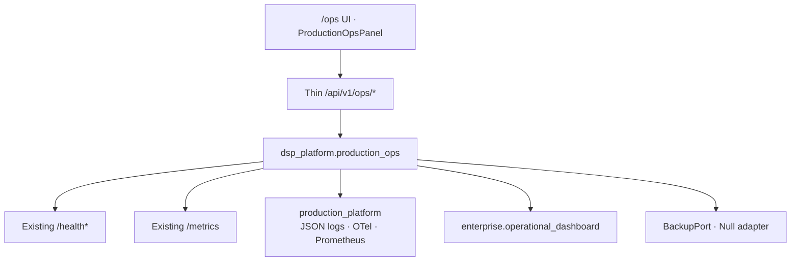

# RC1 Milestone 10 — Production Operations

| | |
|---|---|
| **Status** | Implemented (orchestration / aggregation only) |
| **Rule** | Never duplicate health, metrics, logging, or monitoring |

## 1. Purpose

Prepare DSP AI Indicator for real production deployment. No new investment
functionality — only production readiness façades, docs, and RC CI wiring.

## 2. Architecture

## 3. Logging

Reuses:

- `production_platform.production.json_logging`
- `api_platform` request middleware (`X-Request-Id`)
- `production_platform.production.correlation` (correlation / request IDs)
- Audit: production audit events + enterprise / security audit loggers

Fields: request ID, correlation ID, module, latency, errors, trace ID (when OTel configured).

## 4. Observability & monitoring

| Concern | Reuse |
|---|---|
| Tracing | `OpenTelemetryTracingPort` / OTEL env |
| Metrics | `GET /metrics` + `/ops/metrics` summary alias |
| Grafana | Existing dashboards + `deploy/observability/grafana/dashboards/dsp-rc1-production-ops.json` |
| Prometheus | `docker/prometheus.yml`, Helm scrape annotations |

## 5. Health

| Probe | Path |
|---|---|
| Aggregate | `GET /ops/health` |
| Live | `/ops/health/live` (+ existing `/health/live`) |
| Ready | `/ops/health/ready` (+ `/health/ready`) |
| Startup | `/ops/health/startup` (+ `/health/startup`) |
| Dependencies | `/ops/dependencies` (+ `/health/dependencies`) |
| Status / version | `/ops/status`, `/ops/version` |

## 6. Secrets & backup

- Env validation: `scripts/validate_env.py`
- Secrets ports: `EnvSecretsPort` / Vault interface (`NullVaultSecretsProvider`)
- Rotation hooks: `SecretRotationHookPort` (null until wired)
- Backup: `BackupPort` + shell scripts under `scripts/ops/`

## 7. CI/CD

Existing: `ci.yml`, `frontend.yml`, `security.yml`, `docker.yml`, `release-engineering.yml`  
Additive RC job: `.github/workflows/rc-production-ops.yml`

## 8. Load testing

Pointer script: `scripts/perf/rc1_m10_load_scenarios.py`  
Existing: `load_test.py`, `k6_health_load.js`, `soak_test.py`

See also: [DEPLOYMENT_GUIDE.md](DEPLOYMENT_GUIDE.md), [OPERATIONS_RUNBOOK.md](OPERATIONS_RUNBOOK.md), [BACKUP_RECOVERY.md](BACKUP_RECOVERY.md).
