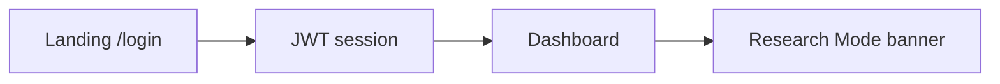
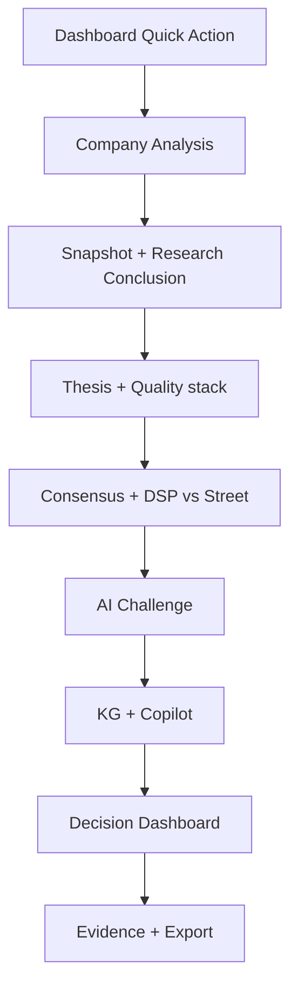
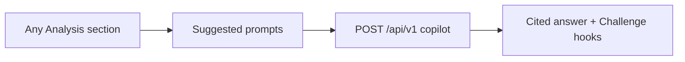

# Product Experience Blueprint (PXB)

**Epic:** PR1.1  
**Status:** FROZEN for L1.2–L1.7 implementation  
**Mode:** Design & architecture only — no backend / API / engine / compliance code changes  

**Inputs:** PR1.0 (Research Mode, Feature Flags, Compliance Architecture, Design Standard V2)

**Tagline:** Complex Analysis. Simple Decisions.  
**Secondary:** Professional Investment Research for Everyone.

---

## 1. Purpose

Freeze the complete product experience so L1.2 (Company Analysis Workspace) through
later L-series phases can be built consistently without redesigning IA mid-flight.

This blueprint is the **source of truth for UX**. When PR1.0 compliance
`analysis_sections` differs, **PXB wins for UI implementation**; align the
compliance enum in a dedicated follow-up (not PR1.1).

---

## 2. Operating constraints

| Constraint | Rule |
|---|---|
| Research Mode (default) | No Buy / Sell / Hold / Official Target Price labels |
| SEBI Mode | Flag-gated; architecture only until registration |
| Thin client | No valuation / recommendation / AI reasoning in browser |
| Four questions | Every screen: What / Why / Why care / What next |
| Metric card | Title · Rating · Value · Meaning · Why · Takeaway (+ Learn More · AI) |
| **Trust** | [USER_TRUST_STANDARD.md](USER_TRUST_STANDARD.md) — Traceable → Research First |
| **Constitution** | [PRODUCT_CONSTITUTION.md](PRODUCT_CONSTITUTION.md) — Trust before polish |
| **Governance** | [ARCHITECTURE_GOVERNANCE.md](ARCHITECTURE_GOVERNANCE.md) — no redesign mid-build |

---

## 3. Document map

| Document | Contents |
|---|---|
| [INFORMATION_ARCHITECTURE.md](INFORMATION_ARCHITECTURE.md) | Every screen + nav + future Advisor / Client Portal |
| [DESIGN_SYSTEM.md](DESIGN_SYSTEM.md) | Type, space, grid, components, a11y, dark mode |
| [METRIC_LIBRARY.md](METRIC_LIBRARY.md) | Metric explanation schema + starter catalog |
| [FINANCIAL_TERMINOLOGY.md](FINANCIAL_TERMINOLOGY.md) | Term definitions library |
| [DECISION_DASHBOARD.md](DECISION_DASHBOARD.md) | Decision Dashboard field freeze |
| [ANALYST_CONSENSUS_UX.md](ANALYST_CONSENSUS_UX.md) | Consensus UX specification |
| [AI_COPILOT_UX.md](AI_COPILOT_UX.md) | Context-aware prompts per section |
| [KNOWLEDGE_GRAPH_UX.md](KNOWLEDGE_GRAPH_UX.md) | Nodes, filters, interactions |
| [MOBILE_UX.md](MOBILE_UX.md) | Mobile-first adaptations |
| This file | Master PXB, journeys, wireframe inventory, analysis order |
| [PR1_2_VISUAL_LANGUAGE_AND_INTERACTION_SYSTEM.md](PR1_2_VISUAL_LANGUAGE_AND_INTERACTION_SYSTEM.md) | **PR1.2 VLIS** — visual & interaction OS |

---

## 4. Frozen Company Analysis screen order (PXB)

> Supersedes PR1.0 section list for **product UI**. Implement in L1.2.

1. Company Snapshot  
2. Research Conclusion  
3. Executive Summary  
4. Investment Thesis  
5. Business Quality  
6. Financial Strength  
7. Growth  
8. Valuation  
9. Risk  
10. Management  
11. Competitive Advantage  
12. Market Analyst Consensus  
13. DSP vs Street  
14. AI Challenge Mode  
15. Knowledge Graph  
16. AI Copilot  
17. Decision Dashboard  
18. Evidence  
19. Export  

---

## 5. User journeys (summary)

See detailed flows in §8 below and IA doc.

| Journey | Entry → Outcome |
|---|---|
| J1 Sign-in | `/login` → Dashboard |
| J2 Analyze company | Dashboard / Search → Analysis → Decision Dashboard → Export |
| J3 Compare | Compare → select peers → comparison summary (L1.x) |
| J4 Portfolio | Portfolio → holdings list → drill to Analysis |
| J5 Copilot | Any section → Copilot drawer/page → cited answer |
| J6 Reports | Reports → report detail → Evidence |
| J7 Settings | Theme / session preferences |
| J8 Mobile analyze | Mobile drawer → Analysis stacked sections |

---

## 6. Wireframe inventory

Low-fidelity wireframes live in this blueprint and linked docs (ASCII / mermaid).

| ID | Surface | Breakpoints |
|---|---|---|
| WF-D01 | App shell (sidebar + topbar) | Desktop |
| WF-D02 | Dashboard widgets | Desktop |
| WF-D03 | Company Analysis (section stack) | Desktop |
| WF-D04 | Decision Dashboard panel | Desktop |
| WF-T01 | App shell collapsed | Tablet |
| WF-T02 | Analysis two-column → one | Tablet |
| WF-M01 | Mobile drawer nav | Mobile |
| WF-M02 | Analysis single column | Mobile |
| WF-M03 | Copilot bottom sheet | Mobile |
| WF-M04 | Metric card compact | Mobile |

---

## 7. UX standards (quick reference)

1. Summary first, details later  
2. Every metric uses Metric Library schema  
3. Every jargon term links to Terminology Library  
4. Every section exposes Copilot prompts  
5. AI Challenge Mode mandatory on conclusions  
6. Charts always include interpretation copy  
7. Progressive disclosure (collapsed “Learn more”)  
8. Mobile-first adaptations (not shrunk desktop)  
9. WCAG-oriented a11y (focus, labels, contrast)  
10. Research Mode terminology via feature flags  

---

## 8. User journey maps

### J1 — Sign-in



### J2 — Company research (primary)



### J5 — Context Copilot



---

## 9. Wireframes (low fidelity)

### WF-D01 — Desktop shell

```text
┌──────────┬────────────────────────────────────────────┐
│ DSP      │  Home / Analysis / …     Theme  Account ▾ │
│ Nav      ├────────────────────────────────────────────┤
│ • Dash   │                                            │
│ • Analy  │           CONTENT AREA                     │
│ • Comp   │                                            │
│ • Port   │                                            │
│ • Copil  │                                            │
│ • Rep    │                                            │
│ • Set    │                                            │
└──────────┴────────────────────────────────────────────┘
```

### WF-D02 — Dashboard

```text
┌ Quick Actions ┐ ┌ Health ┐ ┌ Platform ┐
┌ Search        ┐ ┌ Copilot┐ ┌ Favorites┐
┌ Recent Reports (span 2)  ┐ ┌ Activity ┐
```

### WF-D03 — Analysis (desktop)

```text
┌ Sticky section TOC (left 240) ─┬─ Scrollable sections ──────────┐
│ Snapshot                        │ [Research Mode banner]         │
│ Conclusion                      │ ## Company Snapshot            │
│ …                               │ metric cards grid              │
│ Decision Dashboard              │ ## Research Conclusion         │
│ Evidence / Export               │ …                              │
└─────────────────────────────────┴────────────────────────────────┘
│ Copilot FAB / rail ───────────────────────────────────────────── │
```

### WF-M02 — Analysis mobile

```text
┌ Menu  Analysis  ··· ┐
│ Progress: 3/19      │
│ ▸ Snapshot (open)   │
│   Metric cards stack│
│ ▸ Conclusion        │
│ ▸ … accordion       │
│ [Ask AI] bottom bar │
└─────────────────────┘
```

---

## 10. Delivery mapping (L-series)

| Phase | Consumes PXB |
|---|---|
| L1.2 Company Analysis Workspace | Analysis order, Decision Dashboard, Metric/Term libs |
| L1.3 AI Copilot Workspace | AI_COPILOT_UX |
| L1.4 Portfolio | IA Portfolio + Mobile |
| L1.5 Reports | IA Reports + Evidence/Export |
| L1.6 Compare (if scheduled) | IA Compare |
| L1.7 Polish / Advisor prep | Advisor IA stubs, SEBI flag readiness |

---

## 11. Non-goals (PR1.1)

- No backend / API / engine / compliance package code changes  
- No provider integrations (consensus)  
- No high-fidelity visual design files (Figma optional later)  
- No SEBI recommendation UI implementation  

---

## 12. Recommendations before L1.2

1. **Align** `compliance.analysis_sections` + web `ANALYSIS_PAGE_ORDER` to PXB order in L1.2 kickoff (not in PR1.1).  
2. Implement **MetricCard** + terminology tooltips before deep charts.  
3. Ship **Decision Dashboard** as summary-first anchor (sticky or early deep-link).  
4. Keep **AI Challenge** mandatory before Export.  
5. Stub Consensus / DSP vs Street with empty states until providers exist.  
6. Validate four-question checklist on every new section PR.  
