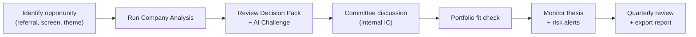
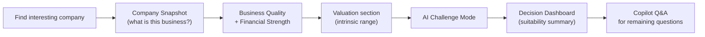
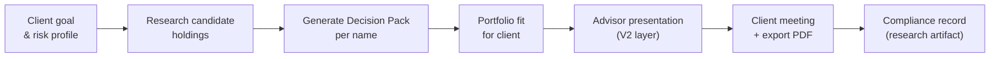
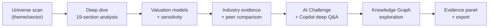
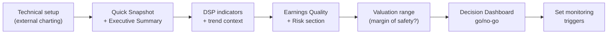

# Product Requirements — DSP AI Indicator

| Field | Value |
|---|---|
| **Version** | `1.0.0` |
| **Status** | **Active** |
| **Last updated** | 2026-07-27 |
| **Audience** | Product · design · engineering · research · sales |
| **Companion** | UX freezes → [PRODUCT_EXPERIENCE_BLUEPRINT.md](PRODUCT_EXPERIENCE_BLUEPRINT.md) · Vision → [PRODUCT_VISION.md](PRODUCT_VISION.md) |

---

## 1. Product Definition

**DSP AI Indicator** is an explainable AI investment intelligence platform that helps users understand businesses before making investment decisions.

| DSP is | DSP is not |
|---|---|
| Institutional-grade research workspace | Stock screener |
| Evidence-backed company analysis | Trading bot or signal service |
| Multi-engine valuation and quality assessment | Brokerage or order execution |
| AI that explains and challenges conclusions | Black-box tip generator |
| Portfolio and risk intelligence layer | Social trading or sentiment feed |

**Primary product feature:** User Trust — see [USER_TRUST_STANDARD.md](USER_TRUST_STANDARD.md).

**Default mode:** Research Mode — educational language, no Buy/Sell/Hold unless compliance mode permits.

---

## 2. Platform Capabilities (All Users)

| Capability | Description |
|---|---|
| **Company Analysis Workspace** | 19-section frozen analysis flow per [COMPANY_ANALYSIS_BLUEPRINT.md](COMPANY_ANALYSIS_BLUEPRINT.md) |
| **Decision Pack** | Recommendation + Decision Brief + Assurance — primary investor artifact |
| **Multi-Engine Valuation** | DCF, Reverse DCF, EPV, Graham, DDM, Relative, Asset-Based, Overall Aggregator |
| **Business Quality Intelligence** | Earnings quality, capital allocation, moat, management, financial strength, growth |
| **AI Investment Committee** | Multi-reviewer deterministic consensus with disagreement surfacing |
| **AI Challenge Mode** | Bull, bear, risks, assumptions, unknowns before user treats conclusion as complete |
| **AI Copilot** | Section-aware Q&A grounded in engine outputs |
| **Knowledge Graph** | Entity-relationship exploration across company, industry, and evidence |
| **Risk Intelligence** | Qualitative and quantitative risk profiling |
| **Portfolio Intelligence** | Multi-holding aggregation, monitoring, and qualitative portfolio view |
| **Evidence Panel** | Full citation trail for every displayed insight |
| **Export** | Download/share research envelope |

---

## 3. Target Users

---

### 3.1 Family Office

#### Profile
Multi-generational wealth stewards managing concentrated portfolios, often with direct equity holdings, co-investments, and a small internal research team (0–3 analysts).

#### Goals

| Goal | Detail |
|---|---|
| Deep due diligence | Understand business quality before large or illiquid positions |
| Generational continuity | Document research rationale for succession and governance |
| Risk oversight | Monitor concentration, correlation, and tail risks across holdings |
| Private market parity | Apply public-equity research rigor to decision frameworks |
| Advisor coordination | Share structured research with external managers and trustees |

#### Pain Points

| Pain Point | Current workaround |
|---|---|
| Research scattered across PDFs, emails, and spreadsheets | Ad hoc filing cabinets and shared drives |
| No consistent valuation methodology | Each analyst uses different models |
| Difficulty tracking thesis drift | Mental notes; no structured monitoring |
| Expensive institutional terminals for small teams | Bloomberg per-seat cost for 1–2 users |
| AI tools lack audit trail | ChatGPT sessions with no citations |

#### Workflow

#### Features Required

| Feature | Priority |
|---|---|
| Full Company Analysis Workspace | P0 |
| Decision Pack with Assurance | P0 |
| Portfolio Intelligence & monitoring | P0 |
| Multi-method valuation with sensitivity | P0 |
| Export to PDF for IC meetings | P0 |
| Knowledge Graph for related entities | P1 |
| Multi-user RBAC (future) | P2 |
| White-label reports | P2 |

#### Dashboard

| Panel | Content |
|---|---|
| Portfolio overview | Holdings, concentration, sector/theme exposure |
| Watchlist | Names under active research with status |
| Risk summary | Top portfolio risks and recent changes |
| Recent analyses | Last Decision Packs with confidence and date |
| Monitoring alerts | Thesis drift, valuation range breaches, risk escalations |

#### Reports

- Investment Committee memorandum (Decision Pack export)
- Quarterly portfolio review with attribution narrative
- Single-name deep dive with full evidence appendix
- Risk assessment summary for trustees

#### Expected User Journey

1. **Discover** — Add symbol to watchlist from theme research or referral
2. **Analyze** — Run Company Analysis; review 19 sections in frozen order
3. **Challenge** — Complete AI Challenge Mode; note falsifiers
4. **Decide** — Internal IC uses Decision Pack; records rationale via export
5. **Allocate** — Portfolio fit check; adjust sizing based on risk and concentration
6. **Monitor** — Portfolio monitoring surfaces thesis drift and risk changes
7. **Review** — Quarterly re-run analysis; compare to prior Decision Pack

---

### 3.2 Individual Investor

#### Profile
Self-directed investor with $100K–$5M in investable assets, holding 5–20 positions, investing personal time in research but lacking institutional tools.

#### Goals

| Goal | Detail |
|---|---|
| Invest like a professional | Access institutional-quality analysis without a research team |
| Understand before buying | Know what a business does and why it might be worth owning |
| Avoid costly mistakes | Identify balance sheet, earnings quality, and valuation risks |
| Build conviction | Hold through volatility with a documented thesis |
| Learn continuously | Improve investing skill through explained metrics |

#### Pain Points

| Pain Point | Current workaround |
|---|---|
| Overwhelmed by financial statements | Skim headlines and social media |
| Valuation feels like guesswork | P/E ratio alone or tip-based entry |
| No structured research process | Random article reading |
| AI chatbots hallucinate numbers | Unreliable for financial decisions |
| Free screeners lack depth | Finviz, Yahoo Finance — metrics without context |

#### Workflow

#### Features Required

| Feature | Priority |
|---|---|
| Plain-English metric explanations | P0 |
| Company Snapshot & Executive Summary | P0 |
| Valuation with range (not point estimate) | P0 |
| AI Challenge Mode | P0 |
| AI Copilot with citations | P0 |
| Mobile-responsive workspace | P1 |
| Portfolio tracking (basic) | P1 |
| Saved research (local persistence) | P1 |

#### Dashboard

| Panel | Content |
|---|---|
| My watchlist | Symbols under research with progress indicator |
| Latest analysis | Most recent Decision Pack summary |
| Key metrics strip | Quality, valuation, risk scores with plain-English labels |
| Copilot bar | Persistent "Ask AI" for current section |
| Next steps | Actionable investigation prompts |

#### Reports

- Single-page investment summary (Executive Summary + Decision Dashboard)
- Full company analysis export for personal records
- Valuation sensitivity report

#### Expected User Journey

1. **Curiosity** — Hear about a company; search symbol
2. **Orientation** — Read Company Snapshot: "What does this business do?"
3. **Quality check** — Review Business Quality and Financial Strength sections
4. **Value check** — Study Valuation range and assumptions in plain English
5. **Stress test** — Run AI Challenge Mode; read bear case and risks
6. **Question** — Ask Copilot about specific concerns
7. **Record** — Export summary; add to watchlist or personal journal

---

### 3.3 Financial Advisor

#### Profile
Registered Investment Advisor (RIA) or independent financial advisor serving 20–200 client households, needing research to support recommendations and client meetings.

#### Goals

| Goal | Detail |
|---|---|
| Client-ready research | Professional reports for review meetings |
| Consistent methodology | Same analytical framework across all client recommendations |
| Compliance safety | Research Mode language; no unauthorized Buy/Sell claims |
| Efficiency | Reduce time per client research from hours to minutes |
| Differentiation | Offer institutional-quality analysis as a service advantage |

#### Pain Points

| Pain Point | Current workaround |
|---|---|
| Research time doesn't scale with client count | Generic model portfolios |
| Clients ask "why this stock?" | Verbal explanations without documentation |
| Compliance risk with AI tools | Avoid AI or use with heavy disclaimers |
| Morningstar/Costco reports lack customization | Third-party one-size-fits-all PDFs |
| No portfolio-level narrative | Spreadsheet allocation tables |

#### Workflow

#### Features Required

| Feature | Priority |
|---|---|
| Client-ready PDF export | P0 |
| Research Mode compliance language | P0 |
| Multi-name portfolio analysis | P0 |
| Advisor presentation layer (V2) | P0 |
| Side-by-side peer comparison | P1 |
| Saved client research bundles | P1 |
| Multi-client RBAC (future) | P2 |
| SEBI Mode (future, jurisdiction-dependent) | P3 |

#### Dashboard

| Panel | Content |
|---|---|
| Client portfolios | Holdings per client with research status |
| Research queue | Names pending analysis before next review |
| Recent reports | Exported Decision Packs with dates |
| Portfolio risk summary | Client-level risk and concentration |
| Comparison view | Peer group for client holdings |

#### Reports

- Client meeting presentation (Advisor V2 format)
- Individual holding research brief
- Portfolio allocation and risk summary
- Quarterly client review packet

#### Expected User Journey

1. **Plan** — Review client goals and current allocation before meeting
2. **Research** — Run analysis on new candidates or existing holdings
3. **Compare** — Use peer comparison for relative quality and valuation
4. **Prepare** — Generate advisor presentation export
5. **Present** — Walk client through Executive Summary and Decision Dashboard
6. **Document** — Save exported research for compliance file
7. **Monitor** — Re-run analysis before next quarterly review

---

### 3.4 Research Analyst

#### Profile
Buy-side or sell-side analyst, independent researcher, or advanced user performing deep fundamental analysis on 20–100 names per year.

#### Goals

| Goal | Detail |
|---|---|
| Comprehensive analysis | Full fundamental, quality, valuation, and risk coverage |
| Model transparency | See every assumption in DCF and sensitivity tables |
| Evidence trail | Citations to filings, statements, and calculated metrics |
| Thesis documentation | Structured bull case, falsifiers, and monitoring triggers |
| Peer context | Industry positioning and relative valuation |

#### Pain Points

| Pain Point | Current workaround |
|---|---|
| Manual spreadsheet models | Excel DCF with version control issues |
| Fragmented data sources | Multiple terminals and filing websites |
| No AI that cites sources | Generic LLM summaries without evidence |
| Time-consuming report writing | Copy-paste from models to Word |
| Inconsistent peer selection | Ad hoc comp sets |

#### Workflow

#### Features Required

| Feature | Priority |
|---|---|
| Full 19-section analysis workspace | P0 |
| All valuation methods with sensitivity | P0 |
| Evidence panel with filing citations | P0 |
| Industry evidence framework | P0 |
| Peer comparison engine | P0 |
| Knowledge Graph | P1 |
| Export with evidence appendix | P0 |
| API access for custom workflows | P2 |

#### Dashboard

| Panel | Content |
|---|---|
| Coverage universe | All names with analysis status and last update |
| Model summary | Valuation range, key assumptions, confidence |
| Evidence feed | Latest filing and data updates for covered names |
| Peer ranking | Relative quality and valuation within industry |
| Thesis tracker | Active theses with falsifier monitoring |

#### Reports

- Full institutional research report (all 19 sections + evidence)
- Valuation workbook export (assumptions + sensitivity)
- Industry comparison report
- Risk assessment memorandum

#### Expected User Journey

1. **Screen** — Define universe by sector, theme, or quantitative filter (external)
2. **Initiate** — Open Company Analysis for target name
3. **Fundamentals** — Work through Financial Strength, Business Quality, Growth sections
4. **Valuation** — Run all applicable models; review sensitivity and reverse DCF implied growth
5. **Context** — Industry evidence, peer comparison, Knowledge Graph
6. **Synthesize** — Review Investment Committee consensus and AI Challenge dissent
7. **Publish** — Export full report with evidence appendix for distribution or filing

---

### 3.5 Swing & Position Trader

#### Profile
Active trader holding positions from days to months, using fundamental context to support technical timing. Not a day-trader — seeks edge from understanding business quality and catalysts alongside price action.

#### Goals

| Goal | Detail |
|---|---|
| Fundamental context for timing | Know if a move is supported by business reality |
| Catalyst awareness | Earnings quality, management actions, industry shifts |
| Risk management | Understand downside before sizing a position |
| Regime identification | DSP indicators for trend and momentum context |
| Quick assessment | Fast go/no-go on a candidate before deeper work |

#### Pain Points

| Pain Point | Current workaround |
|---|---|
| Charts without context | Technical analysis alone misses fundamental shifts |
| Slow fundamental research | Can't analyze 50 candidates deeply |
| Earnings surprises | Didn't read earnings quality section |
| False breakouts | Momentum without business support |
| No structured pre-trade checklist | Gut feel entries |

#### Workflow

#### Features Required

| Feature | Priority |
|---|---|
| Company Snapshot (fast orientation) | P0 |
| DSP Indicator Engine signals | P0 |
| Executive Summary (2-minute read) | P0 |
| Earnings Quality section | P0 |
| Risk section | P0 |
| Valuation range for margin of safety | P0 |
| Decision Dashboard suitability summary | P0 |
| Real-time monitoring alerts (future) | P2 |

#### Dashboard

| Panel | Content |
|---|---|
| Watchlist with signals | DSP indicator state per symbol |
| Quick scores | Quality, risk, valuation strip |
| Catalyst calendar | Earnings dates, filing dates (when providers exist) |
| Active positions | Research status and thesis health |
| Alert feed | Risk escalation and thesis drift notifications |

#### Reports

- Pre-trade checklist summary (1-page)
- Position monitoring update
- Earnings preview brief (quality + expectations context)

#### Expected User Journey

1. **Setup** — Identify technical setup on external charting platform
2. **Qualify** — Open DSP; read Company Snapshot and Executive Summary (< 3 min)
3. **Signal** — Review DSP indicators for trend alignment
4. **Quality gate** — Check Earnings Quality and Risk; reject if red flags
5. **Value gate** — Confirm valuation range offers acceptable margin of safety
6. **Decide** — Decision Dashboard go/no-go; size position accordingly
7. **Monitor** — Set alerts for thesis drift, risk escalation, and earnings

---

## 4. Cross-User Requirements

| Requirement | All users | Implementation |
|---|---|---|
| Research Mode default | ✓ | Compliance flags + terminology ports |
| Source on every insight | ✓ | USER_TRUST_STANDARD |
| Unavailable > fabricated | ✓ | Empty/skeleton states |
| AI Challenge before conviction | ✓ | Mandatory UX gate |
| Deterministic engine outputs | ✓ | Server-side only |
| Export capability | ✓ | Evidence-envelope download |
| Accessibility (WCAG AA) | ✓ | VLIS + PR1.2 |
| Mobile responsive | ✓ | Accordion + progress UX |

---

## 5. Explicit Non-Requirements

| Non-requirement | Rationale |
|---|---|
| Order execution | Not a brokerage |
| Real-time tick data streaming | Research platform, not trading terminal |
| Social features / forums | Not a community platform |
| Autonomous trading | Violates product constitution |
| Buy/Sell as default UX | Research Mode default |
| Fabricated Street consensus | Unavailable until providers integrated |
| Client-side investment math | Thin client mandate |

---

## 6. Related Documents

| Document | Purpose |
|---|---|
| [PRODUCT_VISION.md](PRODUCT_VISION.md) | Vision and mission |
| [PRODUCT_STRATEGY.md](PRODUCT_STRATEGY.md) | Two-mode product strategy |
| [COMPANY_ANALYSIS_BLUEPRINT.md](COMPANY_ANALYSIS_BLUEPRINT.md) | Frozen 19-section UX |
| [DECISION_PACK.md](DECISION_PACK.md) | Primary delivery artifact |
| [USER_TRUST_STANDARD.md](USER_TRUST_STANDARD.md) | Trust principles |
| [RESEARCH_MODE.md](RESEARCH_MODE.md) | Default operating mode |
| [PROJECT_CHARTER.md](PROJECT_CHARTER.md) | Project governance |
