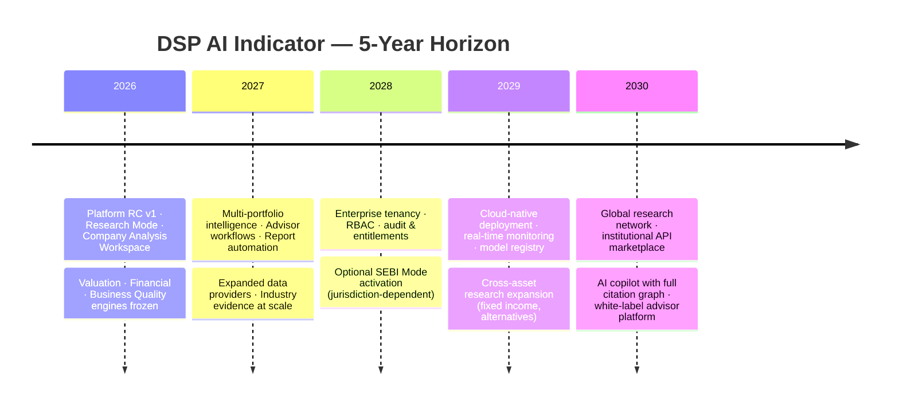

# Project Charter — DSP AI Indicator

| Field | Value |
|---|---|
| **Version** | `1.0.0` |
| **Status** | **Active** |
| **Last updated** | 2026-07-27 |
| **Audience** | Leadership · product · engineering · research · compliance |
| **Authority** | Canonical project charter; operational companion → [DSP_MASTER_PROTOCOL.md](DSP_MASTER_PROTOCOL.md) |

---

## 1. Vision

**DSP AI Indicator** will become the institutional standard for explainable AI investment intelligence — a platform where every investor, from a family office CIO to an individual owner of a concentrated portfolio, can understand a business with the depth of a professional research desk and the clarity of a trusted advisor.

We combine the analytical rigor of a Bloomberg Terminal, the portfolio and risk discipline of an Aladdin-class platform, and the qualitative clarity of Morningstar — delivered through deterministic engines, evidence-backed conclusions, and AI that explains rather than obscures.

> **Tagline:** Complex Analysis. Simple Decisions.

---

## 2. Mission

Help investors **understand businesses before making investment decisions** — not by delivering tips, signals, or trades, but by producing traceable, multi-dimensional research artifacts that support informed judgment.

DSP is an **AI Investment Intelligence Platform**. It is explicitly **not** a stock screener, trading bot, or brokerage.

---

## 3. Project Goals

| # | Goal | Success indicator |
|---|---|---|
| G1 | **Explainable intelligence** | Every score, chart, and conclusion cites source, methodology, and confidence |
| G2 | **Institutional research depth** | Full company analysis: fundamentals, valuation, quality, risk, management, moat |
| G3 | **Deterministic core** | Same inputs → same engine outputs; AI interprets, never silently replaces math |
| G4 | **Multi-audience delivery** | Family offices, advisors, analysts, and individuals each get role-appropriate workflows |
| G5 | **Thin-client integrity** | All investment logic lives server-side; web/mobile are presentation only |
| G6 | **Compliance-ready architecture** | Research Mode default; SEBI Mode prepared without activating prematurely |
| G7 | **Modular extensibility** | New engines, providers, and report types plug in without platform redesign |
| G8 | **Operational trust** | Regression GREEN, frozen modules protected, audit trail for architectural change |

---

## 4. Core Values

| Value | Meaning in practice |
|---|---|
| **Truth over convenience** | Missing data is labeled Unavailable — never fabricated |
| **Evidence over opinion** | Filings and statements rank above news and narrative |
| **Clarity over complexity** | Summary first; progressive disclosure for depth |
| **Humility over certainty** | Confidence scores, ranges, and dissent are first-class outputs |
| **Ownership over duplication** | One package owns each durable artifact; consumers cite, not re-home |
| **Protection over velocity** | Frozen production modules are not modified without explicit unlock |
| **Accessibility over exclusivity** | Professional-grade research available to non-institutional users |

---

## 5. Long-Term Vision (5 Years)

### Year 1 (2026) — Foundation & Trust
- Stable `/api/v1` release candidate
- Company Analysis Workspace (L1.x) delivered
- FEATURE domains (Moat, Management, Financial Strength, Earnings Quality, Growth, Business Quality Aggregator, Investment Recommendation, Investment Committee) composed into platform
- Research Mode as default product identity

### Year 2 (2027) — Portfolio & Advisor Scale
- Portfolio intelligence and monitoring at production quality
- Advisor presentation layer (V2.x) hardened
- Automated report generation for client meetings
- Provider ecosystem for filings, consensus, and macro data

### Year 3 (2028) — Enterprise Readiness
- Multi-tenant architecture with role-based access
- Compliance mode enforcement at organization level
- Full audit logging and data lineage
- Optional regulated research publication mode

### Year 4 (2029) — Cloud & Real-Time Intelligence
- Horizontally scalable signal and research pipelines
- Portfolio monitoring with alerting
- Model registry and governed AI adapter layer
- Cross-asset research modules

### Year 5 (2030) — Institutional Network
- API marketplace for third-party research plugins
- White-label deployment for RIAs and family offices
- Knowledge graph spanning companies, industries, and macro themes
- Recognized standard for explainable AI investment research

---

## 6. Engineering Philosophy

| Principle | Implementation |
|---|---|
| **Clean Architecture** | Domain independent of UI, HTTP, and vendor SDKs |
| **Domain-Driven Design** | Bounded contexts map to packages under `packages/` |
| **Evidence-first outputs** | Every decision-influencing artifact carries source, confidence, limitations |
| **Composition root pattern** | `dsp_platform` wires engines; applications import façade + `contracts` only |
| **Hexagonal ports** | Data providers, LLM adapters, and storage are adapters at the edge |
| **Freeze discipline** | Production-certified modules require ADR + explicit unlock |
| **Monorepo modularity** | Package boundary = primary unit of ownership and testing |
| **Thin client mandate** | `apps/web` maps API envelopes to view-models; zero investment math in browser |

Dependency direction and forbidden imports → [SYSTEM_ARCHITECTURE.md](SYSTEM_ARCHITECTURE.md) · [DSP_ARCHITECTURE.md](DSP_ARCHITECTURE.md).

---

## 7. Financial Research Philosophy

Investment research at DSP follows a **business-first, evidence-ordered** methodology:

1. **Understand the business** — what it sells, to whom, and why it might persist
2. **Verify the financial record** — statements, cash flow, and capital allocation history
3. **Assess quality dimensions** — earnings quality, management, moat, growth durability
4. **Estimate intrinsic value** — multiple valuation models, never a single point estimate
5. **Identify risks** — balance sheet, operational, macro, and governance
6. **Synthesize a view** — committee deliberation with explicit disagreement
7. **Present honestly** — separate facts, calculations, estimates, and AI interpretation

We do not optimize for short-term price prediction. We optimize for **understanding economic reality** and communicating uncertainty.

Research order for source material → [RESEARCH_FRAMEWORK.md](RESEARCH_FRAMEWORK.md).

---

## 8. AI Explainability Principles

AI in DSP is a **research assistant and interpreter**, not an oracle.

| Rule | Requirement |
|---|---|
| Never hallucinate | Missing data → Unavailable; never invent analyst targets or filing numbers |
| Always explain assumptions | Every AI narrative lists the assumptions it relies on |
| Always cite evidence | Citations link to filings, calculated metrics, or engine outputs |
| Separate epistemic categories | Facts · Calculated Values · Estimates · AI Interpretation · External Consensus |
| Assign confidence | Low / Medium / High or numeric scores on all non-fact outputs |
| Show dissent | AI Challenge Mode presents bull, bear, risks, and unknowns |
| Deterministic engines first | LLM adapters explain engine output; they do not replace scoring math |

Full AI behavior specification → [AI_PRINCIPLES.md](AI_PRINCIPLES.md) · [USER_TRUST_STANDARD.md](USER_TRUST_STANDARD.md).

---

## 9. Design Principles

Every screen, report, and API response must answer four questions:

1. **What is happening?**
2. **Why is it happening?**
3. **Why should I care?**
4. **What should I do next?**

A screen that fails any of these is incomplete.

### Product design tenets

| Tenet | Detail |
|---|---|
| Summary first, details later | Progressive disclosure via accordions, tabs, and drill-down |
| Every metric explained | Plain-English definitions via Metric Library |
| Every chart interpreted | No orphan visualizations |
| Research Mode default | No Buy/Sell/Hold unless compliance mode permits |
| Mobile-first · Accessibility-first | WCAG AA; keyboard and screen-reader support |
| Consistent visual language | VLIS tokens; semantic colors for risk and confidence |
| Honest unavailable states | Skeleton and empty states over fabricated placeholders |

UX freezes → [PRODUCT_EXPERIENCE_BLUEPRINT.md](PRODUCT_EXPERIENCE_BLUEPRINT.md) · [COMPANY_ANALYSIS_BLUEPRINT.md](COMPANY_ANALYSIS_BLUEPRINT.md).

---

## 10. Coding Standards

Institutional Python and TypeScript standards are defined in [CODING_STANDARDS.md](CODING_STANDARDS.md).

Operational quick reference for day-to-day work → [DSP_CODING_STANDARDS.md](DSP_CODING_STANDARDS.md).

Non-negotiables:

- Depend inward only; public façades for cross-package imports
- Type hints on all public Python APIs
- No investment math in `apps/web`
- No secrets in version control
- ADR required before modifying frozen modules

---

## 11. Documentation Standards

| Standard | Rule |
|---|---|
| **Canonical suite** | `DSP_*.md` files are the operational documentation layer |
| **Charter & architecture** | This file + [SYSTEM_ARCHITECTURE.md](SYSTEM_ARCHITECTURE.md) for onboarding |
| **Living status** | [DSP_STATUS.md](DSP_STATUS.md) updated when release-facing state changes |
| **Decision records** | Architectural conflicts → [DSP_DECISION_RECORDS.md](DSP_DECISION_RECORDS.md) |
| **Sprint briefs** | One epic brief per change set; do not paste entire freeze docs into sprints |
| **Archive policy** | Superseded specs move to `docs/archive/` — never deleted |
| **Package READMEs** | Every registered package maintains a README card per ASI-005 |
| **Version truth** | [VERSION_MATRIX.md](VERSION_MATRIX.md) is authoritative for package versions |

Documentation is a **deliverable**, not an afterthought. Docs-only sprints are a valid scope class.

---

## 12. Testing Standards

| Layer | Requirement |
|---|---|
| **Unit tests** | Every engine, scorer, and mapper has deterministic unit coverage |
| **Integration tests** | Platform composition paths tested offline (no network) |
| **Architecture tests** | Import cycles, ownership rules, and thin-client invariants enforced |
| **E2E tests** | BUY / SELL / HOLD / partial data / disagreement / determinism scenarios |
| **Web tests** | Vitest for view-model mappers and component contracts |
| **Regression policy** | Change set is GREEN only when all applicable dimensions pass |

Testing matrix → [PACKAGE_TESTING_MATRIX.md](PACKAGE_TESTING_MATRIX.md) · CI gates → [CI.md](CI.md).

---

## 13. Definition of Done

A feature, sprint, or epic is **DONE** when **all** conditions are met:

| # | Criterion |
|---|---|
| 1 | **GREEN** — build, tests, architecture, API compatibility, determinism pass |
| 2 | **Quality Gate** — [IMPLEMENTATION_QUALITY_GATE.md](IMPLEMENTATION_QUALITY_GATE.md) satisfied |
| 3 | **Trust Standard** — [USER_TRUST_STANDARD.md](USER_TRUST_STANDARD.md) honored in all user-visible outputs |
| 4 | **Ownership** — exactly one package owns new durable artifacts |
| 5 | **Documentation** — STATUS, VERSION_MATRIX, and sprint brief updated if release-facing |
| 6 | **Freeze respected** — no unauthorized edits to protected modules |
| 7 | **ADR filed** — if architecture, dependency direction, or public API changed |

"Mostly done" or "works on my machine" is not DONE.

---

## 14. Versioning Strategy

| Artifact | Scheme | Authority |
|---|---|---|
| **API** | Release candidate semver (`v1.0.0-rc1`) | [VERSION_MATRIX.md](VERSION_MATRIX.md) |
| **Python packages** | Independent semver per package | `pyproject.toml` + VERSION_MATRIX |
| **Web app** | Semver (`dsp-web`) | `apps/web/package.json` |
| **Documentation suite** | Semver on DSP_STATUS header | [DSP_STATUS.md](DSP_STATUS.md) |
| **Milestones** | Named tags (`v2.0.0-financial-intelligence`) | DSP_CHANGELOG |

### Versioning rules

- **Patch** — bug fix, no contract change
- **Minor** — additive API or engine capability, backward compatible
- **Major / new RC** — breaking API, epic-level architecture change
- Breaking changes require explicit epic approval — never a drive-by refactor

Release engineering → [RELEASE_ENGINEERING.md](RELEASE_ENGINEERING.md).

---

## 15. Roadmap

High-level phase sequencing → [DEVELOPMENT_ROADMAP.md](DEVELOPMENT_ROADMAP.md).

Epic-level status board → [DSP_ROADMAP.md](DSP_ROADMAP.md).

Living delivery status → [DSP_STATUS.md](DSP_STATUS.md).

### Current state (2026-07-27)

| Area | Status |
|---|---|
| Platform RC | `v1.0.0-rc1` |
| Valuation Engine (Phase 1 Suite) | **Complete · Frozen** |
| Financial Statement Intelligence (Phase 2) | **Complete · Frozen** |
| Business Quality Intelligence (Phase 3) | **Complete · Frozen** |
| FEATURE-001–008 domains | **Complete** (platform composition pending approval) |
| ASI (Architecture Stabilization) | **Closed** |
| EPIC-003 Frontend Integration | **Complete** |
| Next gate | Explicit approval for platform composition of FEATURE domains |

---

## 16. Related Documents

| Document | Purpose |
|---|---|
| [SYSTEM_ARCHITECTURE.md](SYSTEM_ARCHITECTURE.md) | Complete system design |
| [PRODUCT_REQUIREMENTS.md](PRODUCT_REQUIREMENTS.md) | User personas and product scope |
| [DEVELOPMENT_ROADMAP.md](DEVELOPMENT_ROADMAP.md) | Phase-by-phase delivery plan |
| [CODING_STANDARDS.md](CODING_STANDARDS.md) | Engineering standards |
| [AI_PRINCIPLES.md](AI_PRINCIPLES.md) | AI behavior contract |
| [RESEARCH_FRAMEWORK.md](RESEARCH_FRAMEWORK.md) | Research methodology |
| [DSP_MASTER_PROTOCOL.md](DSP_MASTER_PROTOCOL.md) | Operational entry point for all work |
