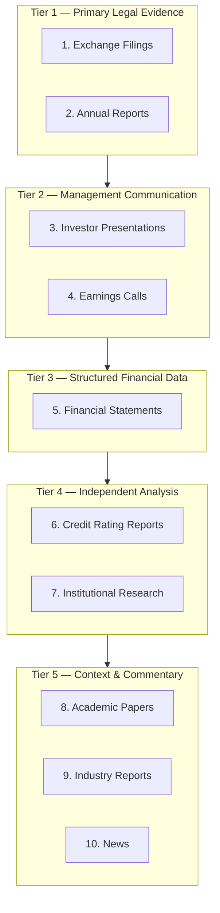

# Research Framework — DSP AI Indicator

| Field | Value |
|---|---|
| **Version** | `1.0.0` |
| **Status** | **Active** |
| **Last updated** | 2026-07-27 |
| **Audience** | Research analysts · AI engineers · product · compliance |
| **Companion** | Company Analysis UX → [COMPANY_ANALYSIS_BLUEPRINT.md](COMPANY_ANALYSIS_BLUEPRINT.md) |

---

## 1. Purpose

This document defines the **canonical order** in which investment research sources are consulted, ingested, and weighted within the DSP AI Indicator platform.

The order is not arbitrary. It reflects a hierarchy of **evidential reliability** — from primary legal disclosures to secondary commentary — ensuring that AI and engine outputs are grounded in the most authoritative data available.

---

## 2. Research Source Hierarchy

| Priority | Source | Reliability | Latency | DSP ingestion |
|---|---|---|---|---|
| 1 | Exchange Filings | Highest — legally mandated | Days–weeks | `data_engine` adapters |
| 2 | Annual Reports | Highest — audited | Annual | `data_engine` → `snapshot_bridge` |
| 3 | Investor Presentations | High — management prepared | Quarterly | `data_engine` adapters |
| 4 | Earnings Calls | High — management Q&A | Quarterly | `data_engine` + `copilot` NLP |
| 5 | Financial Statements | Highest — structured data | Quarterly/Annual | `financial` engine |
| 6 | Credit Rating Reports | High — independent analysis | Periodic | `data_engine` adapters |
| 7 | Institutional Research | Medium — analyst opinion | Ad hoc | `data_engine` (future provider) |
| 8 | Academic Papers | Medium — peer-reviewed theory | Slow | Manual / future ingestion |
| 9 | Industry Reports | Medium — sector context | Periodic | `industry` evidence framework |
| 10 | News | Lowest — unverified, reactive | Real-time | `data_engine` (future; lowest weight) |

---

## 3. Research Order — Detailed

### 3.1 Exchange Filings

**Examples:** SEC 10-K, 10-Q, 8-K (US); BSE/NSE annual reports and exchange disclosures (India); equivalent regulatory filings globally.

**Why first:**
- Legally mandated accuracy with officer certification
- Subject to regulatory audit and enforcement
- Primary source of truth for all downstream analysis
- Material events (8-K) trigger immediate reassessment

**DSP usage:**
- `data_engine` filing adapters parse and normalize
- `snapshot_bridge` maps filing data to engine input snapshots
- Evidence panel cites filing type, date, and section/page

**Research actions:**
1. Identify most recent annual and quarterly filings
2. Check for material event filings (8-K) since last analysis
3. Verify filing date against analysis date (staleness check)
4. Extract financial statements, MD&A, and risk factors

---

### 3.2 Annual Reports

**Examples:** Integrated annual report, Form 10-K annual section, chairman's letter, CSR report.

**Why second:**
- Comprehensive single-document view of the business year
- Audited financial statements with auditor opinion
- Management discussion provides strategic context unavailable in raw data
- Chairman/CEO letter reveals management priorities and tone

**DSP usage:**
- `fundamental` engine extracts business description and strategy
- `management_quality` (FEATURE-002) assesses capital allocation narrative
- `business_quality` engine evaluates business model description

**Research actions:**
1. Read business description and segment breakdown
2. Review auditor opinion and any qualifications
3. Extract MD&A for strategy, risks, and outlook
4. Note significant accounting policy changes

---

### 3.3 Investor Presentations

**Examples:** Quarterly earnings presentation, investor day deck, roadshow materials.

**Why third:**
- Management's curated narrative — useful for intent, dangerous if taken alone
- Contains forward-looking guidance (with safe harbor disclaimers)
- Visual format aids business model understanding
- Supplements but never overrides filing data

**DSP usage:**
- `growth_quality` (FEATURE-005) evaluates growth guidance vs. historical delivery
- `copilot` may summarize presentation highlights with `[AI Interpretation]` label
- Industry evidence framework may reference sector presentations

**Research actions:**
1. Compare presentation claims against filing data (verify, don't trust)
2. Extract forward guidance and capex plans
3. Note discrepancies between presentation and 10-K/10-Q
4. Label all presentation-derived insights as management-prepared

---

### 3.4 Earnings Calls

**Examples:** Quarterly earnings conference call transcripts, Q&A sessions.

**Why fourth:**
- Unscripted management responses reveal conviction and evasion patterns
- Analyst questions highlight market concerns
- Tone and language shifts signal management confidence changes
- Transcripts are secondary to filings but primary for qualitative assessment

**DSP usage:**
- `earnings_quality` (FEATURE-004) cross-references call claims with reported numbers
- `management_quality` (FEATURE-002) evaluates Q&A transparency
- `copilot` NLP (future) extracts key quotes with citation

**Research actions:**
1. Read prepared remarks for official guidance
2. Analyze Q&A for evasive vs. direct answers
3. Compare call claims to subsequent filing outcomes (track record)
4. Flag management language shifts from prior quarters

---

### 3.5 Financial Statements

**Examples:** Income statement, balance sheet, cash flow statement, statement of changes in equity.

**Why fifth:**
- Structured, quantifiable, and machine-processable
- Foundation for all ratio analysis, trend analysis, and valuation inputs
- Audited (annual) or reviewed (quarterly) — high reliability
- Ranked after filings/reports because statements are *contained within* those documents; this step is the structured extraction and analysis phase

**DSP usage:**
- `financial` engine (F2.1–F2.7) — full statement intelligence
- `financial_strength` (FEATURE-003) — balance sheet and solvency
- `valuation` engine — DCF inputs, EPV, ratio-based methods
- `snapshot_bridge` — normalized statement snapshots

**Research actions:**
1. Analyze three to five year trends in revenue, margins, and cash flow
2. Compute and interpret key ratios (ROIC, ROE, debt/equity, current ratio)
3. Reconcile net income to operating cash flow (accruals quality)
4. Identify one-time items and adjust for normalized earnings

---

### 3.6 Credit Rating Reports

**Examples:** S&P, Moody's, Fitch rating reports and outlook changes; CRISIL/ICRA (India).

**Why sixth:**
- Independent third-party assessment of creditworthiness
- Analytical frameworks differ from equity research (focus on debt service)
- Rating changes are material events
- Useful for financial strength and risk assessment

**DSP usage:**
- `financial_strength` (FEATURE-003) incorporates rating context
- `risk` engine includes credit risk dimension
- Evidence panel cites rating agency, date, and outlook

**Research actions:**
1. Note current rating and outlook (stable/positive/negative/watch)
2. Review key rating drivers and sensitivities
3. Compare rating agency view with internal financial strength assessment
4. Monitor for rating changes since last analysis

---

### 3.7 Institutional Research

**Examples:** Sell-side equity research reports, buy-side internal memos, Morningstar/Bloomberg analyst notes.

**Why seventh:**
- Provides market consensus context and variant perception identification
- Analyst models and assumptions may be informative but are opinions
- Potential conflicts of interest (investment banking relationships)
- Must never override primary source data

**DSP usage:**
- Street consensus section (Company Analysis §12) — Unavailable until provider integrated
- `comparison` engine may reference analyst estimates for relative context
- DSP vs Street section (§13) compares internal view to consensus

**Research actions:**
1. Gather consensus estimates (EPS, revenue, target price) if provider available
2. Identify variant perceptions (where DSP analysis diverges from Street)
3. Evaluate analyst track record on this name (historical accuracy)
4. Never treat analyst opinion as fact — label as External Consensus

---

### 3.8 Academic Papers

**Examples:** Journal of Finance, Review of Financial Studies, peer-reviewed working papers on factor models, valuation methods, behavioral finance.

**Why eighth:**
- Provides rigorous methodological foundations
- Factor research (quality, value, momentum) informs engine design
- Slow to publish — not useful for timely analysis of a specific name
- Valuable for validating engine methodology and assumptions

**DSP usage:**
- Engine design references (e.g., accruals quality methodology)
- Valuation method selection rationale (e.g., residual income model basis)
- Not ingested per-company in standard research flow

**Research actions:**
1. Reference when validating engine methodology choices
2. Apply factor research insights to scoring calibration
3. Use for platform-level methodology documentation
4. Do not cite academic papers as evidence for specific company conclusions

---

### 3.9 Industry Reports

**Examples:** Gartner, IBISWorld, McKinsey sector reports, trade association data, government industry statistics.

**Why ninth:**
- Provides sector context for individual company analysis
- Market size, growth rates, and competitive dynamics
- Industry-level data helps calibrate company-specific assumptions
- May lag current conditions; sector reports are periodic

**DSP usage:**
- `industry` package — Industry Identity, taxonomy, evidence framework
- `comparison` engine — peer selection and relative positioning
- Industry evidence bundles (C3.1–C3.7)

**Research actions:**
1. Identify company's industry classification and peer group
2. Review industry growth rates and competitive structure
3. Assess company's market share trend within industry context
4. Use industry evidence bundles for qualitative comparison

---

### 3.10 News

**Examples:** Financial news wires (Reuters, Bloomberg News), business press, social media, press releases.

**Why last:**
- Lowest evidential reliability — reactive, unverified, potential bias
- Useful for timeliness (material events, management changes, lawsuits)
- Must never be primary evidence for financial metrics or valuations
- Press releases are company-prepared (similar to investor presentations)

**DSP usage:**
- Future `data_engine` news adapter (lowest weight in evidence hierarchy)
- `copilot` may reference news with explicit `[AI Interpretation]` and source link
- Material news triggers re-analysis flag in portfolio monitoring

**Research actions:**
1. Scan for material events since last filing date
2. Verify news claims against filings before incorporating
3. Treat press releases as company-prepared (priority 3 weight)
4. Never use news as sole basis for financial metric claims

---

## 4. Why This Order Exists

### 4.1 Evidential reliability principle

Sources higher in the hierarchy have:
- **Legal accountability** — officers certify filings under penalty of law
- **Audit verification** — financial statements reviewed by independent auditors
- **Structured format** — machine-parseable with defined schemas
- **Temporal stability** — not reactive to daily market noise

Sources lower in the hierarchy have:
- **Opinion content** — analyst views, management spin, media narrative
- **Potential bias** — investment banking conflicts, company PR, click incentives
- **Unverified claims** — news may report rumors as facts
- **Ephemeral relevance** — today's headline may be forgotten tomorrow

### 4.2 Conflict resolution rule

When sources disagree, **higher-priority source wins**:

| Conflict | Resolution |
|---|---|
| News reports revenue miss; 10-Q shows beat | 10-Q (Priority 1) governs |
| Analyst estimates differ from DCF | Both presented; filing data grounds DCF |
| Management presentation optimistic; cash flow declining | Cash flow (Priority 5) governs narrative |
| Industry report shows growth; company losing share | Company-specific filings (Priority 1) govern |
| AI interpretation contradicts calculated ratio | Calculated ratio (engine output) governs |

See [PRODUCT_CONSTITUTION.md](PRODUCT_CONSTITUTION.md) for full conflict order.

### 4.3 AI grounding rule

AI components may only generate interpretations **grounded in sources Priority 1–7**. Sources Priority 8–10 provide context but cannot be sole basis for AI claims about a specific company.

---

## 5. Research Workflow Integration

The research order maps to the Company Analysis Workspace sections:

| Research step | Company Analysis section |
|---|---|
| Filings + Annual Report | Company Snapshot, Business Quality |
| Investor Presentations + Earnings Calls | Management, Growth |
| Financial Statements | Financial Strength, Earnings Quality |
| Credit Ratings | Financial Strength, Risk |
| Institutional Research | Market Analyst Consensus, DSP vs Street |
| Industry Reports | Competitive Advantage, Industry Evidence |
| News | Monitoring alerts (not primary section) |
| All sources combined | Evidence Panel (§18), AI Challenge Mode (§14) |

Full section order → [COMPANY_ANALYSIS_BLUEPRINT.md](COMPANY_ANALYSIS_BLUEPRINT.md).

---

## 6. Research Quality Gates

Before a research artifact (Decision Pack) is considered complete:

| Gate | Requirement |
|---|---|
| **Filing freshness** | Most recent quarterly filing within 120 days (or flagged stale) |
| **Statement completeness** | Minimum 3 years income, balance sheet, and cash flow |
| **Source coverage** | At least Priority 1, 3, and 5 sources consulted |
| **Unavailable honesty** | Missing sources labeled Unavailable — not skipped silently |
| **CV-001 authenticity** | No fabricated / placeholder market or financial numbers; show **Data unavailable.** |
| **CV-002…CV-010** | Source-before-score · explainability · determinism · transparency · traceability · auditability · research-first · governance · quality-over-speed |
| **RS-001…RS-010** | Minimum research report content — [RESEARCH_STANDARDS.md](RESEARCH_STANDARDS.md); missing section = FAIL |
| **Evidence citations** | Every displayed metric has a citation in Evidence panel |
| **AI Challenge complete** | Bull, bear, risks, and unknowns presented |
| **Confidence assigned** | Every assessment carries confidence level |
| **Conflict documented** | Source disagreements explicitly noted |

---

## 7. Related Documents

| Document | Purpose |
|---|---|
| [COMPANY_ANALYSIS_BLUEPRINT.md](COMPANY_ANALYSIS_BLUEPRINT.md) | 19-section analysis UX |
| [AI_PRINCIPLES.md](AI_PRINCIPLES.md) | AI behavior and citation rules |
| [USER_TRUST_STANDARD.md](USER_TRUST_STANDARD.md) | Trust enforcement |
| [CORE_VALUES.md](CORE_VALUES.md) · [CV_001_DATA_AUTHENTICITY_FIRST.md](CV_001_DATA_AUTHENTICITY_FIRST.md) · [CV_002_TO_010_TIER0_CORE_VALUES.md](CV_002_TO_010_TIER0_CORE_VALUES.md) | Tier-0 Core Values |
| [RESEARCH_STANDARDS.md](RESEARCH_STANDARDS.md) · [RS_001_TO_RS_010.md](RS_001_TO_RS_010.md) | Research Standards (report content) |
| [RESEARCH_ARCHITECTURE.md](RESEARCH_ARCHITECTURE.md) · [REPORT_ARCHITECTURE.md](REPORT_ARCHITECTURE.md) | Research / report architecture |
| [PRODUCT_CONSTITUTION.md](PRODUCT_CONSTITUTION.md) | Conflict resolution order |
| [C3_0A_INDUSTRY_EVIDENCE_ARCHITECTURE_FREEZE.md](C3_0A_INDUSTRY_EVIDENCE_ARCHITECTURE_FREEZE.md) | Industry evidence framework |
| [PROJECT_CHARTER.md](PROJECT_CHARTER.md) | Financial research philosophy (§7) |
