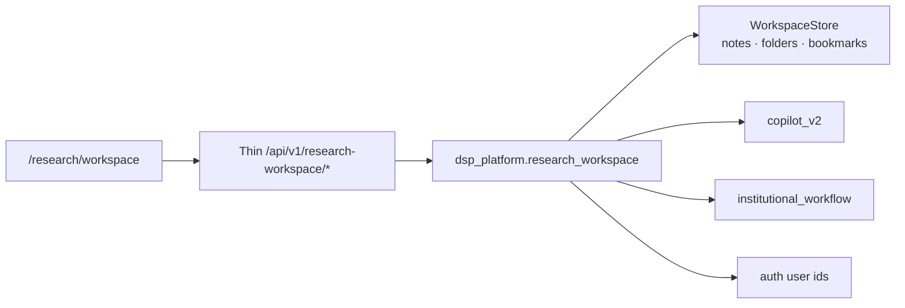

# RC1 Milestone 8 — Research Workspace

| | |
|---|---|
| **Status** | Implemented (orchestration only) |
| **Rule** | No new research engine; no duplicated calculations or AI |

## 1. Purpose

The Institutional Research Workspace is the analyst working environment for
notes, folders, bookmarks, templates, version history, publishing, collaboration,
tags, and search. It **orchestrates** existing platforms — it does not
recalculate valuation, risk, or recommendations.

## 2. Reuse map

| Capability | Reuse |
|---|---|
| AI assist on notes | Copilot 2.0 (`run_copilot_v2`) |
| Publish / review / approve | Institutional Workflow Automation |
| Company attachments | Company Workspace / analyse artifacts (refs only) |
| Portfolio attachments | Portfolio Store / Portfolio Intelligence (refs only) |
| Dashboard widgets (context) | Enterprise Dashboards (optional cross-links) |
| User ids / share targets | Authentication Platform |
| Export of note text | Export Engine patterns (client download / existing export) |
| Documents | Data Connector Framework refs as attachments |

## 3. Features

1. **Notes** — markdown body, AI-generated flag, attach company / portfolio /
   research object / documents
2. **Folders** — create, rename, move, archive, delete (nested under `folder-root`)
3. **Bookmarks** — company, report, portfolio, comparison, document, copilot chat, note
4. **Templates** — investment memo, company report, quarterly / management review,
   bull/base/bear, meeting notes, checklist (shells; enrich via Copilot when inputs exist)
5. **Version history** — every save increments version; diff hunks; restore
6. **Publishing** — draft → review → approved → published → archived via workflow
7. **Collaboration** — share, comments, mentions list, resolve, assignee field
8. **Search** — full-text across notes, folders, bookmarks, tags, comments
9. **Tags** — label, color, kind (company / sector / portfolio / custom)
10. **Workspace dashboard** — recent notes, pending reviews, published, bookmarks,
    copilot history, companies, tasks

## 4. Architecture constraints

- Workspace store is **separate** from persistence `ENTITY_KINDS` (engine payload freeze).
- Process-local store for RC1 — durable DB is a known gap (see Remaining Gaps).
- Missing engine inputs → **Data unavailable.**
- Thin routers only; UI never invents scores or MoS.

## 5. Frontend

- Route: `/research/workspace` (lazy-loaded)
- Flag: `NEXT_PUBLIC_RESEARCH_WORKSPACE_PLATFORM` (default true)
- Existing F007 `/research` library remains unchanged

## 6. API (summary)

See [API_GUIDE.md](API_GUIDE.md) — RC1 Milestone 8 section.

## 7. Security

- Routes sit behind the standard API auth stack.
- Share / comment / assignee store Auth Platform user ids — no parallel identity system.
- Note bodies are workspace artifacts, not valuation payloads.
