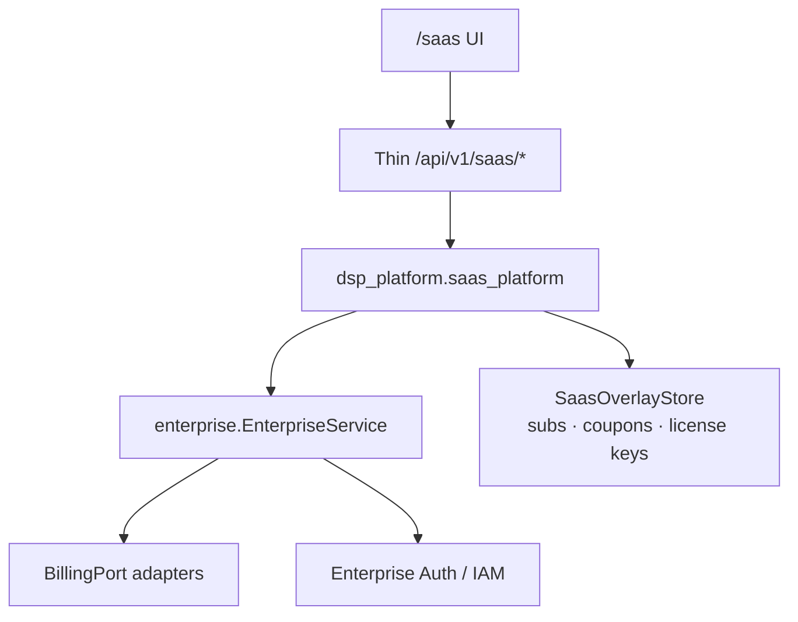

# RC1 Milestone 9 — Commercial SaaS Platform

| | |
|---|---|
| **Status** | Implemented (orchestration only) |
| **Rule** | Never duplicate orgs, IAM, billing, auth, or engines |

## 1. Purpose

Turn DSP AI Indicator into an **organization-aware** commercial multi-tenant
SaaS surface. Domain authority remains in `packages/enterprise`. The SaaS layer
orchestrates plans, subscriptions overlays, billing profiles, license keys, and
an honest admin dashboard.

## 2. Tenant architecture

## 3. Organization model

Reuses `EnterpriseService` organizations:

- Create / rename (update) / archive / soft-delete
- Settings: branding (logo, primary color, theme, workspace name)
- Preferences: timezone, country, currency, language, market, date/number formats,
  default dashboard / landing page, email & notification settings
- Teams, invites, roles, permissions → Enterprise IAM (not duplicated)

## 4. Subscription model

Plans: **Starter · Professional · Enterprise · Custom**

| Concern | Mechanism |
|---|---|
| Plan catalogue | `saas_platform.plans.SAAS_PLANS` |
| Seat / API / Copilot / export limits | Plan limits → license `usage_limits` |
| Feature matrix | Plan `features` + mapped feature flags |
| License tier mapping | starter→research, professional→professional, enterprise→enterprise, custom→institutional |
| Trials / renewals / coupons | Overlay metadata only |
| Payments | `BillingPort` — **never faked** |

## 5. License model

- Assign / validate via existing `assign_license` / `validate_license`
- Enterprise license keys issued/activated in overlay → then bind via enterprise license
- Seat allocation = license seats + org `seat_limit`
- Expiry / status from enterprise license records

## 6. Billing

- Billing profile (tax / GST / VAT / currency) stored in overlay
- Invoices / payment history / checkout → BillingPort adapters (Stripe/Razorpay/Paddle stubs remain unavailable)
- Coupon codes = discount metadata only until a provider is live

## 7. Usage & audit

- `increment_usage` / `usage_snapshot` / `platform_usage_analytics` (enterprise)
- Usage events also append to enterprise audit (no fourth logger)
- Admin SaaS dashboard: honest zeros; **revenue always unavailable** without a gateway

## 8. Feature limits

Per-plan limits for portfolios, research, Copilot, exports, storage, API, workflows,
dashboards, admin — expressed as packaging + feature flags. Engines unchanged.

## 9. Frontend

- Route: `/saas` (lazy)
- Flag: `NEXT_PUBLIC_SAAS_PLATFORM`
- Existing `/portal` and `/ops` remain; SaaS is the commercial control plane

## 10. API

See [API_GUIDE.md](API_GUIDE.md) — RC1 Milestone 9.
