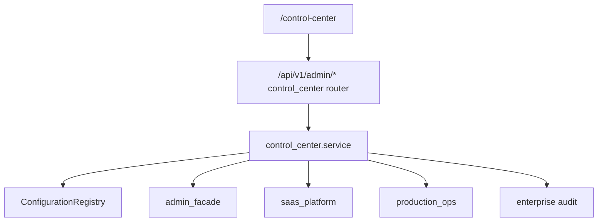
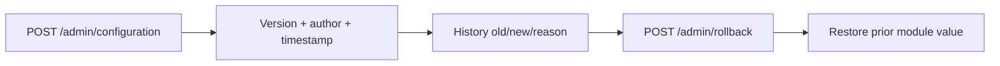
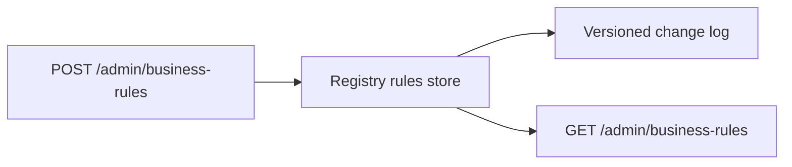

# RC1 Milestone 11 — Super Admin Control Center

Platform Operating System for DSP AI Indicator. Configuration registry,
versioning/rollback, branding, CMS overlays, feature flags, AI/valuation/risk
overlays, business rules, notifications, dashboard layout, SaaS control
pointers, security overlays, templates, monitoring façade, audit export,
backup/release façades — **without** duplicating engines or redesigning
completed architecture.

## Non-negotiable rules

| Rule | Enforcement |
|---|---|
| Orchestration only | `dsp_platform.control_center.service` |
| No valuation / AI / risk execution | Config overlays only; `engines_executed: false` |
| No duplicate auth / IAM | Reuses `require_admin_access` + Admin / Enterprise |
| No duplicate monitoring | Monitoring Center → Production Ops + Admin metrics |
| No duplicate SaaS / Ops | Pointers + façades to `/saas` and `/ops` |
| Thin routers | `api_platform.api.routers.control_center` |
| Thin client | `/control-center` calls `/api/v1/admin/*` only |
| Missing data | **Data unavailable.** |

## Architecture

### Configuration Registry

### Business Rules

## Modules (registry keys)

`platform`, `branding`, `cms`, `feature_flags`, `ai`, `research`, `portfolio`,
`valuation`, `risk`, `workflow`, `dashboard`, `saas`, `security`, `market`,
`notifications`, `exports`, `regional`, `connectors`, `business_rules`,
`templates`, `monitoring`, `backup`, `release`, `users_orgs`.

Valuation / AI / risk / market / connector values are **overlays**. Engines
continue to use their frozen defaults until explicitly wired to consume the
registry (post-RC1). Secrets (API keys) are never stored in plaintext in the
registry.

## APIs (additive to A010)

| Method | Path | Purpose |
|---|---|---|
| GET | `/admin/control-center/schema` | Schema + modules + routes |
| GET | `/admin/control-center/dashboard` | Control Center overview |
| GET | `/admin/configuration/registry` | Full or per-module registry |
| POST | `/admin/configuration` | Update module (versioned) |
| GET | `/admin/configuration/history` | Version history |
| POST | `/admin/rollback` | One-click rollback |
| POST | `/admin/branding` | Branding overlay |
| POST | `/admin/cms` | CMS page overlay |
| POST | `/admin/feature-flags/overrides` | Runtime flag overrides |
| POST | `/admin/valuation/config` | Valuation overlay |
| POST | `/admin/ai/config` | AI overlay (strips secrets) |
| POST | `/admin/risk/config` | Risk overlay |
| POST | `/admin/market/config` | Market overlay |
| POST | `/admin/connectors/config` | Connector priority/limits overlay |
| GET/POST/DELETE | `/admin/business-rules` | Configurable rules |
| POST | `/admin/notifications/config` | Notification overlay |
| POST | `/admin/dashboard/layout` | Dashboard layout overlay |
| POST | `/admin/security/config` | Security overlay |
| POST | `/admin/templates/config` | Template overlay |
| POST | `/admin/saas/control` | SaaS defaults + plans façade |
| GET | `/admin/monitoring` | Ops + Admin metrics façade |
| POST | `/admin/backup/control` | BackupPort façade |
| GET | `/admin/release` | Version + release profiles |
| GET | `/admin/audit/config` | Config change audit export |
| GET | `/admin/users-orgs` | Users + orgs façade |

A010 routes remain unchanged (`GET /admin/configuration`, `GET /admin/audit`,
`GET /admin/feature-flags`, etc.).

## Frontend

- Route: `/control-center`
- Flag: `NEXT_PUBLIC_CONTROL_CENTER` (`featureFlags.controlCenter`)
- Shell: existing dashboard layout; tabbed + searchable; lazy panels
- No browser valuation / recommendation / AI reasoning

## Persistence note (RC1 gap)

Registry is **process-local** (same pattern as Research Workspace / SaaS overlay).
Durable DB-backed configuration is a post-RC1 hardening item.

## Tests

- Unit: `packages/dsp_platform/tests/test_control_center.py`
- API: `packages/api_platform/tests/test_control_center_api.py`
- Frontend: `apps/web/src/lib/control-center/control-center.test.tsx`
- Playwright smoke: `/control-center` in `apps/web/e2e/browser/smoke.spec.ts`

## Security

- All Control Center routes require `require_admin_access`
- Secret-like keys stripped from AI config writes
- Config changes recorded in registry history + optional enterprise audit
- No fabricated monitoring or payment data
