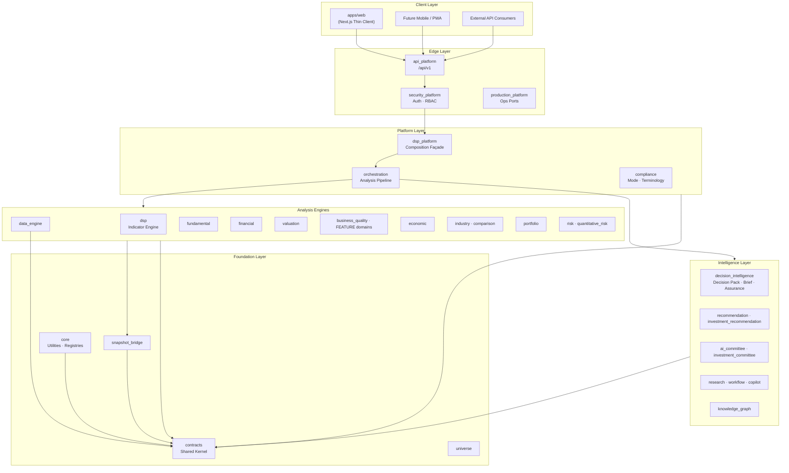
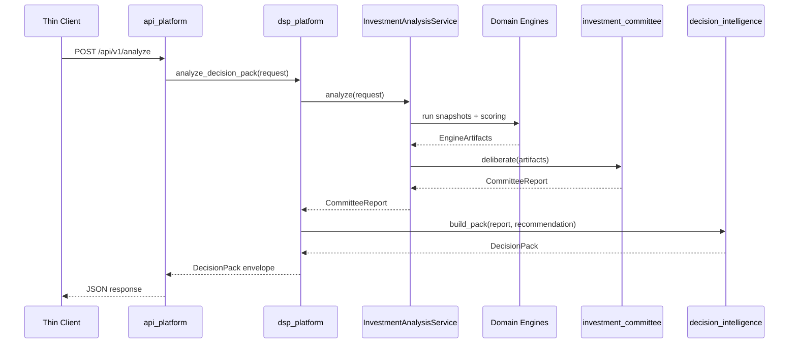
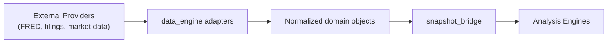
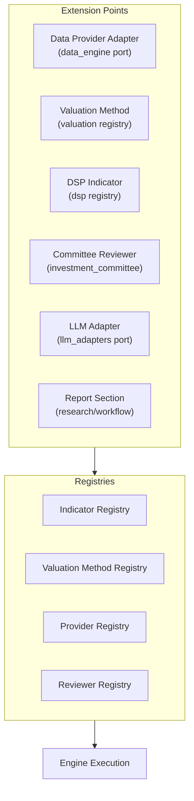
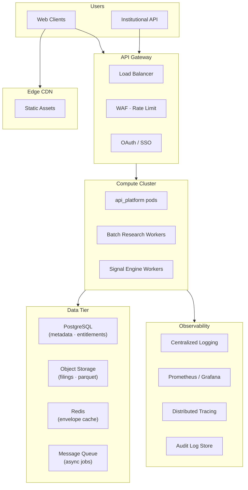

# System Architecture — DSP AI Indicator

| Field | Value |
|---|---|
| **Version** | `1.0.0` |
| **Status** | **Active** |
| **Last updated** | 2026-07-27 |
| **Audience** | Architects · principal engineers · security · AI agents |
| **Companion** | Dependency matrices → [DSP_ARCHITECTURE.md](DSP_ARCHITECTURE.md) · Paths → [DSP_FOLDER_STRUCTURE.md](DSP_FOLDER_STRUCTURE.md) |

---

## 1. Architectural Intent

DSP AI Indicator is a **layered, modular, evidence-first investment research platform**. Intelligence is produced by deterministic domain engines, composed through a platform façade, exposed via a versioned HTTP API, and rendered by thin clients.

The system is designed to scale from a single-analyst workstation deployment to a multi-tenant institutional cloud without rewriting domain logic.

---

## 2. Overall System Diagram



---

## 3. Request Flow — Decision Pack Pipeline



Applications import **`dsp_platform`** and **`contracts`** only. Internal packages are not application dependencies.

---

## 4. Module Catalog

### 4.1 Core

| Package | Role | Status |
|---|---|---|
| `contracts` | Shared kernel — Instrument, enums, domain types, public DTOs | Production · Frozen |
| `core` | Validation, registries, exceptions, domain-agnostic utilities | Production · Frozen |
| `compliance` | Feature flags, terminology ports, Research/SEBI mode policy | Production · Frozen |
| `snapshot_bridge` | Maps statements and time series → engine input snapshots | Production · Frozen |
| `universe` | Investment universe selection and multi-stock aggregation | Production · Frozen |

**Responsibility:** Provide the vocabulary and technical foundation upon which all engines depend. No business scoring logic.

---

### 4.2 Data Engine

| Package | Role | Status |
|---|---|---|
| `data_engine` | Provider adapters, normalization ports, acquisition pipelines | Production · Frozen |

**Responsibility:** Acquire, normalize, and serve market data, filings, and macro series through hexagonal ports. Vendor SDKs live at the adapter edge only.

**Data flow:**



---

### 4.3 DSP Indicator Engine

| Package | Role | Status |
|---|---|---|
| `dsp` | Digital signal processing — filters, transforms, technical indicators | Production · Frozen |

**Responsibility:** Produce deterministic technical and signal-processing indicators from price and volume series. Indicators register in a catalog with parameter metadata.

**Capabilities:**
- Filters (smoothing, detrending)
- Transforms (spectral, wavelet)
- Composite indicator pipelines
- Signal registry with versioning

---

### 4.4 Fundamental Analysis Engine

| Package | Role | Status |
|---|---|---|
| `fundamental` | Company-level fundamental analysis | Production · Frozen |
| `financial` | Financial statement intelligence (F2.1–F2.7) | Production · Frozen |
| `economic_moat` | Economic moat dimensions (FEATURE-001) | Active · 0.2.0 |
| `management_quality` | Management & capital allocation (FEATURE-002) | Active · 0.1.0 |
| `financial_strength` | Balance sheet & solvency (FEATURE-003) | Active · 0.1.0 |
| `earnings_quality` | Earnings quality & predictability (FEATURE-004) | Active · 0.1.0 |
| `growth_quality` | Growth durability (FEATURE-005) | Active · 0.1.0 |
| `business_quality` | Business quality intelligence (Phase 3) | Production · Frozen |
| `business_quality_aggregator` | Cross-domain quality synthesis (FEATURE-006) | Active · 0.1.0 |

**Responsibility:** Analyze business quality, financial health, and competitive position from normalized financial snapshots and qualitative evidence.

---

### 4.5 Valuation Engine

| Package | Role | Status |
|---|---|---|
| `valuation` | Multi-method intrinsic value estimation | Production · Frozen · 0.12.0 |

**Responsibility:** Run deterministic valuation models and aggregate into an overall range with confidence and sensitivity.

| Method | Sprint reference |
|---|---|
| DCF | V1_SPRINT2 |
| Reverse DCF | V1_SPRINT3 |
| Residual Income | V1_SPRINT4 |
| EPV | V1_SPRINT6 |
| Graham | V1_SPRINT7 |
| DDM | V1_SPRINT8 |
| Asset-Based | V1_SPRINT9 |
| Relative | V1_SPRINT10 |
| Overall Aggregator | V1_SPRINT12 |

Shared infrastructure: `ValuationResult`, confidence, validation, sensitivity, scenario, explainability in `valuation/core/`.

---

### 4.6 Portfolio Intelligence

| Package | Role | Status |
|---|---|---|
| `portfolio` | Portfolio assembly, qualitative analysis, monitoring | Production · Frozen |
| `comparison` | Peer and qualitative comparison engine | Production · Frozen |
| `industry` | Industry identity, taxonomy, evidence framework | Production · Frozen |

**Responsibility:** Aggregate single-name Decision Packs into portfolio-level views — allocation, concentration, thematic exposure, and monitoring alerts.

Architecture freeze → [C4_0A_PORTFOLIO_INTELLIGENCE_ARCHITECTURE_FREEZE.md](C4_0A_PORTFOLIO_INTELLIGENCE_ARCHITECTURE_FREEZE.md).

---

### 4.7 Risk Engine

| Package | Role | Status |
|---|---|---|
| `risk` | Qualitative and profile-based risk analysis | Production · Frozen |
| `quantitative_risk` | Quantitative risk metrics and scenarios | Production · Frozen |

**Responsibility:** Identify, score, and explain risk dimensions — balance sheet, operational, macro, governance, and quantitative drawdown/volatility where data permits.

Architecture freeze → [E0_0A_RISK_INTELLIGENCE_ARCHITECTURE_FREEZE.md](E0_0A_RISK_INTELLIGENCE_ARCHITECTURE_FREEZE.md).

---

### 4.8 AI Investment Committee

| Package | Role | Status |
|---|---|---|
| `ai_committee` | Legacy multi-engine deliberation (G-era) | Production · Frozen |
| `investment_committee` | Deterministic multi-reviewer consensus (FEATURE-008) | Active · 0.1.0 |
| `investment_recommendation` | Deterministic recommendation mapping (FEATURE-007) | Active · 0.1.0 |

**Responsibility:** Synthesize engine outputs through rule-based reviewers (Buffett, Value, Quality, Growth, Risk Officer) into an explainable consensus with agreement scores and escalation flags.

No LLM in Phase 1 committee. LLM adapters (`llm_adapters`) exist for copilot interpretation only.

---

### 4.9 Research Engine

| Package | Role | Status |
|---|---|---|
| `research` | Research artifact assembly | Production · Frozen |
| `workflow` | Analysis workflow domain | Production · Frozen |
| `knowledge_graph` | Entity-relationship graph assembly | Production · Frozen |
| `copilot` | Section-aware explainability assistant | Production · Frozen |

**Responsibility:** Assemble research narratives, power AI Challenge Mode, and maintain the knowledge graph linking companies, industries, and evidence.

---

### 4.10 Report Generator

Report generation is a **cross-cutting capability** composed from:

| Component | Role |
|---|---|
| `decision_intelligence` | Decision Brief + Assurance → Decision Pack |
| `research` | Narrative sections and evidence bundles |
| `workflow` | Export and report workflow state |
| `apps/web` export panels | Presentation and download UX |

**Responsibility:** Produce investor-grade PDF/HTML reports from Decision Pack envelopes with full citation trail.

Future dedicated `report_generator` package may extract when export logic exceeds presentation scope.

---

### 4.11 API Layer

| Package | Role | Status |
|---|---|---|
| `api_platform` | FastAPI HTTP surface, DTO mapping, EPIC-002 composition | Active · 0.2.0 |
| `security_platform` | Authentication, RBAC, session management | Production · Frozen |
| `production_platform` | Health checks, ops ports, deployment hooks | Production · Frozen |

**Contract:** `/api/v1` — see [PUBLIC_API_REFERENCE.md](PUBLIC_API_REFERENCE.md).

**Rules:**
- DTO boundary only — no investment math in API layer
- Backward compatible unless epic explicitly breaks RC
- Security wraps HTTP; `dsp_platform` remains auth-independent

---

### 4.12 Frontend Layer

| Path | Role |
|---|---|
| `apps/web/` | Next.js thin client — Intelligence Workspace |

**Structure:**

```text
apps/web/src/
├── app/              # Routes (App Router)
├── components/       # UI components (VLIS-compliant)
└── lib/              # View-model mappers, epic modules
```

**Rules:**
- All numbers from `/api/v1` envelopes
- No DCF, scoring, or recommendation logic in TypeScript
- Research Mode terminology via compliance helpers
- WCAG AA accessibility targets

Frontend epic → [EPIC_003_FRONTEND_INTEGRATION.md](EPIC_003_FRONTEND_INTEGRATION.md).

---

## 5. Folder Structure

```text
DSP-AI-Indicator/
├── apps/
│   └── web/                          # Next.js thin client
├── packages/
│   ├── contracts/                    # Shared kernel
│   ├── core/                         # Technical foundation
│   ├── data_engine/                  # Data acquisition
│   ├── dsp/                          # Indicator engine
│   ├── fundamental/                  # Fundamental analysis
│   ├── financial/                    # Financial statement intelligence
│   ├── valuation/                    # Valuation engine
│   ├── business_quality/             # Business quality
│   ├── economic_moat/                # FEATURE-001
│   ├── management_quality/           # FEATURE-002
│   ├── financial_strength/           # FEATURE-003
│   ├── earnings_quality/             # FEATURE-004
│   ├── growth_quality/               # FEATURE-005
│   ├── business_quality_aggregator/  # FEATURE-006
│   ├── investment_recommendation/    # FEATURE-007
│   ├── investment_committee/         # FEATURE-008
│   ├── decision_intelligence/        # Decision Pack
│   ├── portfolio/                    # Portfolio intelligence
│   ├── risk/                         # Risk engine
│   ├── quantitative_risk/            # Quant risk
│   ├── industry/                     # Industry context
│   ├── comparison/                   # Peer comparison
│   ├── research/                     # Research assembly
│   ├── recommendation/               # Recommendation domain
│   ├── ai_committee/                 # Legacy committee
│   ├── knowledge_graph/              # Knowledge graph
│   ├── copilot/                      # AI copilot
│   ├── workflow/                     # Workflow domain
│   ├── compliance/                   # Mode & terminology
│   ├── orchestration/                # Pipeline flow
│   ├── snapshot_bridge/              # Snapshot mapping
│   ├── universe/                     # Universe selection
│   ├── llm_adapters/                 # LLM port adapters
│   ├── dsp_platform/                 # Composition façade
│   ├── api_platform/                 # HTTP API
│   ├── security_platform/            # Auth
│   └── production_platform/          # Ops
├── docs/                             # Documentation suite
├── scripts/                          # Bootstrap, CI helpers
├── configs/                          # Environment configs
└── .github/workflows/                # CI pipelines
```

Full path map → [DSP_FOLDER_STRUCTURE.md](DSP_FOLDER_STRUCTURE.md).

---

## 6. Package Responsibilities

| Rule | Detail |
|---|---|
| **Single ownership** | Exactly one package owns each durable artifact |
| **Cite, don't embed** | Downstream packages reference upstream by ID/digest — never re-home aggregates |
| **Public façades** | Cross-package imports use public module surfaces only |
| **No upward dependencies** | Lower layers never import from higher layers |
| **Edge isolation** | Vendor SDKs confined to adapter modules |

Ownership matrix → [PACKAGE_OWNERSHIP_MATRIX.md](PACKAGE_OWNERSHIP_MATRIX.md).

---

## 7. Dependency Rules

### 7.1 Allowed dependency direction

```text
contracts / core / data_engine
  → snapshot_bridge
  → analysis engines (dsp, fundamental, financial, valuation, business_quality, economic, FEATURE domains)
  → decision_intelligence
  → industry / comparison
  → portfolio / risk
  → research / recommendation / workflow / knowledge_graph / copilot
  → orchestration
  → dsp_platform (composition root)
  → api_platform / security_platform / production_platform
  → apps/web (HTTP only)
```

### 7.2 Forbidden dependencies

| Forbidden | Reason |
|---|---|
| Domain → `apps/web` | UI must not own domain |
| Domain → `api_platform` | Edge depends on domain, not reverse |
| Domain → `dsp_platform` | Façade is composition root |
| Web → Python package internals | Thin client; HTTP only |
| Web investment math | Violates single ownership |
| Deep private imports | Breaks modularity |
| Circular imports | Extract to `contracts` or invert via port |

### 7.3 Application import rule

```python
# Allowed
from dsp_platform import DSPPlatform
from contracts.domain.instrument import Instrument

# Forbidden in application code
from valuation.dcf import ...        # deep internal import
from fundamental.scoring import ...  # bypass façade
```

Architecture tests enforce these rules — 30/30 PASS per ASI-006.

---

## 8. Plugin Architecture

DSP supports extension through **ports and additive packages**, not runtime plugin loading.



### Plugin contract requirements

| Requirement | Detail |
|---|---|
| **Registration** | Explicit registry entry with version and parameter schema |
| **Determinism** | Same inputs → same outputs (seed if stochastic) |
| **Evidence** | Output includes source, confidence, methodology |
| **Isolation** | Plugin code in its own package; no god-module edits |
| **Testing** | Unit + integration tests before registration |
| **ADR** | Required if plugin changes dependency graph |

Future cloud marketplace will expose registered plugins via API metadata — not dynamic code injection.

---

## 9. Scalability Considerations

| Dimension | Strategy |
|---|---|
| **Codebase scale (1M+ LOC)** | Package boundaries as modularity unit; docs indexed by `DSP_*` suite |
| **Compute** | Stateless engine execution; horizontal scale of API and workers |
| **Data volume** | Parquet/object storage for time series; PostgreSQL for metadata |
| **Concurrent users** | API layer scales independently of engine layer |
| **Batch vs real-time** | Batch research pipelines for deep analysis; cached envelopes for dashboard |
| **Caching** | Decision Pack envelopes cacheable by (instrument, date range, config hash) |
| **Determinism** | Enables reproducible caching — same hash → same envelope |

Performance notes → [packages/dsp_platform/PERFORMANCE.md](../packages/dsp_platform/PERFORMANCE.md).

---

## 10. Future Cloud Architecture



### Cloud migration principles

| Principle | Detail |
|---|---|
| **Lift engines unchanged** | Domain packages deploy as-is; only infra adapters change |
| **Façade as boundary** | `dsp_platform` is the unit of integration testing pre-cloud |
| **Tenant isolation** | Row-level security + entitlements at API layer |
| **Secrets management** | Vault / cloud KMS; never in container images |
| **Audit everything** | Research queries, exports, and mode changes logged |
| **Multi-region readiness** | Stateless API; data residency per tenant configuration |

---

## 11. Related Documents

| Document | Purpose |
|---|---|
| [DSP_ARCHITECTURE.md](DSP_ARCHITECTURE.md) | Canonical dependency matrices |
| [DSP_FOLDER_STRUCTURE.md](DSP_FOLDER_STRUCTURE.md) | Path map and archive policy |
| [PACKAGE_OWNERSHIP_MATRIX.md](PACKAGE_OWNERSHIP_MATRIX.md) | Package status and ownership |
| [DEPENDENCY_GRAPH.md](DEPENDENCY_GRAPH.md) | Visual dependency graph |
| [PUBLIC_API_REFERENCE.md](PUBLIC_API_REFERENCE.md) | API contract |
| [DECISION_PACK.md](DECISION_PACK.md) | Primary delivery artifact |
| [PROJECT_CHARTER.md](PROJECT_CHARTER.md) | Project vision and governance |
