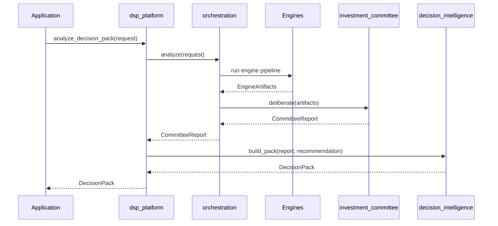

# Data Flow

| Field | Value |
|---|---|
| **Version** | `1.0.0` |
| **Status** | **Active** |
| **Last updated** | 2026-07-27 |
| **Companion** | [SYSTEM_ARCHITECTURE.md](../SYSTEM_ARCHITECTURE.md) · [RESEARCH_FRAMEWORK.md](../RESEARCH_FRAMEWORK.md) |

---

## End-to-end data flow

```mermaid
flowchart LR
    subgraph Sources["External Sources"]
        FILINGS["Exchange Filings"]
        MARKET["Market Data"]
        MACRO["Macro / Economic"]
        PROVIDERS["Future Providers<br/>(consensus, news)"]
    end

    subgraph Ingestion["Ingestion Layer"]
        DE["data_engine<br/>adapters"]
        NORM["Normalized<br/>domain objects"]
    end

    subgraph Bridge["Snapshot Layer"]
        SB["snapshot_bridge"]
        SNAP["Engine input<br/>snapshots"]
    end

    subgraph Engines["Analysis Engines"]
        FIN["financial"]
        VAL["valuation"]
        BQ["business_quality"]
        DSP_E["dsp"]
        FEAT["FEATURE domains"]
    end

    subgraph Output["Output Layer"]
        ART["Engine artifacts"]
        COMM["investment_committee"]
        DI["decision_intelligence"]
        PACK["Decision Pack"]
    end

    subgraph Delivery["Delivery"]
        API["/api/v1"]
        WEB["apps/web<br/>view-models"]
    end

    Sources --> DE --> NORM --> SB --> SNAP
    SNAP --> Engines --> ART --> COMM --> DI --> PACK
    PACK --> API --> WEB
```

## Medallion data layers

| Layer | Content | Mutability | Location |
|---|---|---|---|
| **Raw** | Immutable vendor dumps | Write-once | Object storage (gitignored) |
| **Bronze** | Parsed, minimally cleaned | Append-only | `data_engine` internal |
| **Silver** | Normalized, joined, QC'd | Versioned | `data_engine` output |
| **Gold** | Engine-ready snapshots | Computed | `snapshot_bridge` output |
| **Signals** | Indicator and model outputs | Computed | Engine artifacts |

## Research source → engine mapping

| Source priority | Data engine path | Primary consumer |
|---|---|---|
| Exchange filings | Filing adapter → normalize | `financial`, `fundamental` |
| Financial statements | Statement parser → snapshot | `financial`, `valuation` |
| Market data | Price/volume adapter | `dsp`, `valuation` |
| Industry reports | Industry evidence provider | `industry`, `comparison` |
| Earnings calls | Transcript adapter (future) | `earnings_quality`, `copilot` |

Source hierarchy and conflict resolution → [RESEARCH_FRAMEWORK.md](../RESEARCH_FRAMEWORK.md).

## Decision Pack pipeline

## Partial data handling

| Condition | Behavior |
|---|---|
| Required data missing | `InsufficientDataError` or section marked Unavailable |
| Optional data missing | Section renders skeleton; engine skips gracefully |
| Stale filing (> 120 days) | Staleness flag on analysis; monitoring alert |
| Provider unavailable | Unavailable label — never fabricated |

## Caching strategy

Decision Pack envelopes are cacheable by `(instrument, date_range, config_hash)`. Cache invalidation triggers on new filing ingestion or config change.

Performance detail → [packages/dsp_platform/PERFORMANCE.md](../../packages/dsp_platform/PERFORMANCE.md).
