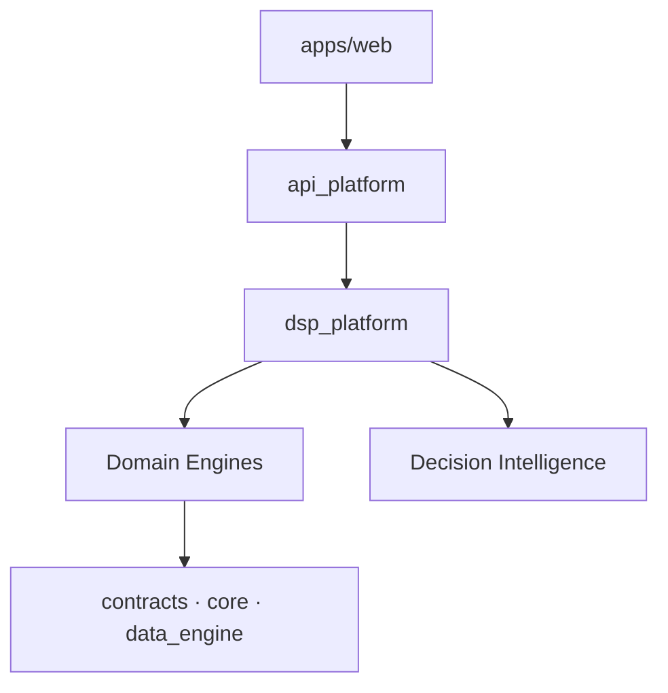

# Architecture Overview

| Field | Value |
|---|---|
| **Version** | `1.0.0` |
| **Status** | **Active** |
| **Last updated** | 2026-07-27 |
| **Superseded by** | [SYSTEM_ARCHITECTURE.md](../SYSTEM_ARCHITECTURE.md) (canonical) · [DSP_ARCHITECTURE.md](../DSP_ARCHITECTURE.md) (dependency rules) |

---

## Summary

DSP AI Indicator is a layered, modular, evidence-first investment research platform. Intelligence flows from data ingestion through deterministic domain engines, composed by a platform façade, exposed via `/api/v1`, and rendered by thin clients.

## Key architectural decisions

| Decision | Rationale |
|---|---|
| Monorepo with package boundaries | Modularity at 1M+ LOC scale |
| Composition root (`dsp_platform`) | Single wiring point; apps import façade only |
| Thin client (`apps/web`) | Zero investment math in browser |
| Evidence-first outputs | Every score cites source, confidence, methodology |
| Freeze discipline | Production modules protected unless explicitly unlocked |
| Research Mode default | Compliance-safe product identity |

## Module layers

| Layer | Packages |
|---|---|
| Foundation | `contracts`, `core`, `data_engine`, `snapshot_bridge` |
| Engines | `dsp`, `fundamental`, `financial`, `valuation`, `business_quality`, FEATURE domains |
| Intelligence | `decision_intelligence`, `investment_committee`, `research`, `copilot` |
| Aggregation | `portfolio`, `risk`, `industry`, `comparison`, `universe` |
| Platform | `dsp_platform`, `orchestration`, `compliance` |
| Edge | `api_platform`, `security_platform`, `production_platform` |
| Client | `apps/web` |

Full module catalog, dependency rules, plugin architecture, and cloud design → [SYSTEM_ARCHITECTURE.md](../SYSTEM_ARCHITECTURE.md).
