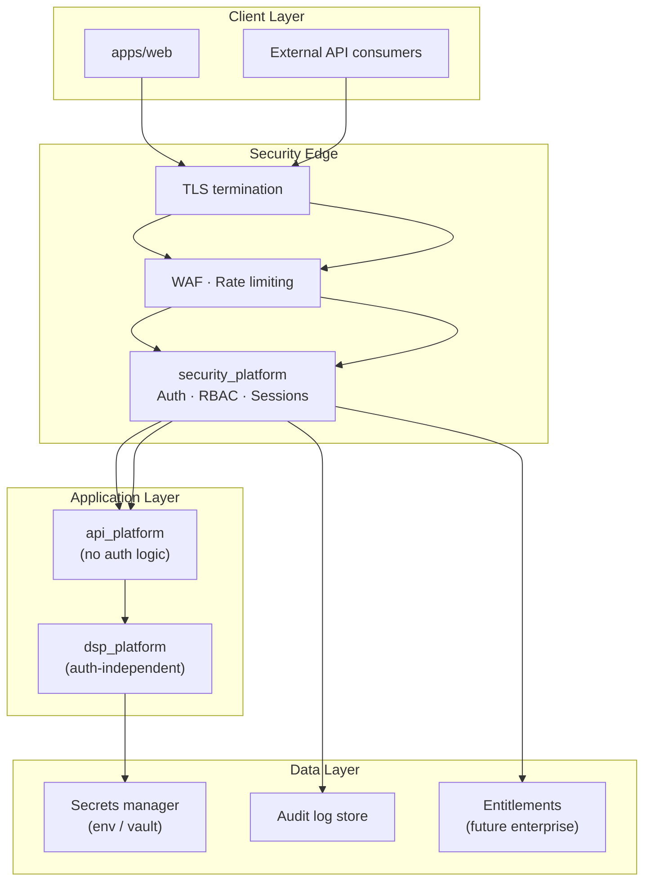

# Security Model

| Field | Value |
|---|---|
| **Version** | `1.0.0` |
| **Status** | **Active** |
| **Last updated** | 2026-07-27 |
| **Companion** | [SYSTEM_ARCHITECTURE.md](../SYSTEM_ARCHITECTURE.md) · [COMPLIANCE_ARCHITECTURE.md](../COMPLIANCE_ARCHITECTURE.md) |

---

## Security architecture



## Core principle

**Domain is auth-independent.** `dsp_platform` and all engine packages operate without knowledge of users, sessions, or permissions. Security wraps HTTP at the edge via `security_platform`.

## Authentication

| Component | Responsibility |
|---|---|
| `security_platform` | Authentication, session management, RBAC |
| `api_platform` | HTTP routing; delegates auth to security layer |
| `dsp_platform` | No auth awareness; receives authenticated context via API layer |
| `apps/web` | Token storage, session refresh, login UX |

### Current state
- Session-based auth via `security_platform`
- SSO / OAuth planned for Phase 9 (Enterprise Platform)

## Authorization (RBAC)

| Role | Capabilities (future enterprise) |
|---|---|
| **Viewer** | Read research, export reports |
| **Analyst** | Run analysis, modify watchlists |
| **Advisor** | Client portfolio management, advisor exports |
| **Admin** | User management, entitlements, audit access |
| **Compliance** | Mode configuration, audit review |

Current deployment: single-user / local development. RBAC architecture prepared, not yet enforced.

## Secrets management

| Rule | Implementation |
|---|---|
| Never commit secrets | `.env` gitignored; `.env.example` documents required vars |
| Platform secrets | `PlatformSecrets` injected via `PlatformConfig` |
| Provider API keys | Environment variables; never in source code |
| Production | Cloud KMS / vault (Phase 9) |

```python
# Correct — inject at runtime
config = PlatformConfig(
    environment=Environment.PRODUCTION,
    secrets=PlatformSecrets(fred_api_key=os.environ["FRED_API_KEY"]),
)
```

## Data protection

| Concern | Mitigation |
|---|---|
| Data in transit | TLS 1.2+ on all API endpoints |
| Data at rest | Encrypted storage (cloud Phase 9) |
| PII | Minimal collection; no PII in engine logs |
| Tenant isolation | Row-level security (Phase 9) |
| Export control | Audit log on every research export |

## Audit logging

| Event | Logged fields |
|---|---|
| Research query | User, instrument, date range, timestamp |
| Export | User, report type, instrument(s), timestamp |
| Mode change | User, old mode, new mode, timestamp |
| Auth events | Login, logout, failed attempts |
| API errors | Correlation ID, endpoint, status code |

Audit logs are append-only and retained per compliance policy.

## Compliance modes

| Mode | Security implication |
|---|---|
| **Research Mode** | Default; no regulated recommendation language |
| **SEBI Mode** | Requires registered entity; additional audit requirements |

Mode enforcement via `compliance` package feature flags. See [RESEARCH_MODE.md](../RESEARCH_MODE.md) · [SEBI_MODE.md](../SEBI_MODE.md).

## Threat model summary

| Threat | Mitigation |
|---|---|
| Unauthorized API access | Auth middleware on all `/api/v1` endpoints |
| Secret exposure | Env injection; CI secret scanning |
| XSS | React auto-escaping; no raw HTML with user content |
| CSRF | Token-based auth; SameSite cookies |
| Data fabrication | Engine determinism; AI grounding rules ([AI_PRINCIPLES.md](../AI_PRINCIPLES.md)) |
| Cross-tenant leakage | Tenant isolation (Phase 9) |
| Dependency vulnerabilities | CI security scan |

## AI security

| Rule | Detail |
|---|---|
| LLM grounding | Adapters receive engine outputs, not open prompts |
| Output validation | Numeric claims in AI text must map to input artifacts |
| No training on user data | Research sessions excluded from model training |
| Prompt injection defense | System prompts enforce citation and epistemic category rules |

Full AI behavior contract → [AI_PRINCIPLES.md](../AI_PRINCIPLES.md).

## Related documents

| Document | Purpose |
|---|---|
| [COMPLIANCE_ARCHITECTURE.md](../COMPLIANCE_ARCHITECTURE.md) | Compliance bounded context |
| [USER_TRUST_STANDARD.md](../USER_TRUST_STANDARD.md) | Trust enforcement |
| [CODING_STANDARDS.md](../CODING_STANDARDS.md) | Security coding rules (§12) |
| [PROJECT_CHARTER.md](../PROJECT_CHARTER.md) | Core values and governance |
