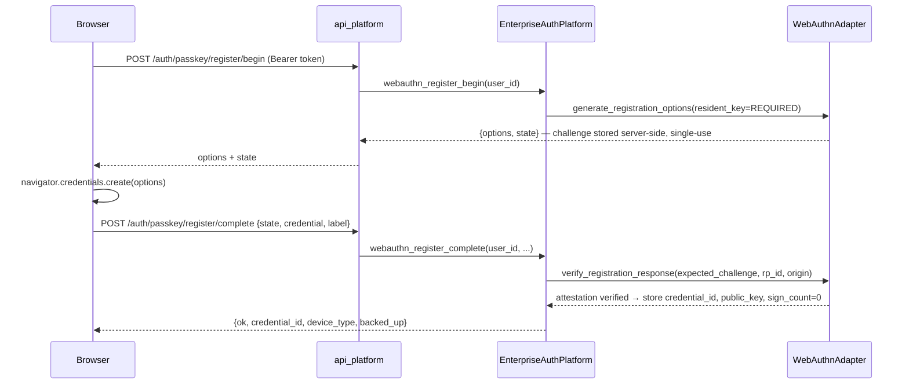
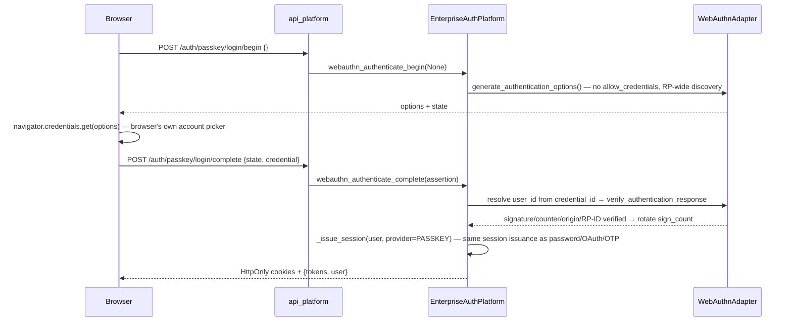
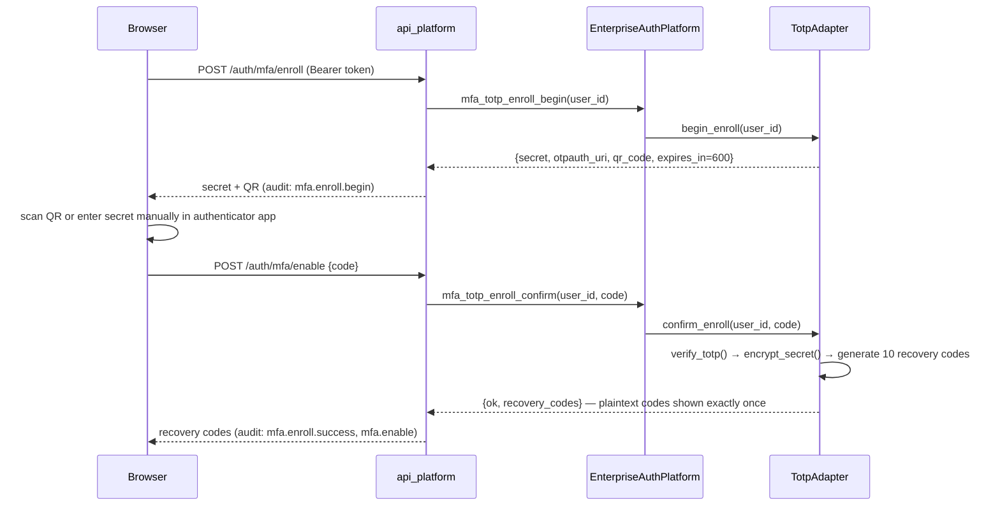

# Enterprise Multi-Provider Authentication Platform

Production-architecture identity layer for DSP AI Indicator. Extends **A009 RBAC** and **EPIC-016** HttpOnly cookie sessions. Does **not** modify valuation engines, REP-002, research methodology, or analytical APIs.

## 1. Database schema

Users remain A008 persistence metadata entities (`auth-user-*`) with enterprise fields in `metadata`:

| Field | Storage | Notes |
|-------|---------|-------|
| id / user_id | payload | UUID |
| name / display_name | payload | Display name |
| username | payload | Unique |
| email | payload | Unique, case-insensitive |
| mobile | metadata.mobile | E.164 India `+91…` |
| passwordHash | payload.password_hash | `bcrypt$…` preferred; `pbkdf2$…` fallback |
| provider | metadata.provider | `EMAIL`, `GOOGLE`, `MICROSOFT`, `FACEBOOK`, `PHONE`, `USERNAME`, `MAGIC_LINK` |
| avatar | metadata.avatar | URL from IdP |
| role / roles | payload.roles | Permission-based RBAC |
| status | payload | `active` \| `disabled` |
| emailVerified | metadata.email_verified | |
| phoneVerified | metadata.phone_verified | |
| linkedProviders | metadata.linked_providers | Account linking by email |
| createdAt / updatedAt | payload | ISO-8601 |
| lastLogin | payload.last_login | |

Additional metadata entities:

- `auth-access-{id}` — enterprise access requests  
- `auth-invite-{token}` — invitations after approval  
- `auth-login-hist-{id}` — login history / device hints  
- `auth-email-verify-{token}`, `auth-pwd-reset-{token}`, `auth-magic-{token}`  
- `auth-session-{id}` — sessions (EPIC-A009 / EPIC-016)

SQL reference (PEP-001 `identity_users`) remains available for the parallel security_platform path; the web primary path is A009 metadata.

## 2. Auth configuration

| Component | Location |
|-----------|----------|
| Platform service | `packages/auth/src/auth/enterprise_platform.py` |
| Models / providers | `packages/auth/src/auth/enterprise_models.py` |
| Password hashing | `packages/auth/src/auth/hashing.py` (bcrypt → PBKDF2) |
| OTP | `packages/auth/src/auth/otp.py` |
| SMS adapters | `packages/auth/src/auth/sms.py` |
| OAuth adapters | `packages/auth/src/auth/oauth_providers.py` |
| API router | `packages/api_platform/.../enterprise_auth_platform.py` |
| Web client | `apps/web/src/lib/api/enterpriseAuth.ts` |
| Login UI | `apps/web/src/app/(auth)/login/LoginForm.tsx` |

Primary login stack: Enterprise platform → A009 sessions/JWT → EPIC-016 cookies + CSRF.

## 3. OAuth configuration

Env-gated real OAuth2 authorization-code flows:

| Provider | Authorize | Token | UserInfo |
|----------|-----------|-------|----------|
| Google | `accounts.google.com/o/oauth2/v2/auth` | `oauth2.googleapis.com/token` | OIDC userinfo |
| Microsoft Entra | `login.microsoftonline.com/{tenant}/oauth2/v2.0/authorize` | token endpoint | Graph `/me` |
| Facebook | `facebook.com/v19.0/dialog/oauth` | Graph token | Graph `/me` |

When client id/secret are absent:

- `GET /auth/enterprise/providers` reports `available: false`
- Login buttons are **disabled** with honest messaging
- `POST /auth/enterprise/oauth/begin` returns **503** with clear detail

First login: auto-create user (verified email required), import name/avatar, link by email to prevent duplicates.

Callback URL (web): `{origin}/oauth/callback`

### 3a. Microsoft Entra ID (Azure AD) — single/multi-tenant + account linking

Microsoft uses the **same generic `OAuthProviderAdapter`** as Google — there is no parallel Microsoft-specific OAuth implementation. `DSP_MICROSOFT_TENANT_ID` selects the authorize/token/JWKS endpoints and the accepted ID-token issuer:

| `DSP_MICROSOFT_TENANT_ID` | Authorize/Token/JWKS host path | Accepted issuers |
|---|---|---|
| unset / `common` (default) | `login.microsoftonline.com/common/...` | exact `.../common/v2.0` **and** the multi-tenant wildcard `login.microsoftonline.com/*/v2.0` (personal + any organizational Entra ID tenant) |
| a specific tenant GUID | `login.microsoftonline.com/{tenant}/...` | exact `.../{tenant}/v2.0` **and** the multi-tenant wildcard (defense-in-depth; the token must still carry the audience/nonce for *this* app registration) |

The wildcard match (`auth.oidc._issuer_matches`) allows exactly one path segment to vary — it never accepts an arbitrary issuer host, only Microsoft's documented multi-tenant issuer shape.

Convenience, browser-navigable endpoints (thin wrappers around the same `oauth_begin` / `oauth_callback` / `unlink_provider` platform methods the JSON SPA flow already uses — no OAuth logic is duplicated):

| Method | Path | Purpose |
|--------|------|---------|
| GET | `/auth/microsoft` | 302-redirects to the Microsoft authorize URL. Uses `redirect_uri` query param if given, else `DSP_MICROSOFT_REDIRECT_URI` |
| GET | `/auth/microsoft/callback` | Completes login (PKCE + ID-token/JWKS/nonce verification), sets HttpOnly session cookies, 302-redirects to `{DSP_FRONTEND_URL}/dashboard` (or `/login?error=...&provider=microsoft` on failure) |
| POST | `/auth/microsoft/link` | Authenticated (`Authorization: Bearer`) — binds a verified Microsoft identity to the *current* user. Rejects if that identity or its email already belongs to a different account (prevents account-takeover via a mismatched OAuth response) |
| POST | `/auth/microsoft/unlink` | Authenticated — removes the Microsoft identity from the current user (blocked if it is the account's only authentication method) |

These are additive; the existing generic `/auth/enterprise/oauth/{begin,callback}` and `/auth/oauth/{provider}/{start,callback}` JSON routes used by the SPA popup flow are unchanged and still work for Microsoft.

Account linking (all identity types funnel into the same `linked_providers` metadata + `EnterpriseAuthPlatform._attach_provider_link`):

- **Implicit** (sign-in time, `oauth_callback` → `_login_from_oauth_profile`): if the Microsoft profile's verified email matches an existing account, the identity is linked automatically; otherwise a new account is auto-provisioned.
- **Explicit** (`link_oauth_provider`, used by `POST /auth/microsoft/link`): binds the identity to a specific already-authenticated user; refuses the link if the Microsoft `oid`/subject or email already belongs to a *different* user.

Both paths, plus `unlink_provider`, record namespaced `oauth.<provider>.login` / `.link` / `.unlink` audit events (`auth.audit.AuditLogger`; see §8c for the full per-provider event catalogue).

### 3b. Facebook Login

Facebook uses the **same generic `OAuthProviderAdapter`** as Google and Microsoft — again, no parallel implementation. Two differences from Google/Microsoft are inherent to Facebook's platform, not to this codebase:

- **No OIDC `id_token`/JWKS.** Facebook's Login for Web dialog does not issue a signed ID token, so `auth.oidc.verify_id_token` is not invoked for this provider (its `oidc_jwks_uri`/`oidc_issuers` are left unset, exactly like any provider without OIDC support — the adapter degrades to userinfo-only trust, the same fallback path already exercised when `cryptography` is unavailable for Google/Microsoft). The trust anchor is the live Graph `/me` call made with the freshly-exchanged access token — an attacker without a genuine token cannot obtain it.
- **PKCE is sent best-effort.** The `code_challenge`/`code_challenge_method=S256` parameters are still included in the authorize URL (same code path as every provider), but Facebook's token endpoint does not document PKCE support and will simply ignore unrecognized parameters — this is harmless, not a security regression, and future-proofs the integration if Facebook adds support.

Profile mapping (`OAuthProviderAdapter._fetch_profile`, Facebook branch) requests `id,name,first_name,last_name,email,picture.type(large),locale` from Graph `/me` and normalizes it into the shared `OAuthProfile`:

| Facebook Graph field | `OAuthProfile` field | Notes |
|---|---|---|
| `id` | `subject` | Rejected with `AuthenticationError` if absent |
| `email` | `email` | Only ever a confirmed address, or omitted — Facebook does not return unverified emails for the `email` permission |
| *(derived from `email` presence)* | `email_verified` | Same convention as Microsoft's Graph `/me` (no separate verified-flag claim exists) |
| `name`, else `first_name + last_name` | `name` | |
| `picture.data.url` | `avatar` | |
| `first_name`, `last_name`, `locale` | `raw_claims[...]` | Not part of the shared `OAuthProfile` shape (Google/Microsoft don't surface these as first-class fields either); available for future use without changing the shared contract |

Convenience, browser-navigable endpoints (thin wrappers over the same `oauth_begin` / `oauth_callback` / `link_oauth_provider` / `unlink_provider` platform methods — no OAuth logic duplicated):

| Method | Path | Purpose |
|--------|------|---------|
| GET | `/auth/facebook` | 302-redirects to the Facebook authorize URL. Uses `redirect_uri` query param if given, else `DSP_FACEBOOK_REDIRECT_URI` |
| GET | `/auth/facebook/callback` | Completes login (code exchange + Graph profile retrieval), sets HttpOnly session cookies, 302-redirects to `{DSP_FRONTEND_URL}/dashboard` (or `/login?error=...&provider=facebook` on failure) |
| POST | `/auth/facebook/link` | Authenticated — binds a verified Facebook identity to the *current* user; rejects if that identity or its email already belongs to a different account |
| POST | `/auth/facebook/unlink` | Authenticated — removes the Facebook identity from the current user (blocked if it is the account's only authentication method) |

A login/link attempt with no `email` (user declined the `email` permission) is rejected outright — the platform has no other way to identify or link the account, and this is treated as a normal, honestly-reported authentication failure (`oauth.facebook.failure`), not a crash.

Discovery (`GET /auth/enterprise/providers` → `oauth` array, entry `provider: "FACEBOOK"`) reports `unavailable` unless both `DSP_FACEBOOK_CLIENT_ID`/`DSP_FACEBOOK_APP_ID` and the matching secret are set — identical `ui_status()` logic to Google/Microsoft, so the frontend hides the button automatically with zero Facebook-specific frontend code.

### 3c. Passkey (WebAuthn / FIDO2) — primary, passwordless sign-in

Real FIDO2 ceremonies (`packages/auth/src/auth/mfa_webauthn.WebAuthnAdapter`, over the optional `webauthn` — Duo Labs `py_webauthn` — protocol library; installed via the `auth[passkey]` extra) back **two** entry points into the exact same credential store, with zero duplicated ceremony/verification code:

1. **MFA step-up** (`/auth/mfa/webauthn/*`, pre-existing) — a passkey used as a *second* factor after password login.
2. **Primary, passwordless sign-in** (`/auth/passkey/*`, this section) — a passkey used *instead of* a password, via a discoverable/resident credential and the browser's own credential picker (no prior username needed).

A credential registered through either route group is immediately usable through both — `complete_discoverable_authentication` resolves the account purely from the credential ID / `userHandle` in the assertion, so there is no per-route-group credential list.

#### Registration (adding a passkey to an account)



Registration requires `ResidentKeyRequirement.REQUIRED` (discoverable credential) so the credential can later be used for a usernameless login; multiple credentials per user are supported without limit (phone, laptop, hardware key, etc.).

#### Login (primary, passwordless)



An `identifier` (email/username) may optionally be supplied to `login/begin` to narrow `allow_credentials` to one account's registered keys — the ceremony still works fully "usernameless" without one.

#### Endpoints

| Method | Path | Purpose |
|--------|------|---------|
| POST | `/auth/passkey/register/begin` | Authenticated — begin adding a passkey; returns FIDO2 `PublicKeyCredentialCreationOptions` + single-use `state` |
| POST | `/auth/passkey/register/complete` | Authenticated — verify attestation, persist the credential |
| POST | `/auth/passkey/login/begin` | Anonymous — begin discoverable ("usernameless") sign-in; returns `PublicKeyCredentialRequestOptions` + `state` |
| POST | `/auth/passkey/login/complete` | Anonymous — verify assertion, resolve the account, issue a full session (HttpOnly cookies + JWT), same as password/OAuth/OTP login |
| GET | `/auth/passkey` | Authenticated — list the caller's registered credentials (never returns public keys) |
| DELETE | `/auth/passkey/{credential_id}` | Authenticated — remove one credential |

These are additive; the pre-existing `/auth/mfa/webauthn/{register,register/complete,credentials,credentials/remove,authenticate,authenticate/complete}` routes are unchanged in behavior and response shape — the frontend's current MFA-step-up passkey flow requires no changes.

#### Security model

- **Challenge generation / expiry / single-use** — each `begin_*` call mints a fresh, cryptographically random challenge bound to a random `state` token, held server-side (never trust a client-supplied challenge) with a 300s TTL; `complete_*` pops (deletes) the pending entry *before* validating it, so a given `state` can be redeemed at most once — replaying the exact same completion request a second time fails with "Invalid or expired authentication challenge."
- **Origin / RP ID validation** — `verify_registration_response` / `verify_authentication_response` check the assertion's `clientDataJSON.origin` against `DSP_WEBAUTHN_ORIGIN` and the authenticator data's `rpIdHash` against SHA-256(`DSP_WEBAUTHN_RP_ID`); a mismatch on either raises and the ceremony fails closed.
- **Signature verification** — the stored COSE public key is used to verify the assertion signature over `authenticatorData || SHA-256(clientDataJSON)`; a tampered signature is rejected.
- **Counter validation / clone detection** — the stored `sign_count` must be less than the assertion's new counter (when both are non-zero); a stored counter at or above the assertion's own value fails verification, guarding against cloned/forked authenticators.
- **Credential binding** — the account is resolved from a server-side index (`credential_id → user_id`), never from client-supplied identity claims; `POST .../register/complete` additionally requires the caller's bearer token to match the `user_id` the challenge was minted for.
- **Resident keys / discoverable credentials** — `ResidentKeyRequirement.REQUIRED` at registration is what makes usernameless `login/begin` (no `allow_credentials`) possible at all.
- **User verification** — requested as `UserVerificationRequirement.PREFERRED` (matches broad authenticator/browser support today); the security guarantee for primary login rests on possession of the private key *and* a valid, freshly-verified signature, not solely the UV flag.

#### Recovery strategy

Losing a device (device migration) does not lock a user out as long as at least one other passkey, or another enrolled login method (password, OAuth, mobile OTP, magic link — all merged into the same account via account linking), remains available:

1. Sign in with any remaining method.
2. `POST /auth/passkey/register/begin|complete` to add the new device's passkey.
3. `DELETE /auth/passkey/{credential_id}` to remove the lost device's credential (`passkey.deleted` audit event recorded).

There is intentionally no "reset all passkeys" self-service flow beyond removing individual credentials — an administrator can be added later via the existing admin-provisioning surface if a full reset is ever required.

#### Browser / deployment requirements

- Requires a browser implementing the WebAuthn Level 2 / Level 3 API (`window.PublicKeyCredential`) — all current evergreen browsers (Chrome, Edge, Safari, Firefox) on desktop and mobile.
- **HTTPS is mandatory in production** (WebAuthn refuses to operate over plain HTTP except for `localhost`); `DSP_WEBAUTHN_ORIGIN` must be the exact scheme+host+port the browser navigates to, and `DSP_WEBAUTHN_RP_ID` must be that host (or a registrable parent domain of it).
- The optional `webauthn` Python package must be installed (`pip install "auth[passkey]"` or `pip install webauthn`) — without it, `WebAuthnAdapter.is_available()` is `False` and all passkey routes report `501` with `{"error": "Passkey authentication not enabled"}` rather than crashing.
- Gated by `DSP_AUTH_MFA=true` (the same flag as MFA step-up — one shared adapter, see discovery below); there is no separate `DSP_AUTH_PASSKEY` flag to keep in sync.

#### Discovery

`GET /auth/enterprise/providers` gains an additive, dedicated `passkey: {available, message}` block (alongside the pre-existing `mfa.webauthn_available`, which is unchanged for frontend backward compatibility) — both computed from the identical `DSP_AUTH_MFA=true` + `webauthn` library gate.

### 3d. MFA (TOTP) — authenticator apps

RFC 6238-compliant Time-based One-Time Password second factor (`packages/auth/src/auth/mfa_totp.TotpAdapter`, behind the pre-existing `MfaMethodPort`/`MfaGateway` abstraction — no new authentication flow is introduced). Works with any standard authenticator app (Google Authenticator, Microsoft Authenticator, Authy, 1Password, etc.).

#### Enrollment (two-phase, replay-safe)



The secret issued by `begin_enroll` is held **in-memory only** (`TotpAdapter._pending`, 10-minute TTL) until a live code proves the user actually provisioned it in their app — nothing is persisted, and nothing is "enabled," until `confirm_enroll` succeeds. This prevents a user from being locked into a secret they never configured.

#### Verification (login step-up)

After any primary authentication (password, OAuth, magic link, mobile OTP, or passkey) that resolves to a user enrolled in TOTP and whose device is not currently trusted (see below), `EnterpriseAuthPlatform._issue_session` returns additive `mfa_required: true`, a short-lived signed `mfa_token` (5 minutes, `auth.jwt.JwtService`, `token_use="mfa_stepup"`), and `methods: ["totp", ...]` — the primary session tokens are already present in the same response (additive, non-blocking design; unchanged from the pre-existing contract). The client then calls `POST /auth/mfa/verify` with `{mfa_token, code}` (or `{mfa_token, recovery_code}`) to complete step-up.

#### Endpoints

| Method | Path | Purpose |
|--------|------|---------|
| POST | `/auth/mfa/enroll` | Authenticated — begin enrollment; returns secret + `otpauth://` URI + QR (canonical alias of `/auth/mfa/totp/enroll`) |
| POST | `/auth/mfa/enable` | Authenticated — confirm the code shown by the authenticator app and activate TOTP; returns 10 recovery codes (alias of `/auth/mfa/totp/enroll/confirm`) |
| POST | `/auth/mfa/verify` | Anonymous (bound to `mfa_token`) — login-time step-up; accepts a 6-digit code or a recovery code (alias of `/auth/mfa/totp/verify`) |
| POST | `/auth/mfa/disable` | Authenticated — **forces re-authentication**: `current_password` is mandatory (unlike the legacy `/auth/mfa/totp/disable`, kept optional for backward compatibility) |
| GET | `/auth/mfa/recovery-codes` | Authenticated — recovery-code *status* only: `{total, remaining, generated_at}`. Codes are salted+hashed at rest and are never re-exposed after generation |
| POST | `/auth/mfa/recovery-codes/regenerate` | Authenticated, forces re-authentication (`current_password` mandatory) — invalidates all existing recovery codes and issues 10 new ones (shown once) |
| POST | `/auth/mfa/totp/enroll` \| `/enroll/confirm` \| `/verify` \| `/disable` | Pre-existing routes, unchanged — the canonical routes above are thin aliases over the exact same `EnterpriseAuthPlatform` methods, not a parallel implementation |

#### Security model

- **RFC 6238 compliance** — standard HMAC-SHA1, 6-digit, 30-second-step TOTP (`auth.mfa_totp._hotp`/`verify_totp`), interoperable with every mainstream authenticator app.
- **Encrypted secret storage at rest** — the TOTP seed is encrypted with `cryptography.fernet.Fernet` (AES-128-CBC + HMAC-SHA256) before being persisted (`auth.secret_box`), keyed by `DSP_MFA_SECRET_KEY` (falls back to a key derived from `DSP_AUTH_JWT_SECRET` in development). Supports key rotation via `DSP_MFA_SECRET_KEY_PREVIOUS` (decrypt-only fallback for already-issued secrets). When the optional `cryptography` package is absent, storage degrades to an explicitly-tagged plaintext form (`secret_encrypted: false` in the record) rather than silently pretending to be encrypted.
- **Clock skew tolerance** — accepts one step (±30s) of drift either side of the current time window.
- **Replay protection** — the last *accepted* step counter is persisted per user; presenting the same valid code twice is rejected the second time.
- **Recovery codes** — 10 codes generated at enrollment (and on regeneration), salted+hashed (never plaintext at rest) exactly like SMS OTPs; each is single-use, tracked independently of the TOTP step counter.
- **Rate limiting / brute-force protection** — enrollment (5/hour), enrollment-confirmation (10/10min), and login step-up (8/5min, keyed by the token's `user_id`) are all rate-limited via the platform's existing `_rate_check` bucket — a 6-digit code has only 1,000,000 possibilities, so step-up attempts must be bounded.
- **Forced re-authentication** — disabling MFA or regenerating recovery codes via the canonical `/auth/mfa/disable` and `/auth/mfa/recovery-codes/regenerate` routes requires the current password, so a hijacked access token alone can never strip or rotate a user's second factor.
- **Remember trusted device** — `remember_device: true` + `device_id` on a successful `/auth/mfa/verify` marks that device (IP + user-agent fingerprint, `auth.devices.DeviceRegistry`) trusted for `DSP_AUTH_TRUSTED_DEVICE_DAYS` (default 30) days; trust **always expires** — `DeviceRecord.is_trust_active()` is checked on every login, not just the `trusted` flag, so a stale "remembered" device cannot skip MFA forever.
- **Audit logging** — every enrollment, activation, verification (success/failure), disable, and recovery-code event is recorded (§8e).

#### Recovery strategy

Losing the authenticator app does not lock a user out: any unused recovery code satisfies the step-up challenge exactly like a TOTP code. If all 10 are exhausted or the device with them is lost, `POST /auth/mfa/recovery-codes/regenerate` (current password required) issues a fresh set — or, if MFA itself is the blocker to signing in at all, an administrator can reset MFA for the account via the existing admin-provisioning surface.

#### Deployment

No new mandatory dependency. Optional extras: `pip install "auth[mfa]"` for QR code image rendering (`qrcode[pil]`; without it, enrollment still returns the raw `otpauth://` URI for manual entry or client-side QR rendering) and the `cryptography` package (also used by `auth.oidc`) for encrypted-at-rest secret storage. Gated by the same `DSP_AUTH_MFA=true` flag as WebAuthn/Passkey — see discovery in §3c.

### 3e. Refresh token rotation & reuse detection (OAuth 2.0 Security BCP)

Every A009 session (`packages/auth`) has exactly one currently-active
refresh token. `AuthenticationService.refresh` (`packages/auth/src/auth/
authentication.py`) — reached from `POST /auth/rbac/refresh`
(`institutional_auth.py`) and from `EnterpriseAuthPlatform.refresh_session`
(`enterprise_platform.py`), both sharing the one `AuthService` singleton —
rotates that token on every call and treats presentation of a stale one as
an attack signal, per [RFC 6819](https://www.rfc-editor.org/rfc/rfc6819)
and the OAuth 2.0 Security Best Current Practice guidance on refresh token
rotation.

#### Rotation sequence

```mermaid
sequenceDiagram
    participant C as Client
    participant API as api_platform
    participant AS as AuthenticationService
    participant SM as SessionManager

    C->>API: POST /auth/rbac/refresh {refresh_token: R1}
    API->>AS: refresh(refresh_token=R1)
    AS->>AS: decode R1 → {sid, jti=J1}
    AS->>SM: require_active(sid)
    AS->>AS: issue new pair (access, R2 with jti=J2)
    AS->>SM: rotate_refresh_token(sid, expected=J1, new=J2)
    SM->>SM: lock(sid); session.refresh_token_id == J1? yes → swap to J2, unlock
    SM-->>AS: rotated session
    AS-->>API: {user, tokens: {access, R2}, session}
    API-->>C: 200 — R1 is now dead; only R2 is valid
```

#### Reuse detected

```mermaid
sequenceDiagram
    participant Attacker
    participant API as api_platform
    participant AS as AuthenticationService
    participant SM as SessionManager

    Attacker->>API: POST /auth/rbac/refresh {refresh_token: R1 (already rotated to R2)}
    API->>AS: refresh(refresh_token=R1)
    AS->>SM: require_active(sid) — still active (R2 has not been used yet)
    AS->>SM: rotate_refresh_token(sid, expected=J1, new=J3)
    SM->>SM: lock(sid); session.refresh_token_id is J2, not J1 → MISMATCH
    SM->>SM: revoke session (audit: session.revoked)
    SM-->>AS: raise RefreshTokenReuseError
    AS-->>API: 401 (audit: refresh.reused, refresh.revoked)
    Note over AS,SM: R2 (the legitimate, never-replayed token) is now also dead —<br/>the whole family is revoked, not just the replayed token.
```

#### Design

- **Rotation, not reuse of the same `jti`** — the pre-existing code path
  reissued a fresh access token but kept the *same* refresh `jti` forever;
  every successful refresh now generates a brand-new `jti` **and** a new
  SHA-256 digest of the raw token (`auth.authentication._hash_refresh_token`),
  both swapped onto the session atomically.
- **Parent/child lineage = the session itself** — rather than a separate
  token-family table, this architecture already has exactly one refresh
  lineage per `auth-session-*` record (`AuthSession.refresh_token_id` /
  `refresh_token_hash` / `refresh_rotated_at`). "Revoke the family" is
  therefore precisely `SessionManager.revoke(session_id)` — no duplicate
  storage, no new persistence kind.
- **Atomic replacement, concurrent refresh protection** —
  `SessionManager.rotate_refresh_token` takes a per-session `threading.Lock`
  (the same per-key lock pattern as `auth.single_use_tokens
  .SingleUseTokenService`) around "read current `refresh_token_id`/hash →
  compare → write new ones", so two requests racing on the same token can
  never both succeed. The loser observes a `refresh_token_id` that the
  winner already advanced and is treated exactly like a replay: full
  session revocation, including the winner's newly issued tokens. This is
  the intentionally strict, textbook-compliant behavior — see
  `docs/SECURITY_GUIDE.md` for the client-facing implication (treat `401`
  from refresh as "re-authenticate", never "retry the same call").
- **Secure hashing** — the raw refresh JWT is never written to storage.
  `AuthSession.refresh_token_hash` is a SHA-256 digest, compared with
  `hmac.compare_digest`-equivalent dataclass equality on read; it is never
  echoed back to clients (`AuthSession.to_public_dict()` strips it from
  every API-facing session payload, including `/auth/rbac/login`,
  `/auth/rbac/refresh`, `/auth/enterprise/*` login responses, and the
  admin session-listing endpoints).
- **Device-aware tracking** — session metadata already captures
  `ip_hint`/`user_agent_hint`/`device_label` at issuance
  (`EnterpriseAuthPlatform._issue_session`); `/auth/rbac/refresh` forwards
  the request's IP/User-Agent into the audit trail on every rotation and
  reuse event for forensic correlation with `auth.devices.DeviceRegistry`.
- **Configurable expiration** — unchanged: refresh TTL is still governed by
  `AuthenticationService.refresh_ttl` (7 days default, 30 days for
  `remember_me` enterprise sessions), reapplied on every rotation as a
  sliding expiry.
- **Backward compatible** — `AuthenticationService.__init__` gained one
  new optional keyword (`audit`, defaulting to `None`/no-op), and
  `refresh()`/`AuthSession` gained optional fields/kwargs only; every
  pre-existing caller (`AuthService.refresh`, `/auth/rbac/refresh`,
  `EnterpriseAuthPlatform._issue_session`) continues to work unchanged,
  and now transparently gains rotation, reuse detection, and audit
  coverage.

#### Audit events

| Event | When |
|---|---|
| `refresh.issued` | A session's very first refresh token is minted (login) |
| `refresh.rotated` | A refresh call succeeds and issues a replacement token |
| `refresh.reused` | A non-current refresh token is presented for an active session |
| `refresh.revoked` | The refresh-token family is torn down following reuse detection |
| `session.revoked` | Any session revocation — logout, admin deactivate/revoke, password reset, or refresh reuse |

#### Deployment

No new dependency, no new environment variable, no new persistence kind —
`AuthSession` (`auth-session-*` metadata rows) gained two optional fields
(`refresh_token_hash`, `refresh_rotated_at`); existing session rows without
them are read back with `None` and simply re-hash on their first
post-upgrade refresh.

## 4. Environment variables

See root `.env.example` and `apps/web/.env.example`. Key variables:

```
# Core
DSP_ENVIRONMENT=development
DSP_JWT_SECRET=
DSP_AUTH_JWT_SECRET=
DSP_COOKIE_AUTH=true
DSP_CSRF_ENABLED=true
DSP_PASSWORD_HASHER=bcrypt
DSP_SEED_ADMIN_PASSWORD=Admin@123
DSP_FORCE_ADMIN_SEED=0

# Google
DSP_GOOGLE_CLIENT_ID=
DSP_GOOGLE_CLIENT_SECRET=

# Microsoft Entra / Azure AD
DSP_MICROSOFT_CLIENT_ID=
DSP_MICROSOFT_CLIENT_SECRET=
DSP_MICROSOFT_TENANT_ID=common
# Optional: default redirect_uri for the browser-navigable /auth/microsoft
# and /auth/microsoft/callback routes (the JSON SPA flow supplies its own
# redirect_uri per-call and does not require this).
DSP_MICROSOFT_REDIRECT_URI=

# Facebook (DSP_FACEBOOK_CLIENT_ID/SECRET preferred; DSP_FACEBOOK_APP_ID/SECRET
# — Meta's own terminology — also accepted for backward compatibility)
DSP_FACEBOOK_CLIENT_ID=
DSP_FACEBOOK_CLIENT_SECRET=
DSP_FACEBOOK_APP_ID=
DSP_FACEBOOK_APP_SECRET=
# Optional: default redirect_uri for the browser-navigable /auth/facebook
# and /auth/facebook/callback routes (the JSON SPA flow supplies its own).
DSP_FACEBOOK_REDIRECT_URI=

# SMS / OTP
DSP_SMS_PROVIDER=dev
DSP_TWILIO_ACCOUNT_SID=
DSP_TWILIO_AUTH_TOKEN=
DSP_TWILIO_FROM_NUMBER=
DSP_MSG91_AUTH_KEY=
DSP_MSG91_SENDER_ID=DSPAI
DSP_MSG91_TEMPLATE_ID=
DSP_FAST2SMS_API_KEY=
DSP_FAST2SMS_SENDER_ID=FSTSMS
DSP_FAST2SMS_ROUTE=otp
DSP_FIREBASE_API_KEY=

# Email delivery (magic link / verification / password reset / invitations)
DSP_EMAIL_PROVIDER=console
DSP_SMTP_HOST=
DSP_SMTP_PORT=587
DSP_SMTP_USERNAME=
DSP_SMTP_PASSWORD=
DSP_SMTP_FROM_ADDRESS=
DSP_SMTP_FROM_NAME=DSP AI Indicator
DSP_SMTP_USE_TLS=true
DSP_SMTP_USE_SSL=false

# One-time link generation (magic link / verify / reset / invite URLs)
DSP_FRONTEND_URL=http://localhost:3000
# Optional HMAC key for single-use token digests (enables key rotation)
DSP_TOKEN_HASH_SECRET=

# OIDC ID-token verification (additive JWKS + nonce hardening; auto-skips
# when the optional `cryptography` package is not installed)
# no extra env vars required — reuses DSP_GOOGLE_CLIENT_ID / DSP_MICROSOFT_*

# MFA / Passkey (WebAuthn) — one flag gates both TOTP step-up and passkeys
# (MFA step-up: /auth/mfa/*; primary passwordless sign-in: /auth/passkey/*)
DSP_AUTH_MFA=false
# RP ID must be the exact host the browser navigates to (or a registrable
# parent domain of it); ORIGIN must be the exact scheme+host+port. Defaults
# below are dev-only — set both explicitly in production.
DSP_WEBAUTHN_RP_ID=localhost
DSP_WEBAUTHN_RP_NAME=DSP AI Indicator
DSP_WEBAUTHN_ORIGIN=http://localhost:3000
# Requires the optional `webauthn` package: pip install "auth[passkey]"

# TOTP MFA secret-at-rest encryption (auth.secret_box). Generate with:
#   python -c "from cryptography.fernet import Fernet; print(Fernet.generate_key().decode())"
# Falls back to a key derived from DSP_AUTH_JWT_SECRET when unset (dev-only).
DSP_MFA_SECRET_KEY=
# Comma-separated retired keys, tried for decrypt-only fallback during rotation.
DSP_MFA_SECRET_KEY_PREVIOUS=
# How long a "remember this device" MFA exemption lasts before expiring.
DSP_AUTH_TRUSTED_DEVICE_DAYS=30

# Web
NEXT_PUBLIC_API_BASE_URL=http://127.0.0.1:8000/api/v1
NEXT_PUBLIC_COOKIE_AUTH=true
```

## 5. API routes

All under `/api/v1` (and root aliases):

| Method | Path | Purpose |
|--------|------|---------|
| GET | `/auth/enterprise/schema` | Schema + feature flags |
| GET | `/auth/enterprise/providers` | OAuth/SMS availability |
| POST | `/auth/enterprise/register` | Email registration |
| POST | `/auth/enterprise/verify-email` | Activate account |
| POST | `/auth/enterprise/login` | Email/username + password |
| POST | `/auth/enterprise/password/forgot` | Reset request |
| POST | `/auth/enterprise/password/reset` | Confirm reset |
| POST | `/auth/enterprise/password/change` | Authenticated change |
| GET | `/auth/enterprise/password/strength` | Strength meter |
| POST | `/auth/enterprise/oauth/begin` | Start OAuth |
| POST | `/auth/enterprise/oauth/callback` | Complete OAuth + session |
| GET | `/auth/microsoft` | Browser-redirect Microsoft Entra ID login start (see §3a) |
| GET | `/auth/microsoft/callback` | Browser-redirect Microsoft Entra ID login completion |
| POST | `/auth/microsoft/link` | Link Microsoft identity to the authenticated user |
| POST | `/auth/microsoft/unlink` | Unlink Microsoft identity from the authenticated user |
| GET | `/auth/facebook` | Browser-redirect Facebook Login start (see §3b) |
| GET | `/auth/facebook/callback` | Browser-redirect Facebook Login completion |
| POST | `/auth/facebook/link` | Link Facebook identity to the authenticated user |
| POST | `/auth/facebook/unlink` | Unlink Facebook identity from the authenticated user |
| POST | `/auth/passkey/register/begin` | Authenticated — begin adding a passkey (see §3c) |
| POST | `/auth/passkey/register/complete` | Authenticated — verify attestation, persist credential |
| POST | `/auth/passkey/login/begin` | Anonymous — begin discoverable passkey sign-in |
| POST | `/auth/passkey/login/complete` | Anonymous — verify assertion, issue full session |
| GET | `/auth/passkey` | Authenticated — list the caller's passkeys |
| DELETE | `/auth/passkey/{credential_id}` | Authenticated — remove a passkey |
| POST | `/auth/mfa/enroll` | Authenticated — begin TOTP enrollment (see §3d) |
| POST | `/auth/mfa/enable` | Authenticated — confirm enrollment code, activate TOTP, return recovery codes |
| POST | `/auth/mfa/verify` | Anonymous (bound to `mfa_token`) — login-time TOTP/recovery-code step-up |
| POST | `/auth/mfa/disable` | Authenticated, forced re-auth — deactivate TOTP MFA |
| GET | `/auth/mfa/recovery-codes` | Authenticated — recovery-code status (counts only, never the codes) |
| POST | `/auth/mfa/recovery-codes/regenerate` | Authenticated, forced re-auth — issue a fresh set of recovery codes |
| POST | `/auth/enterprise/otp/request` | Send India mobile OTP |
| POST | `/auth/enterprise/otp/verify` | Verify OTP + session |
| POST | `/auth/enterprise/magic-link/request` | Optional magic link |
| POST | `/auth/enterprise/magic-link/consume` | Consume magic link |
| POST | `/auth/enterprise/access-requests` | Submit enterprise request |
| GET | `/auth/enterprise/access-requests` | Admin list |
| POST | `/auth/enterprise/access-requests/{id}/decide` | Approve/reject |
| POST | `/auth/enterprise/invitations/accept` | Create password |
| GET | `/auth/enterprise/admin/users` | List users |
| POST | `/auth/enterprise/admin/users/{id}/status` | Enable/disable |
| POST | `/auth/enterprise/admin/users/{id}/reset-password` | Admin reset |
| PUT | `/auth/enterprise/admin/users/{id}/roles` | Assign roles |
| GET | `/auth/enterprise/admin/login-history` | Login history |
| GET | `/auth/enterprise/admin/sessions` | Active sessions |
| POST | `/auth/rbac/refresh` | Rotates the refresh token; detects and revokes on reuse (see §3e) |

Existing `/auth/rbac/*` remains for compatibility. `EnterpriseAuthPlatform.refresh_session(...)` is the equivalent platform-level Python entry point (used directly by tests / future callers), sharing the exact same `AuthenticationService.refresh` implementation and audit trail as the HTTP route above — not a parallel refresh path.

## 6. Middleware

- **CSRF** (`CsrfMiddleware`) — double-submit on mutating requests when access cookie present  
- **Rate limits** — platform `RateLimitHookMiddleware` + in-service buckets (login/OTP/register/reset)  
- **Security headers** — `SecurityHeadersMiddleware`  
- **Optional SecurityMiddleware** — when `DSP_ENABLE_SECURITY=true`  
- Next.js `middleware.ts` — CSP only (auth enforcement remains client `AuthGuard` + API)

Cookies (EPIC-016): `dsp_access`, `dsp_refresh`, `dsp_csrf`, `dsp_session` — HttpOnly where applicable; remember-me extends max-age.

## 7. Admin panel

Admin console **Identity** section adds:

- Enterprise access request approve/reject  
- Login history (provider, device, success)  
- Existing users / roles / sessions (A010)

Roles (product → RBAC permissions, no hardcoded UI checks):

| Product role | A009 role id | Permissions (summary) |
|--------------|--------------|------------------------|
| Administrator | `administrator` | Full |
| Research Analyst | `research_analyst` | Research create/edit/submit |
| Portfolio Manager | `portfolio_manager` | Read + audit + submit |
| Viewer | `viewer` | `read_research` |
| Enterprise Client | `enterprise_client` | `read_research`, `view_audit` |

## 8. OTP / SMS abstraction

`SmsProviderPort` adapters:

- **DevSmsAdapter** — local default; returns `debug_code` (never external send)  
- **NullSmsAdapter** — honest unavailable  
- **TwilioSmsAdapter** / **Msg91SmsAdapter** / **Fast2SmsAdapter** — live when credentials present  
- **FirebaseSmsAdapter** — documents client-SDK requirement; honest server unavailable  

OTP rules: India `+91` mobiles, 6-digit code, 5-minute expiry, 30s resend cooldown, hourly send cap, max 5 verify attempts, IP failure tracking. Codes are stored only as a salted SHA-256 hash (`auth.otp`), never in plaintext.

## 8a. Email delivery abstraction

`EmailProviderPort` adapters (`auth.email_delivery`):

- **ConsoleEmailAdapter** — local/dev default; logs intent, extracts `TOKEN=` marker for debugging  
- **NullEmailAdapter** — honest unavailable (used in production when SMTP is not configured)  
- **SmtpEmailAdapter** — production adapter; STARTTLS or implicit TLS, multipart plaintext + HTML  

All transactional emails (magic link, email verification, password reset, invitations) are rendered via `auth.email_templates` — pure functions returning `(subject, text_body, html_body)`, with no provider coupling. `build_email_provider()` picks SMTP when configured, otherwise Console (non-production) or Null (production) — same selection pattern as `build_sms_provider()`.

## 8b. Single-use authentication tokens & audit trail

Every "one-time link" flow — email verification, password reset, magic-link sign-in, and enterprise invitation acceptance — is implemented once, in `auth.single_use_tokens.SingleUseTokenService`, instead of each flow hand-rolling its own token dict. `EnterpriseAuthPlatform.tokens` is the single shared instance; new one-time flows should use it rather than adding another bespoke mechanism.

Guarantees:

- **No plaintext secrets at rest** — only a SHA-256 (or HMAC, when `DSP_TOKEN_HASH_SECRET` is set) digest of the token is persisted, namespaced by purpose and a `key_version` (rotation-ready).
- **Atomic single-use consumption** — `consume()` deletes the persisted record before validating it, serialized per-token-hash with an in-process lock, so concurrent redemption attempts have exactly one winner.
- **Expiry + replay protection** — expired or already-used tokens are rejected (and burned) rather than left indefinitely valid.
- **Purpose validation + user/organization binding** — a token minted for one purpose (or user/org) cannot be redeemed under another, using constant-time comparisons.
- **Revocation** — `revoke()` / `revoke_all_for_user()` let a flow invalidate outstanding tokens (e.g. completing a password reset revokes any other pending reset links for that user).
- **Built-in audit logging** — every issue / consume / failed-consume / revoke is recorded through `auth.audit.AuditLogger` automatically.

`AuditLogger` (`auth.audit`) is an append-only authentication event trail over the existing generic `audit_record` persistence kind (`allow_update=False` — entries can never be overwritten). `EnterpriseAuthPlatform.audit` is the shared instance; `platform.audit.list_events(user_id=..., event_type=...)` queries it. Beyond the single-use-token lifecycle, `email.verified`, `password.reset`, `email.changed`, `invitation.issued`, and `invitation.accepted` are recorded today, with the same call recorded for future login/logout/OAuth/MFA/passkey events as they are wired in.

## 8c. OAuth audit event catalogue

Every OAuth provider (Google, Microsoft, Facebook — any future one, for free) emits the same five namespaced event types via `EnterpriseAuthPlatform._oauth_event(provider, action)`, so a security team can query one provider's full activity with a single `event_type` prefix. Facebook's are shown as the concrete example:

| Event type | Emitted by | When |
|---|---|---|
| `oauth.facebook.callback` | `oauth_callback` | The authorization code was successfully exchanged and a profile retrieved (before account matching/creation) |
| `oauth.facebook.login` | `_login_from_oauth_profile` | A session was actually issued (new account provisioned or existing account matched) |
| `oauth.facebook.link` | `link_oauth_provider` | An authenticated user explicitly linked a Facebook identity via `POST /auth/facebook/link` |
| `oauth.facebook.unlink` | `unlink_provider` | A Facebook identity was removed via `POST /auth/facebook/unlink` |
| `oauth.facebook.failure` | `oauth_callback` / `link_oauth_provider` | Any exception during code exchange, profile retrieval, email/verification checks, or link-conflict validation — recorded with a truncated `detail` message, then re-raised (never swallowed) |

Google/Microsoft use the identical pattern (`oauth.google.*`, `oauth.microsoft.*`).

## 8d. Passkey audit event catalogue

| Event type | Emitted by | When |
|---|---|---|
| `passkey.register.begin` | `webauthn_register_begin` | A registration ceremony was started for an authenticated user |
| `passkey.register.success` | `webauthn_register_complete` | A new credential was verified and persisted (`detail` = credential id) |
| `passkey.register.failure` | `webauthn_register_begin` / `webauthn_register_complete` | Any exception during begin or attestation verification — truncated `detail`, then re-raised |
| `passkey.login.success` | `webauthn_authenticate_complete` | A full session was issued from a verified passkey assertion (used by both `/auth/mfa/webauthn/authenticate/complete` and `/auth/passkey/login/complete`) |
| `passkey.login.failure` | `webauthn_authenticate_complete` | Any exception — invalid/expired/replayed challenge, unknown credential, signature/counter/origin/RP-ID failure, or account-not-found — recorded even when no `user_id` could be resolved |
| `passkey.deleted` | `webauthn_remove_credential` | A credential was removed (`detail` = credential id) |

## 8e. MFA (TOTP) audit event catalogue

| Event type | Emitted by | When |
|---|---|---|
| `mfa.enroll.begin` | `mfa_totp_enroll_begin` | A new enrollment secret + QR was issued to an authenticated user |
| `mfa.enroll.success` | `mfa_totp_enroll_confirm` | The enrollment code was verified against the pending secret |
| `mfa.enroll.failure` | `mfa_totp_enroll_confirm` | The enrollment code was invalid or the pending enrollment expired — truncated `detail`, then re-raised |
| `mfa.enable` | `mfa_totp_enroll_confirm` | TOTP became the account's active second factor (recorded alongside `mfa.enroll.success`; `metadata.recovery_codes_issued`) |
| `mfa.disable` | `mfa_totp_disable` | TOTP was deactivated for the account |
| `mfa.verify.success` | `mfa_totp_verify_stepup` | A login-time step-up code or recovery code was accepted (`detail` = `"totp"` or `"recovery_code"`) |
| `mfa.verify.failure` | `mfa_totp_verify_stepup` | A login-time step-up code or recovery code was rejected |
| `mfa.recovery.used` | `mfa_totp_verify_stepup` | A recovery code (rather than a live TOTP code) satisfied step-up |
| `mfa.recovery.regenerated` | `mfa_recovery_codes_regenerate` | All existing recovery codes were invalidated and a fresh set issued (`metadata.count`) |

## 8f. Refresh token rotation audit event catalogue

| Event type | Emitted by | When |
|---|---|---|
| `refresh.issued` | `AuthenticationService.attach_initial_refresh_token` | A session's very first refresh token is minted — called from `login()` and from `EnterpriseAuthPlatform._issue_session` (password/OAuth/OTP/magic-link/passkey login all funnel through it) |
| `refresh.rotated` | `AuthenticationService.refresh` | A refresh call succeeds: the presented token matched the session's current one and was swapped for a new one |
| `refresh.reused` | `AuthenticationService.refresh` | A non-current refresh token was presented for an active session (replay, forgery, or a losing concurrent request) |
| `refresh.revoked` | `AuthenticationService.refresh` | Emitted alongside `refresh.reused` — the refresh-token family (session) is being torn down as a direct consequence |
| `session.revoked` | `AuthenticationService.logout`/`refresh`, `EnterpriseAuthPlatform.confirm_password_reset`/`admin_set_status`/`revoke_sessions_for_user` | Any session revocation, whichever call site triggered it — `detail` distinguishes `logout`, `refresh_reuse`, `password_reset:<n>`, `admin_deactivate:<n>`, `admin_revoke_all:<n>` |

See §3e for the full design and sequence diagrams.

## 9. Workflows

### Self-service email

Register → verify email → login (password / remember me) → `/dashboard`

### Enterprise request access

Submit → Admin approve → Invitation token → `/invite` create password → login  

Coexists with `/register`.

### OAuth

Begin → IdP → `/oauth/callback` → session cookies → `/dashboard`

### Mobile OTP

Request → SMS (or Dev debug) → Verify → session

### Dev seed

If no administrator exists (non-production unless `DSP_FORCE_ADMIN_SEED=1`):

- email: `admin@dspai.local`  
- username: `admin`  
- password: `Admin@123` (or `DSP_SEED_ADMIN_PASSWORD`)  
- role: Administrator  

## 10. Security summary

- Passwords: bcrypt/Argon2id (when installed) or PBKDF2-SHA256; never plaintext  
- Sessions: JWT access + refresh; HttpOnly cookies; CSRF; remember-me TTLs  
- OAuth: PKCE (all providers) + additive ID-token JWKS signature/issuer/audience/nonce verification for Google & Microsoft when `cryptography` is installed (`auth.oidc`) — cross-checked against the live userinfo/Graph profile, never the sole trust anchor  
- One-time links (verify/reset/magic-link/invite): single-use, expiring, purpose- and user-bound tokens with no plaintext-at-rest (`auth.single_use_tokens`) — see §8b  
- MFA (TOTP): RFC 6238, encrypted-at-rest secrets with key rotation (`auth.secret_box`), hashed recovery codes, clock-skew tolerance, replay protection, enrollment/verify rate limiting, forced re-authentication on disable/regenerate, and expiring "remember this device" trust — see §3d  
- Refresh tokens: rotated on every use (single-use), SHA-256 digest at rest (never echoed to clients), reuse of an already-rotated token revokes the entire session under a per-session lock (atomic, race-safe) — see §3e  
- Every auth-relevant token lifecycle event + key flows are recorded in an append-only audit trail (`auth.audit`)  
- Rate limiting on auth hot paths  
- Login history + device labels  
- Disabled users lose sessions  
- Honest unavailable messaging when OAuth/SMS/SMTP secrets missing  
- CV-001: no fabricated auth success without real verification  

## 11. Testing

```powershell
cd packages/auth; python -m pytest tests/test_enterprise_auth_platform.py -q
cd packages/auth; python -m pytest tests/test_single_use_tokens.py tests/test_single_use_token_flows.py tests/test_audit.py tests/test_oidc.py tests/test_oauth_providers.py -q
cd packages/auth; python -m pytest tests/test_microsoft_oauth.py -q
cd packages/api_platform; python -m pytest tests/test_microsoft_oauth_api.py -q
cd packages/auth; python -m pytest tests/test_facebook_oauth.py -q
cd packages/api_platform; python -m pytest tests/test_facebook_oauth_api.py -q
cd packages/auth; python -m pytest tests/test_mfa_webauthn.py tests/test_passkey_platform.py -q
cd packages/api_platform; python -m pytest tests/test_passkey_api.py -q
cd packages/auth; python -m pytest tests/test_mfa_totp.py tests/test_mfa_totp_advanced.py -q
cd packages/api_platform; python -m pytest tests/test_mfa_api.py -q
cd packages/auth; python -m pytest tests/test_refresh_rotation.py -q
cd packages/api_platform; python -m pytest tests/test_institutional_auth_api.py -q
cd apps/web; npm test -- --run src/lib/auth/auth.test.ts
```

Coverage: registration, login, OTP+Dev SMS, account linking, admin seed, rate limits / brute-force OTP. Microsoft Entra ID additionally covers: single/multi-tenant issuer resolution, PKCE, OAuth-state replay rejection, ID-token JWKS signature/issuer/audience/expiry/nonce rejection, `oid`↔Graph-profile cross-check, implicit + explicit account linking (including rejecting a link when the identity or email already belongs to a different user), unlink, session/refresh-token issuance, and logout (session revocation). Facebook Login additionally covers: `DSP_FACEBOOK_CLIENT_ID`/`APP_ID` env-alias fallback, full profile mapping (first/last/display name, avatar, locale), missing-email rejection (declined `email` permission), invalid/expired access token, OAuth-state replay rejection, userinfo-call failure, implicit + explicit account linking (including rejecting a link when the identity already belongs to a different user), unlink, the `oauth.facebook.{callback,login,link,unlink,failure}` audit trail, and provider-disabled discovery. Passkey/WebAuthn tests use genuine captured FIDO2 ceremony vectors (real CBOR/COSE parsing and signature verification, not mocks) and additionally cover: full-session issuance from a primary/passwordless login, invalid/expired/replayed challenges, unknown-credential rejection, tampered-signature rejection, counter-replay (clone) rejection, mismatched origin rejection, mismatched RP ID rejection, multiple credentials per user, device migration (add new credential, remove old one), credential deletion, the `passkey.*` audit trail, and MFA-flag-gated availability in provider discovery. TOTP MFA tests additionally cover: RFC 6238 known-vector determinism, enroll→confirm→step-up→disable→re-enroll cycles, clock-skew acceptance (±1 step) and far-future rejection, same-step replay rejection, recovery-code single-use consumption, recovery-code status/regeneration (old codes invalidated, wrong-password rejection), encrypted-secret-at-rest round-trip (and graceful plaintext fallback when `cryptography` is absent, and tamper detection), enrollment/verify rate limiting, the full `mfa.*` audit trail, and expiring "remember this device" trust (`auth.devices.DeviceRegistry`). Refresh token rotation tests additionally cover: successful sequential rotation of both tokens, rotated-away-token replay rejection, family-wide revocation (a stale token from three rotations back still kills the current one), expired-token rejection, explicitly-revoked-session rejection, malformed/wrong-token-use rejection, genuine concurrent (multi-threaded) refresh requests racing on one token (exactly one wins, the loser is treated as reuse), per-session isolation (revoking one session never affects a sibling session for the same user), the `refresh.*`/`session.revoked` audit trail via `EnterpriseAuthPlatform`, and an HTTP-level round trip through `POST /auth/rbac/refresh` (rotation + reuse both return the documented status codes end-to-end).
